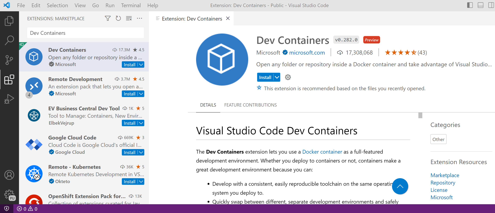
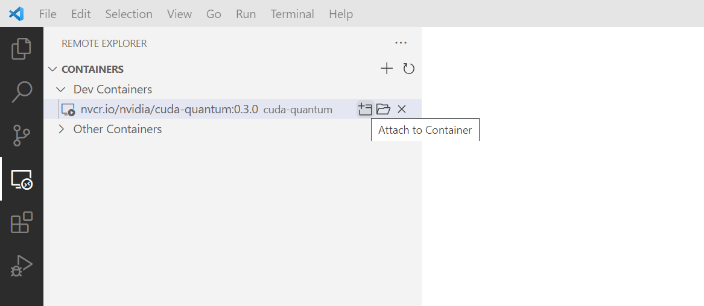
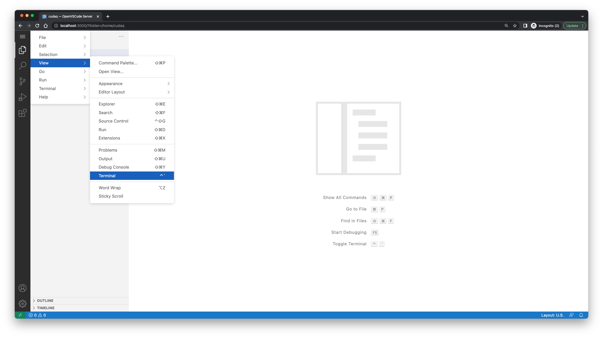

CUDA Quantum Open Beta Installation
*******************************************

Docker Image
--------------------

Install the Docker Image
++++++++++++++++++++++++++++++++++++

Docker images for all CUDA Quantum releases are available on the `NGC Container Registry`_.
The image for the latest version under development is built from source on our `GitHub repository <https://github.com/NVIDIA/cuda-quantum>`_.

.. _NGC Container Registry: https://catalog.ngc.nvidia.com/orgs/nvidia/containers/cuda-quantum

To download the latest version on the main branch of our GitHub repository, for example, use the command

.. code-block:: console

    docker pull ghcr.io/nvidia/cuda-quantum:latest

.. _use-cuda-quantum-in-terminal:

Use CUDA Quantum in a Terminal
+++++++++++++++++++++++++++++++++++++

The container can be run using the following command

.. code-block:: console

    docker run -it --name cuda-quantum <image_name>

replacing :code:`<image_name>` with the name and tag of the image you downloaded.

This will give you terminal access to the created container, for example

.. code-block:: console 

    user@host:~$ docker run -it --name cuda-quantum ghcr.io/nvidia/cuda-quantum:latest
    To run a command as administrator (user "root"), use "sudo <command>".
    See "man sudo_root" for details.

    =========================
    NVIDIA CUDA Quantum
    =========================

    Version: latest

    Copyright (c) 2023 NVIDIA Corporation & Affiliates
    All rights reserved.

    cudaq@container:~$ ls examples/
    cpp  python

.. note:: 

    If you have NVIDIA GPUs available and NVIDIA Docker correctly configured, 
    you can add :code:`--gpus all` to the :code:`docker run` command to expose all available GPUs 
    to the container, or :code:`--gpus '"device=1"'` to select a specific GPU device.
    Unless you specify this flag, you will not be able to compile to the :code:`--target nvidia`
    target. 

.. note:: 

    If you would like a temporary container, pass :code:`--rm`. This will delete your 
    container upon exit. 

You can stop and exit the container by typing the command :code:`exit`. If you did not specify
:code:`--rm`, the container still exists as well as any changes you made in it. You can get back to it using
the command :code:`docker start -i cuda-quantum`. 
You can delete an existing container and any changes you made using :code:`docker rm -v cuda-quantum`. 

Use CUDA Quantum in VS Code
+++++++++++++++++++++++++++++++++++++

If you have `VS Code`_ installed, you can use it to work inside your container.
To do so, install the `Dev Containers extension`_:

Follow the steps :ref:`above<use-cuda-quantum-in-terminal>` to start the container. 
Open VS Code and navigate to the Remote Explorer. You should see the running cuda-quantum development container listed there.

Click on :code:`Attach to Container`. A new VS Code instance will open in that container. Open the `/home/cudaq`
folder to see the `README.md` file and the CUDA Quantum examples that are included in the container. To run the examples, 
open a terminal by going to the Terminal menu and select :code:`New Terminal`. 

You can now compile and run the C++ examples using the :code:`nvq++` compiler, which is installed in your :code:`PATH`, 
or run the Python examples using the Python interpreter.

.. image:: _static/getToWork.png 

.. _VS Code: https://code.visualstudio.com/download
.. _Dev Containers extension: https://marketplace.visualstudio.com/items?itemName=ms-vscode-remote.remote-containers
.. _command palette: https://code.visualstudio.com/docs/getstarted/userinterface#_command-palette

.. note:: 

    VS Code extensions that you have installed locally, such as e.g. an extension for Jupyter notebooks, 
    may not be automatically active in the container environment. You may need to install your preferred 
    extension in the container environment for all of your development tools to be available.

Python wheels
--------------------

CUDA Quantum Python wheels are available on [PyPI.org](https://pypi.org/project/cuda-quantum). 
The CUDA Quantum Python wheels contain the Python API and core components of
CUDA Quantum. For more information about available packages and documentation,
see :doc:`versions`.

To install the latest release using `pip <https://pypi.org/project/pip/>`__, run

.. code-block:: console

    pip install cuda-quantum

There are currently no source distributions available on PyPI, but you can download the source code 
for all releases `here <https://github.com/NVIDIA/cuda-quantum/releases>`__. 
For more information about building a CUDA Quantum Python wheel from source, see the 
`README <https://github.com/NVIDIA/cuda-quantum/blob/main/python/README.md>`__.

Build CUDA Quantum from Source
------------------------------

For more information about building CUDA Quantum from source, 
we refer to the `CUDA Quantum GitHub repository`_.

.. _CUDA Quantum GitHub repository: https://github.com/NVIDIA/cuda-quantum/blob/main/Building.md

Next Steps
----------
With the CUDA Quantum Docker image installed and a container up and running, check out the
Using CUDA Quantum page_. To run the examples codes in the container, checkout the Compiling
and Executing section here_. 

Once in the VS Code IDE or in the terminal for the container in headless mode, you'll 
notice there is an :code:`examples/` folder. These examples are provided to 
get you started with CUDA Quantum and understanding the programming and execution model. 
Start of by trying to compile a simple one, like :code:`examples/cpp/basics/static_kernel.cpp`

.. code-block:: console 

    nvq++ examples/cpp/basics/static_kernel.cpp 
    ./a.out

If you have GPU support (e.g. you successfully provided :code:`--gpus` to your docker 
run command), try out the 30 qubit version of this example.

.. code-block:: console 

    nvq++ examples/cpp/basics/cuquantum_backends.cpp --target nvidia 
    ./a.out 

.. _page: using/cudaq.html
.. _here: using/cudaq/compiling.html
