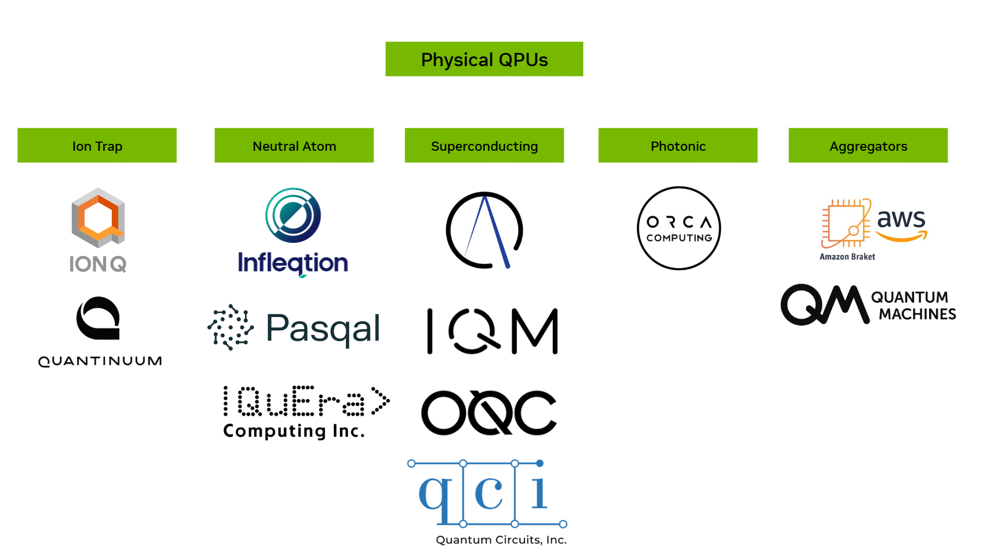

Quantum Hardware (QPU) 
******************************
CUDA-Q supports submission to a set of hardware providers.
To submit to a hardware backend, you need an account with the respective provider.

.. toctree::
   :maxdepth: 2
      
        Ion Trap QPUs <hardware/iontrap.rst>
        Superconducting QPUs <hardware/superconducting.rst>
        Neutral Atom QPUs <hardware/neutralatom.rst>
        Photonic QPUs <hardware/photonic.rst>

