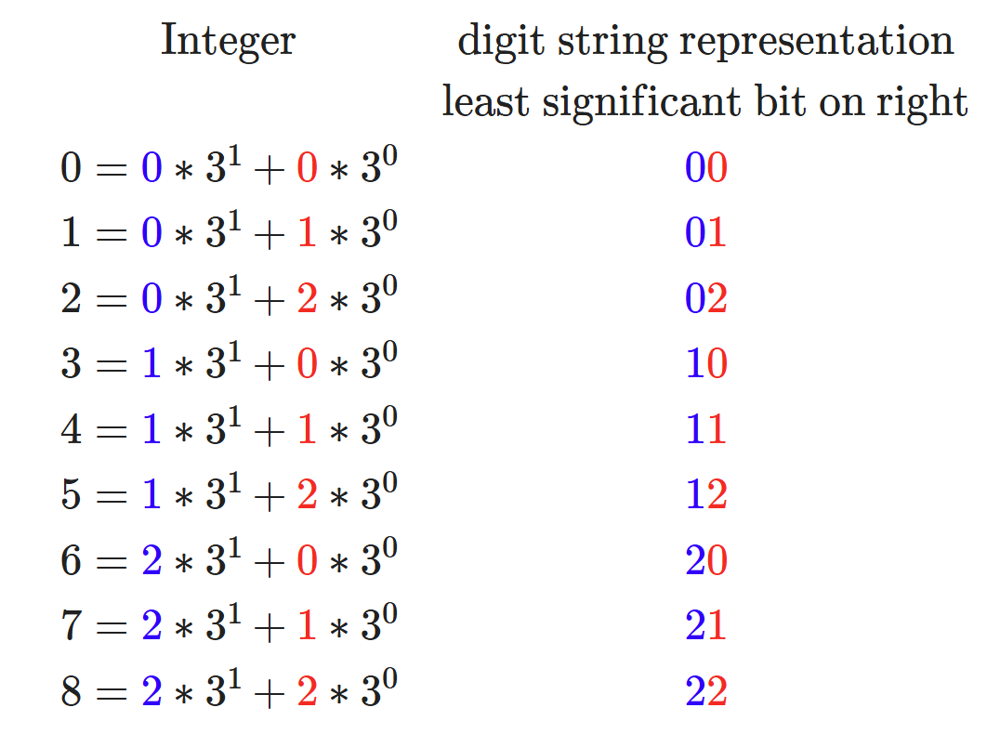

Photonics Simulators
=======================

CUDA-Q provides the ability to simulate photonics circuits. This page provides the details 
needed to run photonics simulations followed by an introduction to photonics kernels.

orca-photonics
----------------

The :code:`orca-photonics` backend provides a state vector simulator with the :code:`Q++` library. 
The :code:`orca-photonics` backend supports supports a double precision simulator that can run in multiple CPUs.

OpenMP CPU-only
^^^^^^^^^^^^^^^^^^^^

.. _qpp-cpu-photonics-backend:

This target provides a state vector simulator based on the CPU-only, OpenMP threaded `Q++ <https://github.com/softwareqinc/qpp>`_  library.
To execute a program on the :code:`orca-photonics` target, use the following commands:

.. tab:: Python

    .. code:: bash

        python3 program.py [...] --target orca-photonics

    The target can also be defined in the application code by calling

    .. code:: python
 
        cudaq.set_target('orca-photonics')

    If a target is set in the application code, this target will override the :code:`--target` command line flag given during program invocation.

.. tab:: C++

    .. code:: bash

        nvq++ --library-mode --target orca-photonics program.cpp [...] -o program.x

Photonics 101
^^^^^^^^^^^^^^^^
The following provides a basic introduction to photonics circuits so that you can simulate your own photonics circuits.  

Quantum Photonic States
++++++++++++++++++++++++

We define a qumode (qudit) to have the states
:math:`\ket{0}`, :math:`\ket{1}`, ... :math:`\ket{d}` in Dirac notation where:

:spellcheck-disable:

.. math:: \ket{0} = \begin{bmatrix} 1 & 0 & 0 & \dots & 0 \end{bmatrix} ^ \top

.. math:: \ket{1} = \begin{bmatrix} 0 & 1 & 0 & \dots & 0 \end{bmatrix}^ \top

.. math:: \ket{2} = \begin{bmatrix} 0 & 0 & 1 & \dots & 0 \end{bmatrix}^ \top

.. math:: \vdots

.. math:: \ket{d} = \begin{bmatrix} 0 & 0 & 0 & \dots & 1 \end{bmatrix}^ \top

:spellcheck-enable:

where the linear combinations of states or superpositions are:

.. math::   \ket{\psi} = \alpha_0\ket{0} + \alpha_1\ket{1} + \alpha_2\ket{2} + \dots + \alpha_d\ket{d}

where :math:`\alpha_i \in \mathbb{C}`. It is important to note that this is
still the state of one qudit; although we have :math:`d` kets, they represent a
superposition state of one qudit.

Multiple qudits can be combined and the possible combinations of their states
used to process information.

A two qudit system, :math:`n=2`, with three levels, :math:`d=3`, has
:math:`d^n=8` computational basis states:
:math:`\ket{00}, \ket{01}, \ket{02}, \ket{10}, \ket{11}, \ket{12}, \ket{20}, \ket{21}, \ket{22}`.

A photonic quantum state of a :math:`n` qudit system with :math:`d` levels is
written as a sum of :math:`d^n` possible basis states where the coefficients
track the probability of the system collapsing into that state if a measurement
is applied.

Storing the complex numbers associated with :math:`d^n` amplitudes would not be
feasible using bits and classical computations once :math:`n` and :math:`d` are
relatively large.

Quantum Photonics Gates
++++++++++++++++++++++++

We can manipulate the state of a qumode via quantum photonic gates. For
example, the create gate allows us to increase the number of photons in a
qumode up to a maximum given by the qudit level :math:`d`:

.. math::  C \ket{0} = \ket{1} 

:spellcheck-disable:

.. math::  \begin{bmatrix}
                0 & 0 & \dots & 0 & 0 & 0 & 0 \\
                1 & 0 & \dots & 0 & 0 & 0 & 0 \\
                0 & 1 & \dots & 0 & 0 & 0 & 0 \\
                  &   & \ddots &  &   &   & \\
                0 & 0 & \dots & 1 & 0 & 0 & 0 \\
                0 & 0 & \dots & 0 & 1 & 0 & 0 \\
                0 & 0 & \dots & 0 & 0 & 1 & 1
            \end{bmatrix}
            \begin{bmatrix} 1 \\ 0 \\ 0 \\ \vdots \\ 0 \\ 0 \\ 0 \end{bmatrix} =
            \begin{bmatrix} 0 \\ 1 \\ 0 \\ \vdots \\ 0 \\ 0 \\ 0 \end{bmatrix}

:spellcheck-enable:

.. literalinclude:: ../../../snippets/python/using/examples/create_photonic_gate.py
    :language: python
    :start-after: [Begin Docs]
    :end-before: [End Docs]

.. parsed-literal::

    { 1:1000 }

The annihilate gate allows us to decrease the number of photons in a qumode, if
it is applied to a qumode where the number of photons is already at the minimum
value 0, the operation has no effect:

.. math::  A \ket{1} =  \ket{0}

:spellcheck-disable:

.. math::  \begin{bmatrix}
                1 & 1 & 0 & 0 & \dots & 0 & 0 \\
                0 & 0 & 1 & 0 & \dots & 0 & 0 \\
                0 & 0 & 0 & 1 & \dots & 0 & 0 \\
                  &   &   &   & \ddots &  & \\
                0 & 0 & 0 & 0 & \dots & 1 & 0 \\
                0 & 0 & 0 & 0 & \dots & 0 & 1 \\
                0 & 0 & 0 & 0 & \dots & 0 & 0
            \end{bmatrix}
            \begin{bmatrix} 0 \\ 1 \\ 0 \\ \vdots \\ 0 \\ 0 \\ 0 \end{bmatrix} =
            \begin{bmatrix} 1 \\ 0 \\ 0 \\ \vdots \\ 0 \\ 0 \\ 0 \end{bmatrix}

:spellcheck-enable:

.. literalinclude:: ../../../snippets/python/using/examples/annihilate_photonic_gate.py
    :language: python
    :start-after: [Begin Docs]
    :end-before: [End Docs]

.. parsed-literal::

    { 0:1000 }

A phase shifter adds a phase :math:`\phi` on a qumode. For the annihilation
(:math:`a_1`) and creation operators (:math:`a_1^\dagger`) of a qumode, the
phase shift operator is defined  by

.. math::
    P(\phi) = \exp\left(i \phi a_1^\dagger a_1  \right)

Just like the single-qubit gates above, we can define multi-qudit gates to act
on multiple qumodes.

Beam splitters act on two qumodes together and are parameterized by a single
angle :math:`\theta`, which is related to the transmission amplitude :math:`t`
by :math:`t=\cos(\theta)`.

For the annihilation (:math:`a_1` and :math:`a_2`) and creation operators
(:math:`a_1^\dagger` and :math:`a_2^\dagger`) of two qumodes, the beam splitter
operator is defined by

.. math::
    B(\theta) = \exp\left[i \theta (a_1^\dagger a_2 + a_1 a_2^\dagger) \right]

As an example, the code below implements a simulation of the Hong-Ou-Mandel
effect, in which two identical photons that interfere on a balanced beam
splitter leave the beam splitter together.

.. literalinclude:: ../../../snippets/python/using/examples/beam_splitter_photonic_gate.py
    :language: python
    :start-after: [Begin Docs]
    :end-before: [End Docs]

.. parsed-literal::

    { 02:491 20:509 }

For a full list of photonic gates supported in CUDA-Q see 
:doc:`Photonic Operations on Qudits <../../../api/default_ops>`.

Measurements
++++++++++++++

Quantum theory is probabilistic and hence requires statistical inference
to derive observations. Prior to measurement, the state of a qumode is
all possible combinations of :math:`\alpha_0, \alpha_1, \dots, \alpha_d`
and upon measurement, wave function collapse yields either a classical
:math:`0, 1, \dots,` or :math:`d`.

The mathematical theory devised to explain quantum phenomena tells us
that the probability of observing the qumode in the state
:math:`\ket{0}, \ket{1}, \dots, \ket{d}`, yielding a classical
:math:`0, 1, \dots,` or :math:`d`, is :math:`\lvert \alpha_0 \rvert ^2, \lvert \alpha_1 \rvert ^2, \dots,`
or :math:`\lvert \alpha_d \rvert ^2`, respectively.

As we see in the example of the `beam_splitter` gate above, states 02 and 20
are yielded roughly 50% of the times, providing and illustration of the
Hong-Ou-Mandel effect.

Executing Photonics Kernels
^^^^^^^^^^^^^^^^^^^^^^^^^^^^
In order to execute a photonics kernel, you need to specify a photonics simulator backend like :code:`orca-photonics` used in the example below. 
There are two ways to execute photonics kernels :code:`sample` and :code:`get_state`

The :code:`sample` command can be used to generate statistics about the quantum state. 

.. code:: python

        import cudaq
        import numpy as np

        qumode_count = 2

        # Define the simulation target.
        cudaq.set_target("orca-photonics")

        # Define a quantum kernel function.

        @cudaq.kernel
        def kernel(qumode_count: int):
            level = qumode_count + 1
            qumodes = [qudit(level) for _ in range(qumode_count)]

            # Apply the create gate to the qumodes.
            for i in range(qumode_count):
                create(qumodes[i])  # |00⟩ -> |11⟩

            # Apply the beam_splitter gate to the qumodes.
            beam_splitter(qumodes[0], qumodes[1], np.pi / 6)

            # measure all qumodes
            mz(qumodes)

        result = cudaq.sample(kernel, qumode_count, shots_count=1000)

        print(result)

.. parsed-literal::

   { 02:376 11:234 20:390 }

The :code:`get_state` command can be used to generate statistics about the quantum state. 

.. code:: python

        import cudaq
        import numpy as np

        qumode_count = 2

        # Define the simulation target.
        cudaq.set_target("orca-photonics")

        # Define a quantum kernel function.

        @cudaq.kernel
        def kernel(qumode_count: int):
            level = qumode_count + 1
            qumodes = [qudit(level) for _ in range(qumode_count)]

            # Apply the create gate to the qumodes.
            for i in range(qumode_count):
                create(qumodes[i])  # |00⟩ -> |11⟩

            # Apply the beam_splitter gate to the qumodes.
            beam_splitter(qumodes[0], qumodes[1], np.pi / 6)

            # measure some of all qumodes if need to be measured
            # mz(qumodes)

        # Compute the statevector of the kernel
        result = cudaq.get_state(kernel, qumode_count)

        print(np.array(result))

.. parsed-literal::

  [ 0.        +0.j  0.        +0.j -0.61237244+0.j  0.        +0.j
  0.5       +0.j  0.        +0.j  0.61237244+0.j  0.        +0.j
  0.        +0.j]

The statevector generated by the :code:`get_state` command follows little-endian convention for associating numbers with their digit string representations, which places the least significant digit on the right. That is, for the example of a 2-qumode system of level 3 (in which possible states are 0, 1, and 2), resulting in the following translation between integers and digit string:
 

