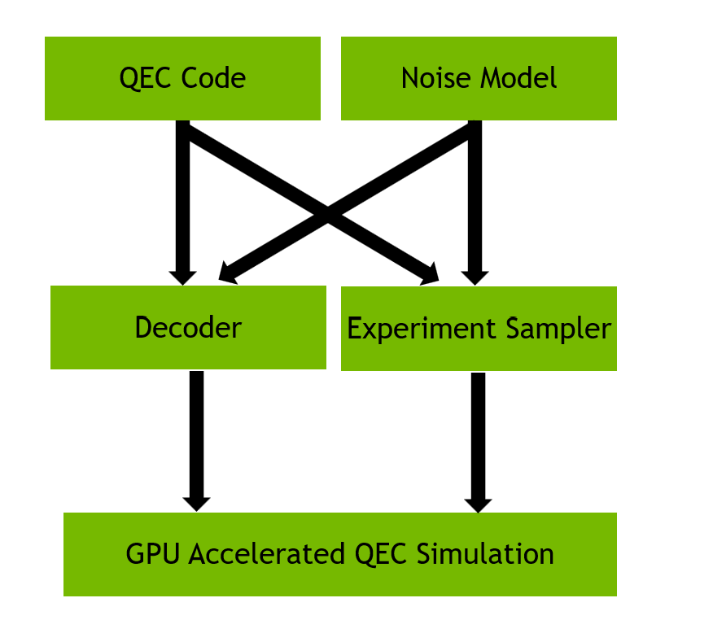

.. _cudaq-qec:

CUDA-Q QEC
==========

CUDA-Q QEC is a library that builds upon the CUDA-Q programming model to enable performant research workflows for quantum error correction. It provides an extensible framework for describing quantum error correcting codes as collections of CUDA-Q kernels and for describing syndrome decoders, state-of-the-art decoder implementations on NVIDIA GPUs, real-time decoding for active error correction on quantum hardware, and pre-built numerical experiment APIs.

Learn more in the `CUDA-Q QEC documentation <https://nvidia.github.io/cudaq-qec/components/qec/index.html>`_ and explore a number of detailed `examples <https://nvidia.github.io/cudaq-qec/examples_rst/qec/examples.html>`__.

