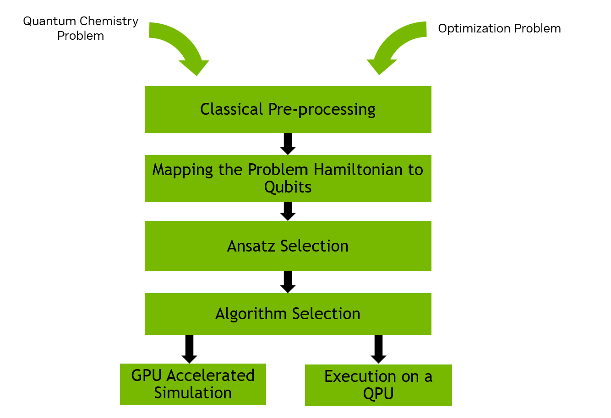
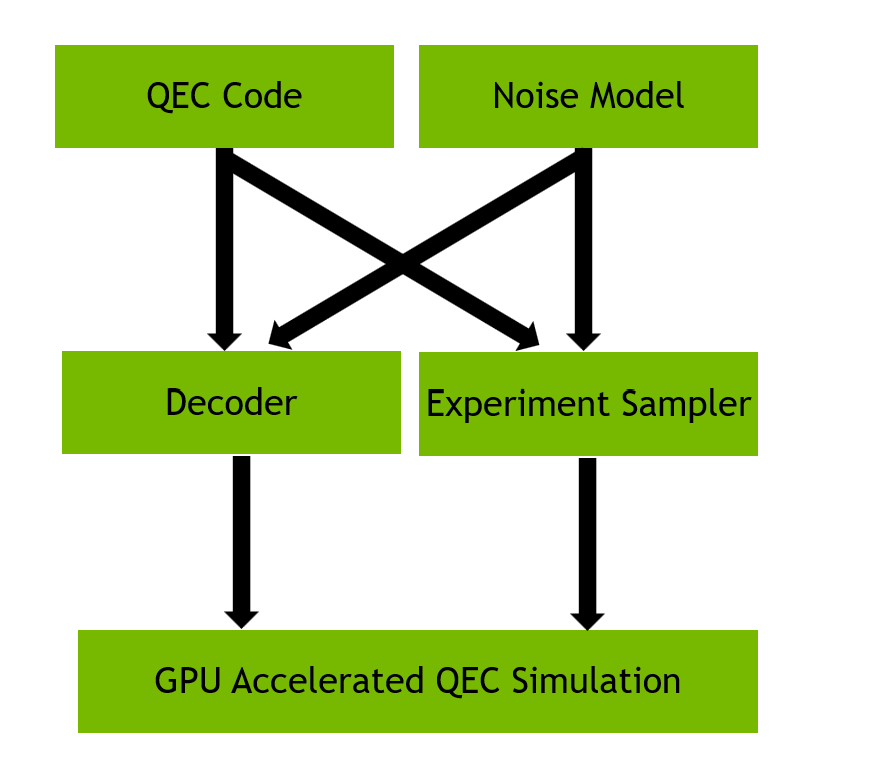

.. _cudaqx:

CUDAQ-QEC
=======

CUDAQ-QEC is a collection of libraries that build upon the CUDA-Q programming model to enable the rapid development of hybrid quantum-classical application code leveraging state-of-the-art CPUs, GPUs, and QPUs. It provides a collection of C++ libraries and Python packages that enable research, development, and application creation for use cases in quantum error correction and hybrid quantum-classical solvers.

.. figure:: cudaq-qec.png
   :width: 500px
   :align: center

You can read more about CUDAQ-QEC in the `release blog <https://developer.nvidia.com/blog/introducing-nvidia-cuda-qx-libraries-for-accelerated-quantum-supercomputing/>`_ and see code examples in the `CUDAQ-QEC documentation <https://nvidia.github.io/cudaq-qec/>`_.

CUDA-Q Solvers
---------------

The CUDA-Q Solvers library provides high-level quantum-classical hybrid algorithms and supporting infrastructure for quantum chemistry and optimization problems. It features implementations of VQE, ADAPT-VQE, and supporting utilities for Hamiltonian generation and operator pool management.

Learn more in the `CUDA-Q Solvers documentation <https://nvidia.github.io/cudaq-qec/components/solvers/introduction.html>`_ and explore a number of detailed `examples <https://nvidia.github.io/cudaq-qec/examples_rst/solvers/examples.html>`__.

CUDA-Q QEC
--------------

The CUDA-Q QEC library provides a comprehensive framework for quantum error correction research and development.

Learn more in the `CUDA-Q QEC documentation <https://nvidia.github.io/cudaq-qec/components/qec/introduction.html>`_ and explore a number of detailed `examples <https://nvidia.github.io/cudaq-qec/examples_rst/qec/examples.html>`__.

