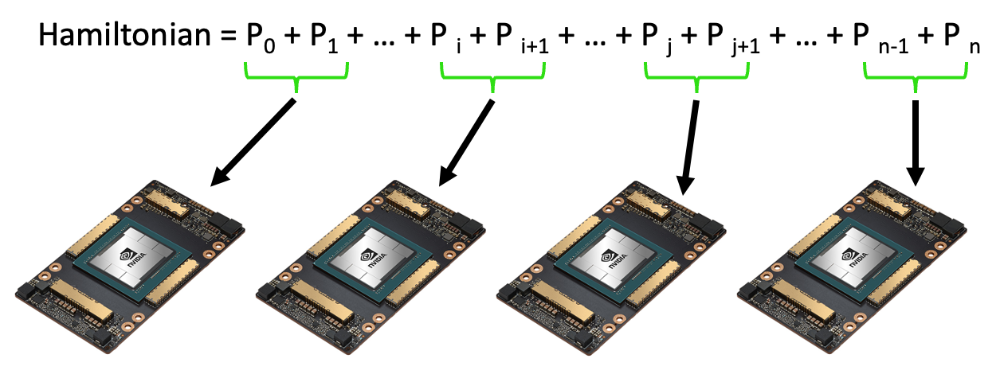
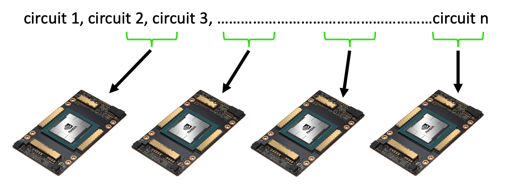

Multi-GPU Workflows
===================

There are many backends available with CUDA-Q which enable seamless
switching between GPUs, QPUs and CPUs and also allow for workflows
involving multiple architectures working in tandem.

.. literalinclude:: ../../snippets/python/using/examples/multi_gpu_workflows/get_targets.py
    :language: python

Available Targets
~~~~~~~~~~~~~~~~~

-  **`qpp-cpu`**: The QPP based CPU backend which is multithreaded to
   maximize the usage of available cores on your system.

-  **`nvidia`**: Single GPU based backend which accelerates quantum circuit
   simulation on NVIDIA GPUs powered by cuQuantum.

-  **`nvidia-mgpu`**: Allows for scaling circuit simulation on multiple GPUs.

-  **`nvidia-mqpu`**: Enables users to program workflows utilizing
   multiple virtual quantum processors in parallel, where each QPU is simulated by the nvidia backend.

-  **`remote-mqpu`**: Enables users to program workflows utilizing
   multiple virtual quantum processors in parallel, where the backend used to simulate each QPU is configurable.

Please see :doc:`../backends/backends` for a full list of all available backends. 
Below we explore how to effectively utilize multiple CUDA-Q targets with the same GHZ state preparation code

.. literalinclude:: ../../snippets/python/using/examples/multi_gpu_workflows/multiple_targets.py
    :language: python
    :start-after: [Begin state]
    :end-before: [End state]

QPP-based CPU Backend
~~~~~~~~~~~~~~~~~~~~~

.. literalinclude:: ../../snippets/python/using/examples/multi_gpu_workflows/multiple_targets.py
    :language: python
    :start-after: [Begin CPU]
    :end-before: [End CPU]

.. parsed-literal::

    { 00:475 11:525 }

Acceleration via NVIDIA GPUs
~~~~~~~~~~~~~~~~~~~~~~~~~~~~

Users will notice a speedup of up to **2500x** in executing the circuit below on
NVIDIA GPUs vs CPUs.

.. literalinclude:: ../../snippets/python/using/examples/multi_gpu_workflows/multiple_targets.py
    :language: python
    :start-after: [Begin GPU]
    :end-before: [End GPU]

.. parsed-literal::

    { 0000000000000000000000000:510 1111111111111111111111111:490 }

Multiple NVIDIA GPUs
~~~~~~~~~~~~~~~~~~~~

A :math:`n` qubit quantum state has :math:`2^n` complex amplitudes, each
of which require 8 bytes of memory to store. Hence the total memory
required to store a :math:`n` qubit quantum state is :math:`8` bytes
:math:`\times 2^n`. For :math:`n = 30` qubits, this is roughly :math:`8`
GB but for :math:`n = 40`, this exponentially increases to 8700 GB.

If one incrementally increases the qubit count in their circuit, we
reach a limit where the memory required is beyond the capabilities of a
single GPU. The ``nvidia-mgpu`` target allows for memory from additional
GPUs to be pooled enabling qubit counts to be scaled.

Execution on the ``nvidia-mgpu`` backend is enabled via ``mpirun``. Users
need to create a ``.py`` file with their code and run the command below
in terminal:

``mpirun -np 4 python3 test.py``

where 4 is the number of GPUs one has access to and ``test`` is the file
name chosen.

Multiple QPUs
~~~~~~~~~~~~~~

The ``remote-mqpu`` backend allows for future multi-QPUs workflows made possible
via GPU simulation today.

Asynchronous Data Collection via Batching Hamiltonian Terms
~~~~~~~~~~~~~~~~~~~~~~~~~~~~~~~~~~~~~~~~~~~~~~~~~~~~~~~~~~~

Expectation value computations of multi-term Hamiltonians can be
asynchronously processed via the ``mqpu`` platform.

For workflows involving multiple GPUs, save the code below in a
``filename.py`` file and execute via:
``mpirun -np n python3 filename.py`` where ``n`` is an integer
specifying the number of GPUs you have access to.

.. literalinclude:: ../../examples/python/multi_gpu_workflows/multi_gpu_run.py
    :language: python
    :start-after: [Begin Docs]
    :end-before: [End Docs]

.. parsed-literal::

    mpi is initialized?  True
    rank 0 num_ranks 1

Asynchronous Data Collection via Circuit Batching
~~~~~~~~~~~~~~~~~~~~~~~~~~~~~~~~~~~~~~~~~~~~~~~~~

Execution of parameterized circuits with different parameters can be
executed asynchronously via the ``mqpu`` platform.

.. literalinclude:: ../../snippets/python/using/examples/multi_gpu_workflows/async_circuit_batching.py
    :language: python
    :start-after: [Begin prepare]
    :end-before: [End prepare]

Let's time the execution on single GPU.

.. literalinclude:: ../../snippets/python/using/examples/multi_gpu_workflows/async_circuit_batching.py
    :language: python
    :start-after: [Begin single]
    :end-before: [End single]

.. parsed-literal::

    31.7 s ± 990 ms per loop (mean ± std. dev. of 7 runs, 1 loop each)

Now let's try to time multi GPU run.

.. literalinclude:: ../../snippets/python/using/examples/multi_gpu_workflows/async_circuit_batching.py
    :language: python
    :start-after: [Begin split]
    :end-before: [End split]

.. parsed-literal::

    We have 10000 parameters which we would like to execute
    We split this into 4 batches of 2500 , 2500 , 2500 , 2500

.. literalinclude:: ../../snippets/python/using/examples/multi_gpu_workflows/async_circuit_batching.py
    :language: python
    :start-after: [Begin multiple]
    :end-before: [End multiple]

.. parsed-literal::

    85.3 ms ± 2.36 ms per loop (mean ± std. dev. of 7 runs, 10 loops each)

