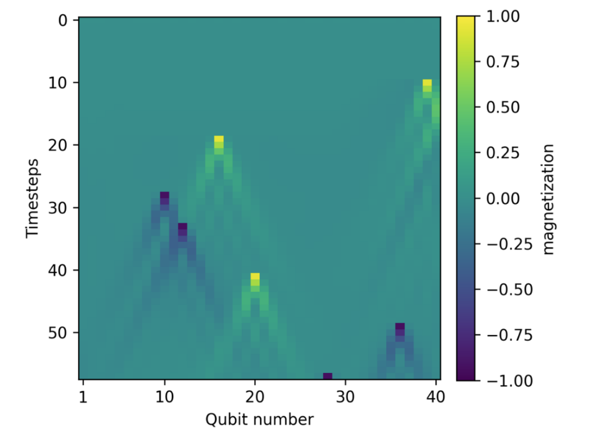

Dynamics Simulation 
+++++++++++++++++++++

CUDA-Q enables the design, simulation and execution of quantum dynamics via 
the ``evolve`` API. Specifically, this API allows us to solve the time evolution 
of quantum systems or models. In the simulation mode, CUDA-Q provides the ``dynamics``
backend target, which is based on the cuQuantum library, optimized for performance and scale
on NVIDIA GPU.

Explore the :ref:`dynamics docs page <dynamics>` to see examples and learn more about CUDA-Q's dynamics capabilities.

   The NVIDIA accelerated dynamics capabilities enabled Google to perform the largest dynamics simulations to date with 40 qubits. The results above correspond to a 40 qubit spin chain simulated with 1,024 GPUs.

