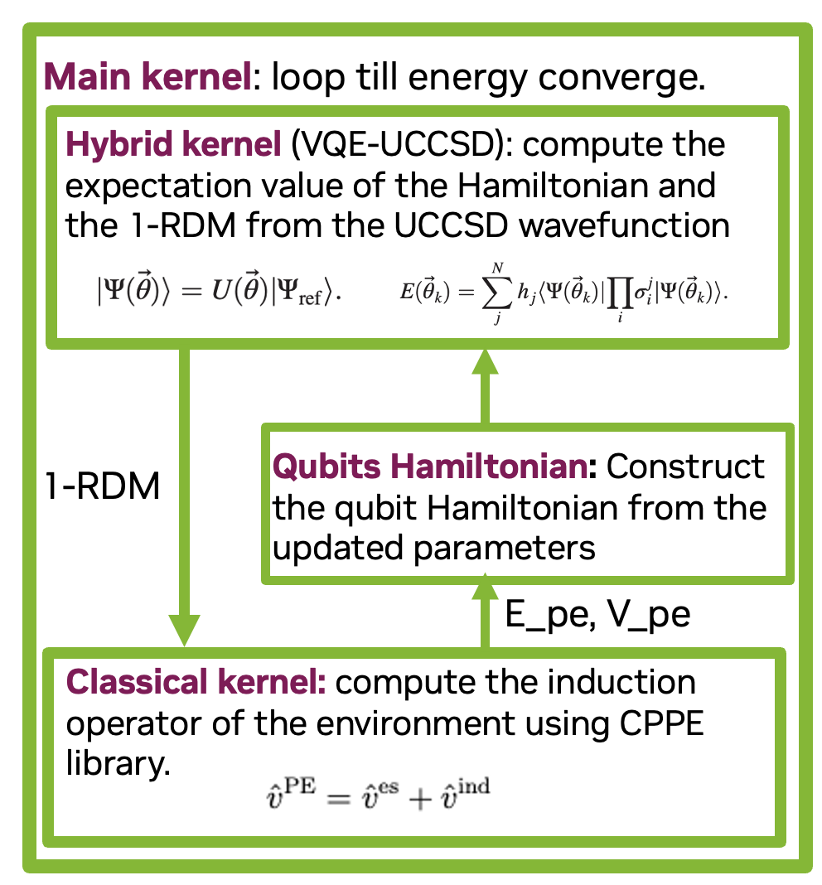

::: wy-grid-for-nav
::: wy-side-scroll
::: {.wy-side-nav-search style="background: #76b900"}
[NVIDIA CUDA-Q](../../index.html){.icon .icon-home}

::: version
pr-4395
:::

::: {role="search"}
:::
:::

::: {.wy-menu .wy-menu-vertical spy="affix" role="navigation" aria-label="Navigation menu"}
[Contents]{.caption-text}

-   [Quick Start](../../using/quick_start.html){.reference .internal}
    -   [Install
        CUDA-Q](../../using/quick_start.html#install-cuda-q){.reference
        .internal}
    -   [Validate your
        Installation](../../using/quick_start.html#validate-your-installation){.reference
        .internal}
    -   [CUDA-Q
        Academic](../../using/quick_start.html#cuda-q-academic){.reference
        .internal}
-   [Basics](../../using/basics/basics.html){.reference .internal}
    -   [What is a CUDA-Q
        Kernel?](../../using/basics/kernel_intro.html){.reference
        .internal}
    -   [Building your first CUDA-Q
        Program](../../using/basics/build_kernel.html){.reference
        .internal}
    -   [Running your first CUDA-Q
        Program](../../using/basics/run_kernel.html){.reference
        .internal}
        -   [Sample](../../using/basics/run_kernel.html#sample){.reference
            .internal}
        -   [Run](../../using/basics/run_kernel.html#run){.reference
            .internal}
        -   [Observe](../../using/basics/run_kernel.html#observe){.reference
            .internal}
        -   [Running on a
            GPU](../../using/basics/run_kernel.html#running-on-a-gpu){.reference
            .internal}
    -   [Troubleshooting](../../using/basics/troubleshooting.html){.reference
        .internal}
        -   [Debugging and Verbose Simulation
            Output](../../using/basics/troubleshooting.html#debugging-and-verbose-simulation-output){.reference
            .internal}
-   [Examples](../../using/examples/examples.html){.reference .internal}
    -   [Introduction](../../using/examples/introduction.html){.reference
        .internal}
    -   [Building
        Kernels](../../using/examples/building_kernels.html){.reference
        .internal}
        -   [Defining
            Kernels](../../using/examples/building_kernels.html#defining-kernels){.reference
            .internal}
        -   [Initializing
            states](../../using/examples/building_kernels.html#initializing-states){.reference
            .internal}
        -   [Applying
            Gates](../../using/examples/building_kernels.html#applying-gates){.reference
            .internal}
        -   [Controlled
            Operations](../../using/examples/building_kernels.html#controlled-operations){.reference
            .internal}
        -   [Multi-Controlled
            Operations](../../using/examples/building_kernels.html#multi-controlled-operations){.reference
            .internal}
        -   [Adjoint
            Operations](../../using/examples/building_kernels.html#adjoint-operations){.reference
            .internal}
        -   [Custom
            Operations](../../using/examples/building_kernels.html#custom-operations){.reference
            .internal}
        -   [Building Kernels with
            Kernels](../../using/examples/building_kernels.html#building-kernels-with-kernels){.reference
            .internal}
        -   [Parameterized
            Kernels](../../using/examples/building_kernels.html#parameterized-kernels){.reference
            .internal}
    -   [Quantum
        Operations](../../using/examples/quantum_operations.html){.reference
        .internal}
        -   [Quantum
            States](../../using/examples/quantum_operations.html#quantum-states){.reference
            .internal}
        -   [Quantum
            Gates](../../using/examples/quantum_operations.html#quantum-gates){.reference
            .internal}
        -   [Measurements](../../using/examples/quantum_operations.html#measurements){.reference
            .internal}
    -   [Measuring
        Kernels](../../using/examples/measuring_kernels.html){.reference
        .internal}
        -   [Mid-circuit Measurement and Conditional
            Logic](../../using/examples/measuring_kernels.html#mid-circuit-measurement-and-conditional-logic){.reference
            .internal}
    -   [Visualizing
        Kernels](../../examples/python/visualization.html){.reference
        .internal}
        -   [Qubit
            Visualization](../../examples/python/visualization.html#Qubit-Visualization){.reference
            .internal}
        -   [Kernel
            Visualization](../../examples/python/visualization.html#Kernel-Visualization){.reference
            .internal}
    -   [Executing
        Kernels](../../using/examples/executing_kernels.html){.reference
        .internal}
        -   [Sample](../../using/examples/executing_kernels.html#sample){.reference
            .internal}
            -   [Sample
                Asynchronous](../../using/examples/executing_kernels.html#sample-asynchronous){.reference
                .internal}
        -   [Run](../../using/examples/executing_kernels.html#run){.reference
            .internal}
            -   [Return Custom Data
                Types](../../using/examples/executing_kernels.html#return-custom-data-types){.reference
                .internal}
            -   [Run
                Asynchronous](../../using/examples/executing_kernels.html#run-asynchronous){.reference
                .internal}
        -   [Observe](../../using/examples/executing_kernels.html#observe){.reference
            .internal}
            -   [Observe
                Asynchronous](../../using/examples/executing_kernels.html#observe-asynchronous){.reference
                .internal}
        -   [Get
            State](../../using/examples/executing_kernels.html#get-state){.reference
            .internal}
            -   [Get State
                Asynchronous](../../using/examples/executing_kernels.html#get-state-asynchronous){.reference
                .internal}
    -   [Computing Expectation
        Values](../../using/examples/expectation_values.html){.reference
        .internal}
        -   [Parallelizing across Multiple
            Processors](../../using/examples/expectation_values.html#parallelizing-across-multiple-processors){.reference
            .internal}
    -   [Multi-GPU
        Workflows](../../using/examples/multi_gpu_workflows.html){.reference
        .internal}
        -   [From CPU to
            GPU](../../using/examples/multi_gpu_workflows.html#from-cpu-to-gpu){.reference
            .internal}
        -   [Pooling the memory of multiple GPUs ([`mgpu`{.code
            .docutils .literal
            .notranslate}]{.pre})](../../using/examples/multi_gpu_workflows.html#pooling-the-memory-of-multiple-gpus-mgpu){.reference
            .internal}
        -   [Parallel execution over multiple QPUs ([`mqpu`{.code
            .docutils .literal
            .notranslate}]{.pre})](../../using/examples/multi_gpu_workflows.html#parallel-execution-over-multiple-qpus-mqpu){.reference
            .internal}
            -   [Batching Hamiltonian
                Terms](../../using/examples/multi_gpu_workflows.html#batching-hamiltonian-terms){.reference
                .internal}
            -   [Circuit
                Batching](../../using/examples/multi_gpu_workflows.html#circuit-batching){.reference
                .internal}
        -   [Multi-QPU + Other Backends ([`remote-mqpu`{.code .docutils
            .literal
            .notranslate}]{.pre})](../../using/examples/multi_gpu_workflows.html#multi-qpu-other-backends-remote-mqpu){.reference
            .internal}
    -   [Optimizers &
        Gradients](../../examples/python/optimizers_gradients.html){.reference
        .internal}
        -   [CUDA-Q Optimizer
            Overview](../../examples/python/optimizers_gradients.html#CUDA-Q-Optimizer-Overview){.reference
            .internal}
            -   [Gradient-Free Optimizers (no gradients
                required):](../../examples/python/optimizers_gradients.html#Gradient-Free-Optimizers-(no-gradients-required):){.reference
                .internal}
            -   [Gradient-Based Optimizers (require
                gradients):](../../examples/python/optimizers_gradients.html#Gradient-Based-Optimizers-(require-gradients):){.reference
                .internal}
        -   [1. Built-in CUDA-Q Optimizers and
            Gradients](../../examples/python/optimizers_gradients.html#1.-Built-in-CUDA-Q-Optimizers-and-Gradients){.reference
            .internal}
            -   [1.1 Adam Optimizer with Parameter
                Configuration](../../examples/python/optimizers_gradients.html#1.1-Adam-Optimizer-with-Parameter-Configuration){.reference
                .internal}
            -   [1.2 SGD (Stochastic Gradient Descent)
                Optimizer](../../examples/python/optimizers_gradients.html#1.2-SGD-(Stochastic-Gradient-Descent)-Optimizer){.reference
                .internal}
            -   [1.3 SPSA (Simultaneous Perturbation Stochastic
                Approximation)](../../examples/python/optimizers_gradients.html#1.3-SPSA-(Simultaneous-Perturbation-Stochastic-Approximation)){.reference
                .internal}
        -   [2. Third-Party
            Optimizers](../../examples/python/optimizers_gradients.html#2.-Third-Party-Optimizers){.reference
            .internal}
        -   [3. Parallel Parameter Shift
            Gradients](../../examples/python/optimizers_gradients.html#3.-Parallel-Parameter-Shift-Gradients){.reference
            .internal}
    -   [Noisy
        Simulations](../../examples/python/noisy_simulations.html){.reference
        .internal}
    -   [Pre-Trajectory Sampling with Batch
        Execution](../../using/examples/ptsbe.html){.reference
        .internal}
        -   [Conceptual
            Overview](../../using/examples/ptsbe.html#conceptual-overview){.reference
            .internal}
        -   [When to Use
            PTSBE](../../using/examples/ptsbe.html#when-to-use-ptsbe){.reference
            .internal}
        -   [Quick
            Start](../../using/examples/ptsbe.html#quick-start){.reference
            .internal}
        -   [Usage
            Tutorial](../../using/examples/ptsbe.html#usage-tutorial){.reference
            .internal}
            -   [Controlling the Number of
                Trajectories](../../using/examples/ptsbe.html#controlling-the-number-of-trajectories){.reference
                .internal}
            -   [Choosing a Trajectory Sampling
                Strategy](../../using/examples/ptsbe.html#choosing-a-trajectory-sampling-strategy){.reference
                .internal}
            -   [Shot Allocation
                Strategies](../../using/examples/ptsbe.html#shot-allocation-strategies){.reference
                .internal}
            -   [Inspecting Execution
                Data](../../using/examples/ptsbe.html#inspecting-execution-data){.reference
                .internal}
    -   [Constructing
        Operators](../../using/examples/operators.html){.reference
        .internal}
        -   [Constructing Spin
            Operators](../../using/examples/operators.html#constructing-spin-operators){.reference
            .internal}
        -   [Pauli Words and Exponentiating Pauli
            Words](../../using/examples/operators.html#pauli-words-and-exponentiating-pauli-words){.reference
            .internal}
    -   [Performance
        Optimizations](../../examples/python/performance_optimizations.html){.reference
        .internal}
        -   [Gate
            Fusion](../../examples/python/performance_optimizations.html#Gate-Fusion){.reference
            .internal}
    -   [Using Quantum Hardware
        Providers](../../using/examples/hardware_providers.html){.reference
        .internal}
        -   [Amazon
            Braket](../../using/examples/hardware_providers.html#amazon-braket){.reference
            .internal}
        -   [Anyon
            Technologies](../../using/examples/hardware_providers.html#anyon-technologies){.reference
            .internal}
        -   [Infleqtion](../../using/examples/hardware_providers.html#infleqtion){.reference
            .internal}
        -   [IonQ](../../using/examples/hardware_providers.html#ionq){.reference
            .internal}
        -   [IQM](../../using/examples/hardware_providers.html#iqm){.reference
            .internal}
        -   [OQC](../../using/examples/hardware_providers.html#oqc){.reference
            .internal}
        -   [ORCA
            Computing](../../using/examples/hardware_providers.html#orca-computing){.reference
            .internal}
        -   [Pasqal](../../using/examples/hardware_providers.html#pasqal){.reference
            .internal}
        -   [Quantinuum](../../using/examples/hardware_providers.html#quantinuum){.reference
            .internal}
        -   [Quantum Circuits,
            Inc.](../../using/examples/hardware_providers.html#quantum-circuits-inc){.reference
            .internal}
        -   [Quantum
            Machines](../../using/examples/hardware_providers.html#quantum-machines){.reference
            .internal}
        -   [QuEra
            Computing](../../using/examples/hardware_providers.html#quera-computing){.reference
            .internal}
        -   [Scaleway](../../using/examples/hardware_providers.html#scaleway){.reference
            .internal}
        -   [TII](../../using/examples/hardware_providers.html#tii){.reference
            .internal}
    -   [When to Use sample vs.
        run](../../using/examples/sample_vs_run.html){.reference
        .internal}
        -   [Introduction](../../using/examples/sample_vs_run.html#introduction){.reference
            .internal}
        -   [Usage
            Guidelines](../../using/examples/sample_vs_run.html#usage-guidelines){.reference
            .internal}
        -   [What Is Supported with [`sample`{.docutils .literal
            .notranslate}]{.pre}](../../using/examples/sample_vs_run.html#what-is-supported-with-sample){.reference
            .internal}
        -   [What Is Not Supported with [`sample`{.docutils .literal
            .notranslate}]{.pre}](../../using/examples/sample_vs_run.html#what-is-not-supported-with-sample){.reference
            .internal}
        -   [How to
            Migrate](../../using/examples/sample_vs_run.html#how-to-migrate){.reference
            .internal}
            -   [Step 1: Add a return type to the
                kernel](../../using/examples/sample_vs_run.html#step-1-add-a-return-type-to-the-kernel){.reference
                .internal}
            -   [Step 2: Replace [`sample`{.docutils .literal
                .notranslate}]{.pre} with [`run`{.docutils .literal
                .notranslate}]{.pre}](../../using/examples/sample_vs_run.html#step-2-replace-sample-with-run){.reference
                .internal}
            -   [Step 3: Update result
                processing](../../using/examples/sample_vs_run.html#step-3-update-result-processing){.reference
                .internal}
        -   [Migration
            Examples](../../using/examples/sample_vs_run.html#migration-examples){.reference
            .internal}
            -   [Example 1: Simple conditional
                logic](../../using/examples/sample_vs_run.html#example-1-simple-conditional-logic){.reference
                .internal}
            -   [Example 2: Returning multiple measurement
                results](../../using/examples/sample_vs_run.html#example-2-returning-multiple-measurement-results){.reference
                .internal}
            -   [Example 3: Quantum
                teleportation](../../using/examples/sample_vs_run.html#example-3-quantum-teleportation){.reference
                .internal}
        -   [Additional
            Notes](../../using/examples/sample_vs_run.html#additional-notes){.reference
            .internal}
    -   [Dynamics
        Examples](../../using/examples/dynamics_examples.html){.reference
        .internal}
        -   [Python Examples (Jupyter
            Notebooks)](../../using/examples/dynamics_examples.html#python-examples-jupyter-notebooks){.reference
            .internal}
            -   [Introduction to CUDA-Q Dynamics (Jaynes-Cummings
                Model)](../../examples/python/dynamics/dynamics_intro_1.html){.reference
                .internal}
            -   [Introduction to CUDA-Q Dynamics (Time Dependent
                Hamiltonians)](../../examples/python/dynamics/dynamics_intro_2.html){.reference
                .internal}
            -   [Superconducting
                Qubits](../../examples/python/dynamics/superconducting.html){.reference
                .internal}
            -   [Spin
                Qubits](../../examples/python/dynamics/spinqubits.html){.reference
                .internal}
            -   [Trapped Ion
                Qubits](../../examples/python/dynamics/iontrap.html){.reference
                .internal}
            -   [Control](../../examples/python/dynamics/control.html){.reference
                .internal}
        -   [C++
            Examples](../../using/examples/dynamics_examples.html#c-examples){.reference
            .internal}
            -   [Introduction: Single Qubit
                Dynamics](../../using/examples/dynamics_examples.html#introduction-single-qubit-dynamics){.reference
                .internal}
            -   [Introduction: Cavity QED (Jaynes-Cummings
                Model)](../../using/examples/dynamics_examples.html#introduction-cavity-qed-jaynes-cummings-model){.reference
                .internal}
            -   [Superconducting Qubits: Cross-Resonance
                Gate](../../using/examples/dynamics_examples.html#superconducting-qubits-cross-resonance-gate){.reference
                .internal}
            -   [Spin Qubits: Heisenberg Spin
                Chain](../../using/examples/dynamics_examples.html#spin-qubits-heisenberg-spin-chain){.reference
                .internal}
            -   [Control: Driven
                Qubit](../../using/examples/dynamics_examples.html#control-driven-qubit){.reference
                .internal}
            -   [State
                Batching](../../using/examples/dynamics_examples.html#state-batching){.reference
                .internal}
            -   [Numerical
                Integrators](../../using/examples/dynamics_examples.html#numerical-integrators){.reference
                .internal}
-   [Applications](../../using/applications.html){.reference .internal}
    -   [Max-Cut with QAOA](qaoa.html){.reference .internal}
    -   [Molecular docking via
        DC-QAOA](digitized_counterdiabatic_qaoa.html){.reference
        .internal}
        -   [Setting up the Molecular Docking
            Problem](digitized_counterdiabatic_qaoa.html#Setting-up-the-Molecular-Docking-Problem){.reference
            .internal}
        -   [CUDA-Q
            Implementation](digitized_counterdiabatic_qaoa.html#CUDA-Q-Implementation){.reference
            .internal}
    -   [Multi-reference Quantum Krylov Algorithm - [\\(H_2\\)]{.math
        .notranslate .nohighlight} Molecule](krylov.html){.reference
        .internal}
        -   [Setup](krylov.html#Setup){.reference .internal}
        -   [Computing the matrix
            elements](krylov.html#Computing-the-matrix-elements){.reference
            .internal}
        -   [Determining the ground state energy of the
            subspace](krylov.html#Determining-the-ground-state-energy-of-the-subspace){.reference
            .internal}
    -   [Quantum-Selected Configuration Interaction
        (QSCI)](qsci.html){.reference .internal}
        -   [0. Problem
            definition](qsci.html#0.-Problem-definition){.reference
            .internal}
        -   [1. Prepare an Approximate Quantum
            State](qsci.html#1.-Prepare-an-Approximate-Quantum-State){.reference
            .internal}
        -   [2 Quantum Sampling to Select
            Configuration](qsci.html#2-Quantum-Sampling-to-Select-Configuration){.reference
            .internal}
        -   [3. Classical Diagonalization on the Selected
            Subspace](qsci.html#3.-Classical-Diagonalization-on-the-Selected-Subspace){.reference
            .internal}
        -   [5. Compare
            results](qsci.html#5.-Compare-results){.reference .internal}
        -   [Reference](qsci.html#Reference){.reference .internal}
    -   [Bernstein-Vazirani
        Algorithm](bernstein_vazirani.html){.reference .internal}
        -   [Classical
            case](bernstein_vazirani.html#Classical-case){.reference
            .internal}
        -   [Quantum
            case](bernstein_vazirani.html#Quantum-case){.reference
            .internal}
        -   [Implementing in
            CUDA-Q](bernstein_vazirani.html#Implementing-in-CUDA-Q){.reference
            .internal}
    -   [Cost Minimization](cost_minimization.html){.reference
        .internal}
    -   [Deutsch's Algorithm](deutsch_algorithm.html){.reference
        .internal}
        -   [XOR [\\(\\oplus\\)]{.math .notranslate
            .nohighlight}](deutsch_algorithm.html#XOR-\oplus){.reference
            .internal}
        -   [Quantum
            oracles](deutsch_algorithm.html#Quantum-oracles){.reference
            .internal}
        -   [Phase
            oracle](deutsch_algorithm.html#Phase-oracle){.reference
            .internal}
        -   [Quantum
            parallelism](deutsch_algorithm.html#Quantum-parallelism){.reference
            .internal}
        -   [Deutsch's
            Algorithm:](deutsch_algorithm.html#Deutsch's-Algorithm:){.reference
            .internal}
    -   [Divisive Clustering With Coresets Using
        CUDA-Q](divisive_clustering_coresets.html){.reference .internal}
        -   [Data
            preprocessing](divisive_clustering_coresets.html#Data-preprocessing){.reference
            .internal}
        -   [Quantum
            functions](divisive_clustering_coresets.html#Quantum-functions){.reference
            .internal}
        -   [Divisive Clustering
            Function](divisive_clustering_coresets.html#Divisive-Clustering-Function){.reference
            .internal}
        -   [QAOA
            Implementation](divisive_clustering_coresets.html#QAOA-Implementation){.reference
            .internal}
        -   [Scaling simulations with
            CUDA-Q](divisive_clustering_coresets.html#Scaling-simulations-with-CUDA-Q){.reference
            .internal}
    -   [Hybrid Quantum Neural
        Networks](hybrid_quantum_neural_networks.html){.reference
        .internal}
    -   [Using the Hadamard Test to Determine Quantum Krylov Subspace
        Decomposition Matrix Elements](hadamard_test.html){.reference
        .internal}
        -   [Numerical result as a
            reference:](hadamard_test.html#Numerical-result-as-a-reference:){.reference
            .internal}
        -   [Using [`Sample`{.docutils .literal .notranslate}]{.pre} to
            perform the Hadamard
            test](hadamard_test.html#Using-Sample-to-perform-the-Hadamard-test){.reference
            .internal}
        -   [Multi-GPU evaluation of QKSD matrix elements using the
            Hadamard
            Test](hadamard_test.html#Multi-GPU-evaluation-of-QKSD-matrix-elements-using-the-Hadamard-Test){.reference
            .internal}
            -   [Classically Diagonalize the Subspace
                Matrix](hadamard_test.html#Classically-Diagonalize-the-Subspace-Matrix){.reference
                .internal}
    -   [Spin-Hamiltonian Simulation Using
        CUDA-Q](hamiltonian_simulation.html){.reference .internal}
        -   [Introduction](hamiltonian_simulation.html#Introduction){.reference
            .internal}
            -   [Heisenberg
                Hamiltonian](hamiltonian_simulation.html#Heisenberg-Hamiltonian){.reference
                .internal}
            -   [Transverse Field Ising Model
                (TFIM)](hamiltonian_simulation.html#Transverse-Field-Ising-Model-(TFIM)){.reference
                .internal}
            -   [Time Evolution and Trotter
                Decomposition](hamiltonian_simulation.html#Time-Evolution-and-Trotter-Decomposition){.reference
                .internal}
        -   [Key
            steps](hamiltonian_simulation.html#Key-steps){.reference
            .internal}
            -   [1. Prepare initial
                state](hamiltonian_simulation.html#1.-Prepare-initial-state){.reference
                .internal}
            -   [2. Hamiltonian
                Trotterization](hamiltonian_simulation.html#2.-Hamiltonian-Trotterization){.reference
                .internal}
            -   [3. [`Compute`{.docutils .literal
                .notranslate}]{.pre}` `{.docutils .literal
                .notranslate}[`overlap`{.docutils .literal
                .notranslate}]{.pre}](hamiltonian_simulation.html#3.-Compute-overlap){.reference
                .internal}
            -   [4. Construct Heisenberg
                Hamiltonian](hamiltonian_simulation.html#4.-Construct-Heisenberg-Hamiltonian){.reference
                .internal}
            -   [5. Construct TFIM
                Hamiltonian](hamiltonian_simulation.html#5.-Construct-TFIM-Hamiltonian){.reference
                .internal}
            -   [6. Extract coefficients and Pauli
                words](hamiltonian_simulation.html#6.-Extract-coefficients-and-Pauli-words){.reference
                .internal}
        -   [Main
            code](hamiltonian_simulation.html#Main-code){.reference
            .internal}
        -   [Visualization of probablity over
            time](hamiltonian_simulation.html#Visualization-of-probablity-over-time){.reference
            .internal}
        -   [Expectation value over
            time:](hamiltonian_simulation.html#Expectation-value-over-time:){.reference
            .internal}
        -   [Visualization of expectation over
            time](hamiltonian_simulation.html#Visualization-of-expectation-over-time){.reference
            .internal}
        -   [Additional
            information](hamiltonian_simulation.html#Additional-information){.reference
            .internal}
        -   [Relevant
            references](hamiltonian_simulation.html#Relevant-references){.reference
            .internal}
    -   [Quantum Fourier
        Transform](quantum_fourier_transform.html){.reference .internal}
        -   [Quantum Fourier Transform
            revisited](quantum_fourier_transform.html#Quantum-Fourier-Transform-revisited){.reference
            .internal}
    -   [Quantum Teleporation](quantum_teleportation.html){.reference
        .internal}
        -   [Teleportation
            explained](quantum_teleportation.html#Teleportation-explained){.reference
            .internal}
    -   [Quantum Volume](quantum_volume.html){.reference .internal}
    -   [Readout Error
        Mitigation](readout_error_mitigation.html){.reference .internal}
        -   [Inverse confusion matrix from single-qubit noise
            model](readout_error_mitigation.html#Inverse-confusion-matrix-from-single-qubit-noise-model){.reference
            .internal}
        -   [Inverse confusion matrix from k local confusion
            matrices](readout_error_mitigation.html#Inverse-confusion-matrix-from-k-local-confusion-matrices){.reference
            .internal}
        -   [Inverse of full confusion
            matrix](readout_error_mitigation.html#Inverse-of-full-confusion-matrix){.reference
            .internal}
    -   [Compiling Unitaries Using Diffusion
        Models](unitary_compilation_diffusion_models.html){.reference
        .internal}
        -   [Diffusion model
            pipeline](unitary_compilation_diffusion_models.html#Diffusion-model-pipeline){.reference
            .internal}
        -   [Setup and load
            models](unitary_compilation_diffusion_models.html#Setup-and-load-models){.reference
            .internal}
            -   [Load discrete
                model](unitary_compilation_diffusion_models.html#Load-discrete-model){.reference
                .internal}
            -   [Load continuous
                model](unitary_compilation_diffusion_models.html#Load-continuous-model){.reference
                .internal}
            -   [Create helper
                functions](unitary_compilation_diffusion_models.html#Create-helper-functions){.reference
                .internal}
        -   [Unitary
            compilation](unitary_compilation_diffusion_models.html#Unitary-compilation){.reference
            .internal}
            -   [Random
                unitary](unitary_compilation_diffusion_models.html#Random-unitary){.reference
                .internal}
            -   [Discrete
                model](unitary_compilation_diffusion_models.html#Discrete-model){.reference
                .internal}
            -   [Continuous
                model](unitary_compilation_diffusion_models.html#Continuous-model){.reference
                .internal}
            -   [Quantum Fourier
                transform](unitary_compilation_diffusion_models.html#Quantum-Fourier-transform){.reference
                .internal}
            -   [XXZ-Hamiltonian
                evolution](unitary_compilation_diffusion_models.html#XXZ-Hamiltonian-evolution){.reference
                .internal}
        -   [Choosing the circuit you
            need](unitary_compilation_diffusion_models.html#Choosing-the-circuit-you-need){.reference
            .internal}
    -   [VQE with gradients, active spaces, and gate
        fusion](vqe_advanced.html){.reference .internal}
        -   [The Basics of
            VQE](vqe_advanced.html#The-Basics-of-VQE){.reference
            .internal}
        -   [Installing/Loading Relevant
            Packages](vqe_advanced.html#Installing/Loading-Relevant-Packages){.reference
            .internal}
        -   [Implementing VQE in
            CUDA-Q](vqe_advanced.html#Implementing-VQE-in-CUDA-Q){.reference
            .internal}
        -   [Parallel Parameter Shift
            Gradients](vqe_advanced.html#Parallel-Parameter-Shift-Gradients){.reference
            .internal}
        -   [Using an Active
            Space](vqe_advanced.html#Using-an-Active-Space){.reference
            .internal}
        -   [Gate Fusion for Larger
            Circuits](vqe_advanced.html#Gate-Fusion-for-Larger-Circuits){.reference
            .internal}
    -   [Quantum Enhanced Auxiliary Field Quantum Monte
        Carlo](afqmc.html){.reference .internal}
        -   [Hamiltonian preparation for
            VQE](afqmc.html#Hamiltonian-preparation-for-VQE){.reference
            .internal}
        -   [Run VQE with
            CUDA-Q](afqmc.html#Run-VQE-with-CUDA-Q){.reference
            .internal}
        -   [Auxiliary Field Quantum Monte Carlo
            (AFQMC)](afqmc.html#Auxiliary-Field-Quantum-Monte-Carlo-(AFQMC)){.reference
            .internal}
        -   [Preparation of the molecular
            Hamiltonian](afqmc.html#Preparation-of-the-molecular-Hamiltonian){.reference
            .internal}
        -   [Preparation of the trial wave
            function](afqmc.html#Preparation-of-the-trial-wave-function){.reference
            .internal}
        -   [Setup of the AFQMC
            parameters](afqmc.html#Setup-of-the-AFQMC-parameters){.reference
            .internal}
    -   [ADAPT-QAOA algorithm](adapt_qaoa.html){.reference .internal}
        -   [Simulation
            input:](adapt_qaoa.html#Simulation-input:){.reference
            .internal}
        -   [The problem Hamiltonian [\\(H_C\\)]{.math .notranslate
            .nohighlight} of the max-cut
            graph:](adapt_qaoa.html#The-problem-Hamiltonian-H_C-of-the-max-cut-graph:){.reference
            .internal}
        -   [Th operator pool [\\(A_j\\)]{.math .notranslate
            .nohighlight}:](adapt_qaoa.html#Th-operator-pool-A_j:){.reference
            .internal}
        -   [The commutator [\\(\[H_C,A_j\]\\)]{.math .notranslate
            .nohighlight}:](adapt_qaoa.html#The-commutator-%5BH_C,A_j%5D:){.reference
            .internal}
        -   [Beginning of ADAPT-QAOA
            iteration:](adapt_qaoa.html#Beginning-of-ADAPT-QAOA-iteration:){.reference
            .internal}
    -   [ADAPT-VQE algorithm](adapt_vqe.html){.reference .internal}
        -   [Classical
            pre-processing](adapt_vqe.html#Classical-pre-processing){.reference
            .internal}
        -   [Jordan Wigner:](adapt_vqe.html#Jordan-Wigner:){.reference
            .internal}
        -   [UCCSD operator
            pool](adapt_vqe.html#UCCSD-operator-pool){.reference
            .internal}
            -   [Single
                excitation](adapt_vqe.html#Single-excitation){.reference
                .internal}
            -   [Double
                excitation](adapt_vqe.html#Double-excitation){.reference
                .internal}
        -   [Commutator \[[\\(H\\)]{.math .notranslate .nohighlight},
            [\\(A_i\\)]{.math .notranslate
            .nohighlight}\]](adapt_vqe.html#Commutator-%5BH,-A_i%5D){.reference
            .internal}
        -   [Reference
            State:](adapt_vqe.html#Reference-State:){.reference
            .internal}
        -   [Quantum
            kernels:](adapt_vqe.html#Quantum-kernels:){.reference
            .internal}
        -   [Beginning of
            ADAPT-VQE:](adapt_vqe.html#Beginning-of-ADAPT-VQE:){.reference
            .internal}
    -   [Quantum edge detection](edge_detection.html){.reference
        .internal}
        -   [Image](edge_detection.html#Image){.reference .internal}
        -   [Quantum Probability Image Encoding
            (QPIE):](edge_detection.html#Quantum-Probability-Image-Encoding-(QPIE):){.reference
            .internal}
            -   [Below we show how to encode an image using QPIE in
                cudaq.](edge_detection.html#Below-we-show-how-to-encode-an-image-using-QPIE-in-cudaq.){.reference
                .internal}
        -   [Flexible Representation of Quantum Images
            (FRQI):](edge_detection.html#Flexible-Representation-of-Quantum-Images-(FRQI):){.reference
            .internal}
            -   [Building the FRQI
                State:](edge_detection.html#Building-the-FRQI-State:){.reference
                .internal}
        -   [Quantum Hadamard Edge Detection
            (QHED)](edge_detection.html#Quantum-Hadamard-Edge-Detection-(QHED)){.reference
            .internal}
            -   [Post-processing](edge_detection.html#Post-processing){.reference
                .internal}
    -   [Factoring Integers With Shor's
        Algorithm](shors.html){.reference .internal}
        -   [Shor's algorithm](shors.html#Shor's-algorithm){.reference
            .internal}
            -   [Solving the order-finding problem
                classically](shors.html#Solving-the-order-finding-problem-classically){.reference
                .internal}
            -   [Solving the order-finding problem with a quantum
                algorithm](shors.html#Solving-the-order-finding-problem-with-a-quantum-algorithm){.reference
                .internal}
            -   [Determining the order from the measurement results of
                the phase
                kernel](shors.html#Determining-the-order-from-the-measurement-results-of-the-phase-kernel){.reference
                .internal}
            -   [Postscript](shors.html#Postscript){.reference
                .internal}
    -   [Generating the electronic
        Hamiltonian](generate_fermionic_ham.html){.reference .internal}
        -   [Second Quantized
            formulation.](generate_fermionic_ham.html#Second-Quantized-formulation.){.reference
            .internal}
            -   [Computational
                Implementation](generate_fermionic_ham.html#Computational-Implementation){.reference
                .internal}
            -   [(a) Generate the molecular Hamiltonian using Restricted
                Hartree Fock molecular
                orbitals](generate_fermionic_ham.html#(a)-Generate-the-molecular-Hamiltonian-using-Restricted-Hartree-Fock-molecular-orbitals){.reference
                .internal}
            -   [(b) Generate the molecular Hamiltonian using
                Unrestricted Hartree Fock molecular
                orbitals](generate_fermionic_ham.html#(b)-Generate-the-molecular-Hamiltonian-using-Unrestricted-Hartree-Fock-molecular-orbitals){.reference
                .internal}
            -   [(a) Generate the active space hamiltonian using RHF
                molecular
                orbitals.](generate_fermionic_ham.html#(a)-Generate-the-active-space-hamiltonian-using-RHF-molecular-orbitals.){.reference
                .internal}
            -   [(b) Generate the active space Hamiltonian using the
                natural orbitals computed from MP2
                simulation](generate_fermionic_ham.html#(b)-Generate-the-active-space-Hamiltonian-using-the-natural-orbitals-computed-from-MP2-simulation){.reference
                .internal}
            -   [(c) Generate the active space Hamiltonian computed from
                the CASSCF molecular
                orbitals](generate_fermionic_ham.html#(c)-Generate-the-active-space-Hamiltonian-computed-from-the-CASSCF-molecular-orbitals){.reference
                .internal}
            -   [(d) Generate the electronic Hamiltonian using
                ROHF](generate_fermionic_ham.html#(d)-Generate-the-electronic-Hamiltonian-using-ROHF){.reference
                .internal}
            -   [(e) Generate electronic Hamiltonian using
                UHF](generate_fermionic_ham.html#(e)-Generate-electronic-Hamiltonian-using-UHF){.reference
                .internal}
    -   [Grover's Algorithm](grovers.html){.reference .internal}
        -   [Overview](grovers.html#Overview){.reference .internal}
        -   [Problem](grovers.html#Problem){.reference .internal}
        -   [Structure of Grover's
            Algorithm](grovers.html#Structure-of-Grover's-Algorithm){.reference
            .internal}
            -   [Step 1:
                Preparation](grovers.html#Step-1:-Preparation){.reference
                .internal}
            -   [Good and Bad
                States](grovers.html#Good-and-Bad-States){.reference
                .internal}
            -   [Step 2: Oracle
                application](grovers.html#Step-2:-Oracle-application){.reference
                .internal}
            -   [Step 3: Amplitude
                amplification](grovers.html#Step-3:-Amplitude-amplification){.reference
                .internal}
            -   [Steps 4 and 5: Iteration and
                measurement](grovers.html#Steps-4-and-5:-Iteration-and-measurement){.reference
                .internal}
    -   [Quantum PageRank](quantum_pagerank.html){.reference .internal}
        -   [Problem
            Definition](quantum_pagerank.html#Problem-Definition){.reference
            .internal}
        -   [Simulating Quantum PageRank by CUDA-Q
            dynamics](quantum_pagerank.html#Simulating-Quantum-PageRank-by-CUDA-Q-dynamics){.reference
            .internal}
        -   [Breakdown of
            Terms](quantum_pagerank.html#Breakdown-of-Terms){.reference
            .internal}
    -   [The UCCSD Wavefunction ansatz](uccsd_wf_ansatz.html){.reference
        .internal}
        -   [What is
            UCCSD?](uccsd_wf_ansatz.html#What-is-UCCSD?){.reference
            .internal}
        -   [Implementation in Quantum
            Computing](uccsd_wf_ansatz.html#Implementation-in-Quantum-Computing){.reference
            .internal}
        -   [Run VQE](uccsd_wf_ansatz.html#Run-VQE){.reference
            .internal}
        -   [Challenges and
            consideration](uccsd_wf_ansatz.html#Challenges-and-consideration){.reference
            .internal}
    -   [Approximate State Preparation using MPS Sequential
        Encoding](mps_encoding.html){.reference .internal}
        -   [Ran's
            approach](mps_encoding.html#Ran's-approach){.reference
            .internal}
    -   [QM/MM simulation: VQE within a Polarizable Embedded
        Framework.](#){.current .reference .internal}
        -   [Key concepts:](#Key-concepts:){.reference .internal}
        -   [PE-VQE-SCF Algorithm
            Steps](#PE-VQE-SCF-Algorithm-Steps){.reference .internal}
            -   [Step 1: Initialize (Classical
                pre-processing)](#Step-1:-Initialize-(Classical-pre-processing)){.reference
                .internal}
            -   [Step 2: Build the
                Hamiltonian](#Step-2:-Build-the-Hamiltonian){.reference
                .internal}
            -   [Step 3: Run VQE](#Step-3:-Run-VQE){.reference
                .internal}
            -   [Step 4: Update
                Environment](#Step-4:-Update-Environment){.reference
                .internal}
            -   [Step 5: Self-Consistency
                Loop](#Step-5:-Self-Consistency-Loop){.reference
                .internal}
            -   [Requirments:](#Requirments:){.reference .internal}
            -   [Example 1: LiH with 2 water
                molecules.](#Example-1:-LiH-with-2-water-molecules.){.reference
                .internal}
            -   [VQE, update environment, and scf
                loop.](#VQE,-update-environment,-and-scf-loop.){.reference
                .internal}
            -   [Example 2: NH3 with 46 water molecule using active
                space.](#Example-2:-NH3-with-46-water-molecule-using-active-space.){.reference
                .internal}
    -   [Sample-Based Krylov Quantum Diagonalization
        (SKQD)](skqd.html){.reference .internal}
        -   [Why SKQD?](skqd.html#Why-SKQD?){.reference .internal}
        -   [Understanding Krylov
            Subspaces](skqd.html#Understanding-Krylov-Subspaces){.reference
            .internal}
            -   [What is a Krylov
                Subspace?](skqd.html#What-is-a-Krylov-Subspace?){.reference
                .internal}
            -   [The SKQD
                Algorithm](skqd.html#The-SKQD-Algorithm){.reference
                .internal}
        -   [Problem Setup: 22-Qubit Heisenberg
            Model](skqd.html#Problem-Setup:-22-Qubit-Heisenberg-Model){.reference
            .internal}
        -   [Krylov State Generation via Repeated
            Evolution](skqd.html#Krylov-State-Generation-via-Repeated-Evolution){.reference
            .internal}
        -   [Quantum Measurements and
            Sampling](skqd.html#Quantum-Measurements-and-Sampling){.reference
            .internal}
            -   [The Sampling
                Process](skqd.html#The-Sampling-Process){.reference
                .internal}
        -   [Classical Post-Processing and
            Diagonalization](skqd.html#Classical-Post-Processing-and-Diagonalization){.reference
            .internal}
            -   [Matrix Construction
                Details](skqd.html#Matrix-Construction-Details){.reference
                .internal}
            -   [Approach 1: GPU-Vectorized CSR Sparse
                Matrix](skqd.html#Approach-1:-GPU-Vectorized-CSR-Sparse-Matrix){.reference
                .internal}
            -   [Approach 2: Matrix-Free Lanczos via
                [`distributed_eigsh`{.docutils .literal
                .notranslate}]{.pre}](skqd.html#Approach-2:-Matrix-Free-Lanczos-via-distributed_eigsh){.reference
                .internal}
        -   [Results Analysis and
            Convergence](skqd.html#Results-Analysis-and-Convergence){.reference
            .internal}
            -   [What to Expect:](skqd.html#What-to-Expect:){.reference
                .internal}
        -   [Postprocessing Acceleration: CSR matrix approach, single
            GPU vs
            CPU](skqd.html#Postprocessing-Acceleration:-CSR-matrix-approach,-single-GPU-vs-CPU){.reference
            .internal}
        -   [Postprocessing Scale-Up and Scale-Out: Linear Operator
            Approach, Multi-GPU
            Multi-Node](skqd.html#Postprocessing-Scale-Up-and-Scale-Out:-Linear-Operator-Approach,-Multi-GPU-Multi-Node){.reference
            .internal}
            -   [Saving Hamiltonian
                Data](skqd.html#Saving-Hamiltonian-Data){.reference
                .internal}
            -   [Running the Distributed
                Solver](skqd.html#Running-the-Distributed-Solver){.reference
                .internal}
        -   [Summary](skqd.html#Summary){.reference .internal}
    -   [Entanglement Accelerates Quantum
        Simulation](entanglement_acc_hamiltonian_simulation.html){.reference
        .internal}
        -   [2. Model
            Definition](entanglement_acc_hamiltonian_simulation.html#2.-Model-Definition){.reference
            .internal}
            -   [2.1 Initial product
                state](entanglement_acc_hamiltonian_simulation.html#2.1-Initial-product-state){.reference
                .internal}
            -   [2.2 QIMF
                Hamiltonian](entanglement_acc_hamiltonian_simulation.html#2.2-QIMF-Hamiltonian){.reference
                .internal}
            -   [2.3 First-Order Trotter Formula
                (PF1)](entanglement_acc_hamiltonian_simulation.html#2.3-First-Order-Trotter-Formula-(PF1)){.reference
                .internal}
            -   [2.4 PF1 step for the QIMF
                partition](entanglement_acc_hamiltonian_simulation.html#2.4-PF1-step-for-the-QIMF-partition){.reference
                .internal}
            -   [2.5 Hamiltonian
                helpers](entanglement_acc_hamiltonian_simulation.html#2.5-Hamiltonian-helpers){.reference
                .internal}
        -   [3. Entanglement
            metrics](entanglement_acc_hamiltonian_simulation.html#3.-Entanglement-metrics){.reference
            .internal}
        -   [4. Simulation
            workflow](entanglement_acc_hamiltonian_simulation.html#4.-Simulation-workflow){.reference
            .internal}
            -   [4.1 Single-step Trotter
                error](entanglement_acc_hamiltonian_simulation.html#4.1-Single-step-Trotter-error){.reference
                .internal}
            -   [4.2 Dual trajectory
                update](entanglement_acc_hamiltonian_simulation.html#4.2-Dual-trajectory-update){.reference
                .internal}
        -   [5. Reproducing the paper's Figure
            1a](entanglement_acc_hamiltonian_simulation.html#5.-Reproducing-the-paper’s-Figure-1a){.reference
            .internal}
            -   [5.1 Visualising the joint
                behaviour](entanglement_acc_hamiltonian_simulation.html#5.1-Visualising-the-joint-behaviour){.reference
                .internal}
            -   [5.2 Interpreting the
                result](entanglement_acc_hamiltonian_simulation.html#5.2-Interpreting-the-result){.reference
                .internal}
        -   [6. References and further
            reading](entanglement_acc_hamiltonian_simulation.html#6.-References-and-further-reading){.reference
            .internal}
    -   [Pre-Trajectory Sampling with Batch Execution
        (PTSBE)](ptsbe.html){.reference .internal}
        -   [Set up the
            environment](ptsbe.html#Set-up-the-environment){.reference
            .internal}
        -   [Define the circuit and noise
            model](ptsbe.html#Define-the-circuit-and-noise-model){.reference
            .internal}
            -   [Inline noise with [`apply_noise`{.docutils .literal
                .notranslate}]{.pre}](ptsbe.html#Inline-noise-with-apply_noise){.reference
                .internal}
        -   [Run PTSBE
            sampling](ptsbe.html#Run-PTSBE-sampling){.reference
            .internal}
            -   [Larger circuit for execution
                data](ptsbe.html#Larger-circuit-for-execution-data){.reference
                .internal}
        -   [Inspecting trajectories with execution
            data](ptsbe.html#Inspecting-trajectories-with-execution-data){.reference
            .internal}
        -   [Performance of PTSBE vs standard noisy
            sampling](ptsbe.html#Performance-of-PTSBE-vs-standard-noisy-sampling){.reference
            .internal}
-   [Backends](../../using/backends/backends.html){.reference .internal}
    -   [Circuit
        Simulation](../../using/backends/simulators.html){.reference
        .internal}
        -   [State Vector
            Simulators](../../using/backends/sims/svsims.html){.reference
            .internal}
            -   [CPU](../../using/backends/sims/svsims.html#cpu){.reference
                .internal}
            -   [Single-GPU](../../using/backends/sims/svsims.html#single-gpu){.reference
                .internal}
            -   [Multi-GPU
                multi-node](../../using/backends/sims/svsims.html#multi-gpu-multi-node){.reference
                .internal}
        -   [Tensor Network
            Simulators](../../using/backends/sims/tnsims.html){.reference
            .internal}
            -   [Multi-GPU
                multi-node](../../using/backends/sims/tnsims.html#multi-gpu-multi-node){.reference
                .internal}
            -   [Matrix product
                state](../../using/backends/sims/tnsims.html#matrix-product-state){.reference
                .internal}
            -   [Fermioniq](../../using/backends/sims/tnsims.html#fermioniq){.reference
                .internal}
        -   [Multi-QPU
            Simulators](../../using/backends/sims/mqpusims.html){.reference
            .internal}
            -   [Simulate Multiple QPUs in
                Parallel](../../using/backends/sims/mqpusims.html#simulate-multiple-qpus-in-parallel){.reference
                .internal}
            -   [Multi-QPU + Other
                Backends](../../using/backends/sims/mqpusims.html#multi-qpu-other-backends){.reference
                .internal}
        -   [Noisy
            Simulators](../../using/backends/sims/noisy.html){.reference
            .internal}
            -   [Trajectory Noisy
                Simulation](../../using/backends/sims/noisy.html#trajectory-noisy-simulation){.reference
                .internal}
            -   [Density
                Matrix](../../using/backends/sims/noisy.html#density-matrix){.reference
                .internal}
            -   [Stim](../../using/backends/sims/noisy.html#stim){.reference
                .internal}
        -   [Photonics
            Simulators](../../using/backends/sims/photonics.html){.reference
            .internal}
            -   [orca-photonics](../../using/backends/sims/photonics.html#orca-photonics){.reference
                .internal}
    -   [Quantum Hardware
        (QPUs)](../../using/backends/hardware.html){.reference
        .internal}
        -   [Ion Trap
            QPUs](../../using/backends/hardware/iontrap.html){.reference
            .internal}
            -   [IonQ](../../using/backends/hardware/iontrap.html#ionq){.reference
                .internal}
            -   [Quantinuum](../../using/backends/hardware/iontrap.html#quantinuum){.reference
                .internal}
        -   [Superconducting
            QPUs](../../using/backends/hardware/superconducting.html){.reference
            .internal}
            -   [Anyon Technologies/Anyon
                Computing](../../using/backends/hardware/superconducting.html#anyon-technologies-anyon-computing){.reference
                .internal}
            -   [IQM](../../using/backends/hardware/superconducting.html#iqm){.reference
                .internal}
            -   [OQC](../../using/backends/hardware/superconducting.html#oqc){.reference
                .internal}
            -   [Quantum Circuits,
                Inc.](../../using/backends/hardware/superconducting.html#quantum-circuits-inc){.reference
                .internal}
            -   [TII](../../using/backends/hardware/superconducting.html#tii){.reference
                .internal}
        -   [Neutral Atom
            QPUs](../../using/backends/hardware/neutralatom.html){.reference
            .internal}
            -   [Infleqtion](../../using/backends/hardware/neutralatom.html#infleqtion){.reference
                .internal}
            -   [Pasqal](../../using/backends/hardware/neutralatom.html#pasqal){.reference
                .internal}
            -   [QuEra
                Computing](../../using/backends/hardware/neutralatom.html#quera-computing){.reference
                .internal}
        -   [Photonic
            QPUs](../../using/backends/hardware/photonic.html){.reference
            .internal}
            -   [ORCA
                Computing](../../using/backends/hardware/photonic.html#orca-computing){.reference
                .internal}
        -   [Quantum Control
            Systems](../../using/backends/hardware/qcontrol.html){.reference
            .internal}
            -   [Quantum
                Machines](../../using/backends/hardware/qcontrol.html#quantum-machines){.reference
                .internal}
    -   [Dynamics
        Simulation](../../using/backends/dynamics_backends.html){.reference
        .internal}
    -   [Cloud](../../using/backends/cloud.html){.reference .internal}
        -   [Amazon Braket
            (braket)](../../using/backends/cloud/braket.html){.reference
            .internal}
            -   [Setting
                Credentials](../../using/backends/cloud/braket.html#setting-credentials){.reference
                .internal}
            -   [Submitting](../../using/backends/cloud/braket.html#submitting){.reference
                .internal}
        -   [Scaleway QaaS
            (scaleway)](../../using/backends/cloud/scaleway.html){.reference
            .internal}
            -   [Setting
                Credentials](../../using/backends/cloud/scaleway.html#setting-credentials){.reference
                .internal}
            -   [Submitting](../../using/backends/cloud/scaleway.html#submitting){.reference
                .internal}
            -   [Manage your QPU
                session](../../using/backends/cloud/scaleway.html#manage-your-qpu-session){.reference
                .internal}
-   [Dynamics](../../using/dynamics.html){.reference .internal}
    -   [Quick Start](../../using/dynamics.html#quick-start){.reference
        .internal}
    -   [Operator](../../using/dynamics.html#operator){.reference
        .internal}
    -   [Time-Dependent
        Dynamics](../../using/dynamics.html#time-dependent-dynamics){.reference
        .internal}
    -   [Super-operator
        Representation](../../using/dynamics.html#super-operator-representation){.reference
        .internal}
    -   [Numerical
        Integrators](../../using/dynamics.html#numerical-integrators){.reference
        .internal}
    -   [Batch
        simulation](../../using/dynamics.html#batch-simulation){.reference
        .internal}
    -   [Multi-GPU Multi-Node
        Execution](../../using/dynamics.html#multi-gpu-multi-node-execution){.reference
        .internal}
    -   [Examples](../../using/dynamics.html#examples){.reference
        .internal}
-   [Realtime](../../using/realtime.html){.reference .internal}
    -   [Installation](../../using/realtime/installation.html){.reference
        .internal}
        -   [Prerequisites](../../using/realtime/installation.html#prerequisites){.reference
            .internal}
        -   [Setup](../../using/realtime/installation.html#setup){.reference
            .internal}
        -   [Latency
            Measurement](../../using/realtime/installation.html#latency-measurement){.reference
            .internal}
    -   [Host API](../../using/realtime/host.html){.reference .internal}
        -   [What is
            HSB?](../../using/realtime/host.html#what-is-hsb){.reference
            .internal}
        -   [Transport
            Mechanisms](../../using/realtime/host.html#transport-mechanisms){.reference
            .internal}
            -   [Supported Transport
                Options](../../using/realtime/host.html#supported-transport-options){.reference
                .internal}
        -   [The 3-Kernel Architecture (HSB Example)
            {#three-kernel-architecture}](../../using/realtime/host.html#the-3-kernel-architecture-hsb-example-three-kernel-architecture){.reference
            .internal}
            -   [Data Flow
                Summary](../../using/realtime/host.html#data-flow-summary){.reference
                .internal}
            -   [Why 3
                Kernels?](../../using/realtime/host.html#why-3-kernels){.reference
                .internal}
        -   [Unified Dispatch
            Mode](../../using/realtime/host.html#unified-dispatch-mode){.reference
            .internal}
            -   [Architecture](../../using/realtime/host.html#architecture){.reference
                .internal}
            -   [Transport-Agnostic
                Design](../../using/realtime/host.html#transport-agnostic-design){.reference
                .internal}
            -   [When to Use Which
                Mode](../../using/realtime/host.html#when-to-use-which-mode){.reference
                .internal}
            -   [Host API
                Extensions](../../using/realtime/host.html#host-api-extensions){.reference
                .internal}
            -   [Wiring Example (Unified Mode with
                HSB)](../../using/realtime/host.html#wiring-example-unified-mode-with-hsb){.reference
                .internal}
        -   [What This API Does (In One
            Paragraph)](../../using/realtime/host.html#what-this-api-does-in-one-paragraph){.reference
            .internal}
        -   [Scope](../../using/realtime/host.html#scope){.reference
            .internal}
        -   [Terms and
            Components](../../using/realtime/host.html#terms-and-components){.reference
            .internal}
        -   [Schema Data
            Structures](../../using/realtime/host.html#schema-data-structures){.reference
            .internal}
            -   [Type
                Descriptors](../../using/realtime/host.html#type-descriptors){.reference
                .internal}
            -   [Handler
                Schema](../../using/realtime/host.html#handler-schema){.reference
                .internal}
        -   [RPC Messaging
            Protocol](../../using/realtime/host.html#rpc-messaging-protocol){.reference
            .internal}
        -   [Host API
            Overview](../../using/realtime/host.html#host-api-overview){.reference
            .internal}
        -   [Manager and Dispatcher
            Topology](../../using/realtime/host.html#manager-and-dispatcher-topology){.reference
            .internal}
        -   [Host API
            Functions](../../using/realtime/host.html#host-api-functions){.reference
            .internal}
            -   [Occupancy Query and Eager Module
                Loading](../../using/realtime/host.html#occupancy-query-and-eager-module-loading){.reference
                .internal}
            -   [Graph-Based Dispatch
                Functions](../../using/realtime/host.html#graph-based-dispatch-functions){.reference
                .internal}
            -   [Kernel Launch Helper
                Functions](../../using/realtime/host.html#kernel-launch-helper-functions){.reference
                .internal}
        -   [Memory Layout and Ring Buffer
            Wiring](../../using/realtime/host.html#memory-layout-and-ring-buffer-wiring){.reference
            .internal}
        -   [Step-by-Step: Wiring the Host API
            (Minimal)](../../using/realtime/host.html#step-by-step-wiring-the-host-api-minimal){.reference
            .internal}
        -   [Device Handler and Function
            ID](../../using/realtime/host.html#device-handler-and-function-id){.reference
            .internal}
            -   [Multi-Argument Handler
                Example](../../using/realtime/host.html#multi-argument-handler-example){.reference
                .internal}
        -   [CUDA Graph Dispatch
            Mode](../../using/realtime/host.html#cuda-graph-dispatch-mode){.reference
            .internal}
            -   [Requirements](../../using/realtime/host.html#requirements){.reference
                .internal}
            -   [Graph-Based Dispatch
                API](../../using/realtime/host.html#graph-based-dispatch-api){.reference
                .internal}
            -   [Graph Handler Setup
                Example](../../using/realtime/host.html#graph-handler-setup-example){.reference
                .internal}
            -   [Graph Capture and
                Instantiation](../../using/realtime/host.html#graph-capture-and-instantiation){.reference
                .internal}
            -   [When to Use Graph
                Dispatch](../../using/realtime/host.html#when-to-use-graph-dispatch){.reference
                .internal}
            -   [Graph vs Device Call
                Dispatch](../../using/realtime/host.html#graph-vs-device-call-dispatch){.reference
                .internal}
        -   [Building and Sending an RPC
            Message](../../using/realtime/host.html#building-and-sending-an-rpc-message){.reference
            .internal}
        -   [Reading the
            Response](../../using/realtime/host.html#reading-the-response){.reference
            .internal}
        -   [Schema-Driven Argument
            Parsing](../../using/realtime/host.html#schema-driven-argument-parsing){.reference
            .internal}
        -   [HSB 3-Kernel Workflow
            (Primary)](../../using/realtime/host.html#hsb-3-kernel-workflow-primary){.reference
            .internal}
        -   [NIC-Free Testing (No HSB / No
            ConnectX-7)](../../using/realtime/host.html#nic-free-testing-no-hsb-no-connectx-7){.reference
            .internal}
        -   [Troubleshooting](../../using/realtime/host.html#troubleshooting){.reference
            .internal}
    -   [Messaging
        Protocol](../../using/realtime/protocol.html){.reference
        .internal}
        -   [Scope](../../using/realtime/protocol.html#scope){.reference
            .internal}
        -   [RPC Header /
            Response](../../using/realtime/protocol.html#rpc-header-response){.reference
            .internal}
        -   [Request ID
            Semantics](../../using/realtime/protocol.html#request-id-semantics){.reference
            .internal}
        -   [[`PTP`{.docutils .literal .notranslate}]{.pre} Timestamp
            Semantics](../../using/realtime/protocol.html#ptp-timestamp-semantics){.reference
            .internal}
        -   [Function ID
            Semantics](../../using/realtime/protocol.html#function-id-semantics){.reference
            .internal}
        -   [Schema and Payload
            Interpretation](../../using/realtime/protocol.html#schema-and-payload-interpretation){.reference
            .internal}
            -   [Type
                System](../../using/realtime/protocol.html#type-system){.reference
                .internal}
        -   [Payload
            Encoding](../../using/realtime/protocol.html#payload-encoding){.reference
            .internal}
            -   [Single-Argument
                Payloads](../../using/realtime/protocol.html#single-argument-payloads){.reference
                .internal}
            -   [Multi-Argument
                Payloads](../../using/realtime/protocol.html#multi-argument-payloads){.reference
                .internal}
            -   [Size
                Constraints](../../using/realtime/protocol.html#size-constraints){.reference
                .internal}
            -   [Encoding
                Examples](../../using/realtime/protocol.html#encoding-examples){.reference
                .internal}
            -   [Bit-Packed Data
                Encoding](../../using/realtime/protocol.html#bit-packed-data-encoding){.reference
                .internal}
            -   [Multi-Bit Measurement
                Encoding](../../using/realtime/protocol.html#multi-bit-measurement-encoding){.reference
                .internal}
        -   [Response
            Encoding](../../using/realtime/protocol.html#response-encoding){.reference
            .internal}
            -   [Single-Result
                Response](../../using/realtime/protocol.html#single-result-response){.reference
                .internal}
            -   [Multi-Result
                Response](../../using/realtime/protocol.html#multi-result-response){.reference
                .internal}
            -   [Status
                Codes](../../using/realtime/protocol.html#status-codes){.reference
                .internal}
        -   [QEC-Specific Usage
            Example](../../using/realtime/protocol.html#qec-specific-usage-example){.reference
            .internal}
            -   [QEC
                Terminology](../../using/realtime/protocol.html#qec-terminology){.reference
                .internal}
            -   [QEC Decoder
                Handler](../../using/realtime/protocol.html#qec-decoder-handler){.reference
                .internal}
            -   [Decoding
                Rounds](../../using/realtime/protocol.html#decoding-rounds){.reference
                .internal}
-   [CUDA-QX](../../using/cudaqx/cudaqx.html){.reference .internal}
    -   [CUDA-Q
        Solvers](../../using/cudaqx/cudaqx.html#cuda-q-solvers){.reference
        .internal}
    -   [CUDA-Q
        QEC](../../using/cudaqx/cudaqx.html#cuda-q-qec){.reference
        .internal}
-   [Installation](../../using/install/install.html){.reference
    .internal}
    -   [Local
        Installation](../../using/install/local_installation.html){.reference
        .internal}
        -   [Introduction](../../using/install/local_installation.html#introduction){.reference
            .internal}
            -   [Docker](../../using/install/local_installation.html#docker){.reference
                .internal}
            -   [Known Blackwell
                Issues](../../using/install/local_installation.html#known-blackwell-issues){.reference
                .internal}
            -   [Singularity](../../using/install/local_installation.html#singularity){.reference
                .internal}
            -   [Python
                wheels](../../using/install/local_installation.html#python-wheels){.reference
                .internal}
            -   [Pre-built
                binaries](../../using/install/local_installation.html#pre-built-binaries){.reference
                .internal}
        -   [Development with VS
            Code](../../using/install/local_installation.html#development-with-vs-code){.reference
            .internal}
            -   [Using a Docker
                container](../../using/install/local_installation.html#using-a-docker-container){.reference
                .internal}
            -   [Using a Singularity
                container](../../using/install/local_installation.html#using-a-singularity-container){.reference
                .internal}
        -   [Connecting to a Remote
            Host](../../using/install/local_installation.html#connecting-to-a-remote-host){.reference
            .internal}
            -   [Developing with Remote
                Tunnels](../../using/install/local_installation.html#developing-with-remote-tunnels){.reference
                .internal}
            -   [Remote Access via
                SSH](../../using/install/local_installation.html#remote-access-via-ssh){.reference
                .internal}
        -   [DGX
            Cloud](../../using/install/local_installation.html#dgx-cloud){.reference
            .internal}
            -   [Get
                Started](../../using/install/local_installation.html#get-started){.reference
                .internal}
            -   [Use
                JupyterLab](../../using/install/local_installation.html#use-jupyterlab){.reference
                .internal}
            -   [Use VS
                Code](../../using/install/local_installation.html#use-vs-code){.reference
                .internal}
        -   [Additional CUDA
            Tools](../../using/install/local_installation.html#additional-cuda-tools){.reference
            .internal}
            -   [Installation via
                PyPI](../../using/install/local_installation.html#installation-via-pypi){.reference
                .internal}
            -   [Installation In Container
                Images](../../using/install/local_installation.html#installation-in-container-images){.reference
                .internal}
            -   [Installing Pre-built
                Binaries](../../using/install/local_installation.html#installing-pre-built-binaries){.reference
                .internal}
        -   [Distributed Computing with
            MPI](../../using/install/local_installation.html#distributed-computing-with-mpi){.reference
            .internal}
        -   [Updating
            CUDA-Q](../../using/install/local_installation.html#updating-cuda-q){.reference
            .internal}
        -   [Dependencies and
            Compatibility](../../using/install/local_installation.html#dependencies-and-compatibility){.reference
            .internal}
        -   [Next
            Steps](../../using/install/local_installation.html#next-steps){.reference
            .internal}
    -   [Data Center
        Installation](../../using/install/data_center_install.html){.reference
        .internal}
        -   [Prerequisites](../../using/install/data_center_install.html#prerequisites){.reference
            .internal}
        -   [Build
            Dependencies](../../using/install/data_center_install.html#build-dependencies){.reference
            .internal}
            -   [CUDA](../../using/install/data_center_install.html#cuda){.reference
                .internal}
            -   [Toolchain](../../using/install/data_center_install.html#toolchain){.reference
                .internal}
        -   [Building
            CUDA-Q](../../using/install/data_center_install.html#building-cuda-q){.reference
            .internal}
        -   [Python
            Support](../../using/install/data_center_install.html#python-support){.reference
            .internal}
        -   [C++
            Support](../../using/install/data_center_install.html#c-support){.reference
            .internal}
        -   [Installation on the
            Host](../../using/install/data_center_install.html#installation-on-the-host){.reference
            .internal}
            -   [CUDA Runtime
                Libraries](../../using/install/data_center_install.html#cuda-runtime-libraries){.reference
                .internal}
            -   [MPI](../../using/install/data_center_install.html#mpi){.reference
                .internal}
-   [Integration](../../using/integration/integration.html){.reference
    .internal}
    -   [Downstream CMake
        Integration](../../using/integration/cmake_app.html){.reference
        .internal}
    -   [Combining CUDA with
        CUDA-Q](../../using/integration/cuda_gpu.html){.reference
        .internal}
    -   [Integrating with Third-Party
        Libraries](../../using/integration/libraries.html){.reference
        .internal}
        -   [Calling a CUDA-Q library from
            C++](../../using/integration/libraries.html#calling-a-cuda-q-library-from-c){.reference
            .internal}
        -   [Calling an C++ library from
            CUDA-Q](../../using/integration/libraries.html#calling-an-c-library-from-cuda-q){.reference
            .internal}
        -   [Interfacing between binaries compiled with a different
            toolchains](../../using/integration/libraries.html#interfacing-between-binaries-compiled-with-a-different-toolchains){.reference
            .internal}
-   [Extending](../../using/extending/extending.html){.reference
    .internal}
    -   [Add a new Hardware
        Backend](../../using/extending/backend.html){.reference
        .internal}
        -   [Overview](../../using/extending/backend.html#overview){.reference
            .internal}
        -   [Server Helper
            Implementation](../../using/extending/backend.html#server-helper-implementation){.reference
            .internal}
            -   [Directory
                Structure](../../using/extending/backend.html#directory-structure){.reference
                .internal}
            -   [Server Helper
                Class](../../using/extending/backend.html#server-helper-class){.reference
                .internal}
            -   [[`CMakeLists.txt`{.docutils .literal
                .notranslate}]{.pre}](../../using/extending/backend.html#cmakelists-txt){.reference
                .internal}
        -   [Target
            Configuration](../../using/extending/backend.html#target-configuration){.reference
            .internal}
            -   [Update Parent [`CMakeLists.txt`{.docutils .literal
                .notranslate}]{.pre}](../../using/extending/backend.html#update-parent-cmakelists-txt){.reference
                .internal}
        -   [Testing](../../using/extending/backend.html#testing){.reference
            .internal}
            -   [Unit
                Tests](../../using/extending/backend.html#unit-tests){.reference
                .internal}
            -   [Mock
                Server](../../using/extending/backend.html#mock-server){.reference
                .internal}
            -   [Python
                Tests](../../using/extending/backend.html#python-tests){.reference
                .internal}
            -   [Integration
                Tests](../../using/extending/backend.html#integration-tests){.reference
                .internal}
        -   [Documentation](../../using/extending/backend.html#documentation){.reference
            .internal}
        -   [Example
            Usage](../../using/extending/backend.html#example-usage){.reference
            .internal}
        -   [Code
            Review](../../using/extending/backend.html#code-review){.reference
            .internal}
        -   [Maintaining a
            Backend](../../using/extending/backend.html#maintaining-a-backend){.reference
            .internal}
        -   [Conclusion](../../using/extending/backend.html#conclusion){.reference
            .internal}
    -   [Create a new NVQIR
        Simulator](../../using/extending/nvqir_simulator.html){.reference
        .internal}
        -   [[`CircuitSimulator`{.code .docutils .literal
            .notranslate}]{.pre}](../../using/extending/nvqir_simulator.html#circuitsimulator){.reference
            .internal}
        -   [Let's see this in
            action](../../using/extending/nvqir_simulator.html#let-s-see-this-in-action){.reference
            .internal}
    -   [Working with CUDA-Q
        IR](../../using/extending/cudaq_ir.html){.reference .internal}
    -   [Create an MLIR Pass for
        CUDA-Q](../../using/extending/mlir_pass.html){.reference
        .internal}
-   [Specifications](../../specification/index.html){.reference
    .internal}
    -   [Language
        Specification](../../specification/cudaq.html){.reference
        .internal}
        -   [1. Machine
            Model](../../specification/cudaq/machine_model.html){.reference
            .internal}
        -   [2. Namespace and
            Standard](../../specification/cudaq/namespace.html){.reference
            .internal}
        -   [3. Quantum
            Types](../../specification/cudaq/types.html){.reference
            .internal}
            -   [3.1. [`cudaq::qudit<Levels>`{.code .docutils .literal
                .notranslate}]{.pre}](../../specification/cudaq/types.html#cudaq-qudit-levels){.reference
                .internal}
            -   [3.2. [`cudaq::qubit`{.code .docutils .literal
                .notranslate}]{.pre}](../../specification/cudaq/types.html#cudaq-qubit){.reference
                .internal}
            -   [3.3. Quantum
                Containers](../../specification/cudaq/types.html#quantum-containers){.reference
                .internal}
        -   [4. Quantum
            Operators](../../specification/cudaq/operators.html){.reference
            .internal}
            -   [4.1. [`cudaq::spin_op`{.code .docutils .literal
                .notranslate}]{.pre}](../../specification/cudaq/operators.html#cudaq-spin-op){.reference
                .internal}
        -   [5. Quantum
            Operations](../../specification/cudaq/operations.html){.reference
            .internal}
            -   [5.1. Operations on [`cudaq::qubit`{.code .docutils
                .literal
                .notranslate}]{.pre}](../../specification/cudaq/operations.html#operations-on-cudaq-qubit){.reference
                .internal}
        -   [6. Quantum
            Kernels](../../specification/cudaq/kernels.html){.reference
            .internal}
        -   [7. Sub-circuit
            Synthesis](../../specification/cudaq/synthesis.html){.reference
            .internal}
        -   [8. Control
            Flow](../../specification/cudaq/control_flow.html){.reference
            .internal}
        -   [9. Just-in-Time Kernel
            Creation](../../specification/cudaq/dynamic_kernels.html){.reference
            .internal}
        -   [10. Quantum
            Patterns](../../specification/cudaq/patterns.html){.reference
            .internal}
            -   [10.1.
                Compute-Action-Uncompute](../../specification/cudaq/patterns.html#compute-action-uncompute){.reference
                .internal}
        -   [11.
            Platform](../../specification/cudaq/platform.html){.reference
            .internal}
        -   [12. Algorithmic
            Primitives](../../specification/cudaq/algorithmic_primitives.html){.reference
            .internal}
            -   [12.1. [`cudaq::sample`{.code .docutils .literal
                .notranslate}]{.pre}](../../specification/cudaq/algorithmic_primitives.html#cudaq-sample){.reference
                .internal}
            -   [12.2. [`cudaq::run`{.code .docutils .literal
                .notranslate}]{.pre}](../../specification/cudaq/algorithmic_primitives.html#cudaq-run){.reference
                .internal}
            -   [12.3. [`cudaq::observe`{.code .docutils .literal
                .notranslate}]{.pre}](../../specification/cudaq/algorithmic_primitives.html#cudaq-observe){.reference
                .internal}
            -   [12.4. [`cudaq::optimizer`{.code .docutils .literal
                .notranslate}]{.pre} (deprecated, functionality moved to
                CUDA-Q
                libraries)](../../specification/cudaq/algorithmic_primitives.html#cudaq-optimizer-deprecated-functionality-moved-to-cuda-q-libraries){.reference
                .internal}
            -   [12.5. [`cudaq::gradient`{.code .docutils .literal
                .notranslate}]{.pre} (deprecated, functionality moved to
                CUDA-Q
                libraries)](../../specification/cudaq/algorithmic_primitives.html#cudaq-gradient-deprecated-functionality-moved-to-cuda-q-libraries){.reference
                .internal}
        -   [13. Example
            Programs](../../specification/cudaq/examples.html){.reference
            .internal}
            -   [13.1. Hello World - Simple Bell
                State](../../specification/cudaq/examples.html#hello-world-simple-bell-state){.reference
                .internal}
            -   [13.2. GHZ State Preparation and
                Sampling](../../specification/cudaq/examples.html#ghz-state-preparation-and-sampling){.reference
                .internal}
            -   [13.3. Quantum Phase
                Estimation](../../specification/cudaq/examples.html#quantum-phase-estimation){.reference
                .internal}
            -   [13.4. Deuteron Binding Energy Parameter
                Sweep](../../specification/cudaq/examples.html#deuteron-binding-energy-parameter-sweep){.reference
                .internal}
            -   [13.5. Grover's
                Algorithm](../../specification/cudaq/examples.html#grover-s-algorithm){.reference
                .internal}
            -   [13.6. Iterative Phase
                Estimation](../../specification/cudaq/examples.html#iterative-phase-estimation){.reference
                .internal}
    -   [Quake
        Specification](../../specification/quake-dialect.html){.reference
        .internal}
        -   [General
            Introduction](../../specification/quake-dialect.html#general-introduction){.reference
            .internal}
        -   [Motivation](../../specification/quake-dialect.html#motivation){.reference
            .internal}
-   [API Reference](../../api/api.html){.reference .internal}
    -   [C++ API](../../api/languages/cpp_api.html){.reference
        .internal}
        -   [Operators](../../api/languages/cpp_api.html#operators){.reference
            .internal}
        -   [Quantum](../../api/languages/cpp_api.html#quantum){.reference
            .internal}
        -   [Common](../../api/languages/cpp_api.html#common){.reference
            .internal}
        -   [Noise
            Modeling](../../api/languages/cpp_api.html#noise-modeling){.reference
            .internal}
        -   [Kernel
            Builder](../../api/languages/cpp_api.html#kernel-builder){.reference
            .internal}
        -   [Algorithms](../../api/languages/cpp_api.html#algorithms){.reference
            .internal}
        -   [Platform](../../api/languages/cpp_api.html#platform){.reference
            .internal}
        -   [Utilities](../../api/languages/cpp_api.html#utilities){.reference
            .internal}
        -   [Namespaces](../../api/languages/cpp_api.html#namespaces){.reference
            .internal}
        -   [PTSBE](../../api/languages/cpp_api.html#ptsbe){.reference
            .internal}
            -   [Sampling
                Functions](../../api/languages/cpp_api.html#sampling-functions){.reference
                .internal}
            -   [Options](../../api/languages/cpp_api.html#options){.reference
                .internal}
            -   [Result
                Type](../../api/languages/cpp_api.html#result-type){.reference
                .internal}
            -   [Trajectory Sampling
                Strategies](../../api/languages/cpp_api.html#trajectory-sampling-strategies){.reference
                .internal}
            -   [Shot Allocation
                Strategy](../../api/languages/cpp_api.html#shot-allocation-strategy){.reference
                .internal}
            -   [Execution
                Data](../../api/languages/cpp_api.html#execution-data){.reference
                .internal}
            -   [Trajectory and Selection
                Types](../../api/languages/cpp_api.html#trajectory-and-selection-types){.reference
                .internal}
    -   [Python API](../../api/languages/python_api.html){.reference
        .internal}
        -   [Program
            Construction](../../api/languages/python_api.html#program-construction){.reference
            .internal}
            -   [[`make_kernel()`{.docutils .literal
                .notranslate}]{.pre}](../../api/languages/python_api.html#cudaq.make_kernel){.reference
                .internal}
            -   [[`PyKernel`{.docutils .literal
                .notranslate}]{.pre}](../../api/languages/python_api.html#cudaq.PyKernel){.reference
                .internal}
            -   [[`Kernel`{.docutils .literal
                .notranslate}]{.pre}](../../api/languages/python_api.html#cudaq.Kernel){.reference
                .internal}
            -   [[`PyKernelDecorator`{.docutils .literal
                .notranslate}]{.pre}](../../api/languages/python_api.html#cudaq.PyKernelDecorator){.reference
                .internal}
            -   [[`kernel()`{.docutils .literal
                .notranslate}]{.pre}](../../api/languages/python_api.html#cudaq.kernel){.reference
                .internal}
        -   [Kernel
            Execution](../../api/languages/python_api.html#kernel-execution){.reference
            .internal}
            -   [[`sample()`{.docutils .literal
                .notranslate}]{.pre}](../../api/languages/python_api.html#cudaq.sample){.reference
                .internal}
            -   [[`sample_async()`{.docutils .literal
                .notranslate}]{.pre}](../../api/languages/python_api.html#cudaq.sample_async){.reference
                .internal}
            -   [[`run()`{.docutils .literal
                .notranslate}]{.pre}](../../api/languages/python_api.html#cudaq.run){.reference
                .internal}
            -   [[`run_async()`{.docutils .literal
                .notranslate}]{.pre}](../../api/languages/python_api.html#cudaq.run_async){.reference
                .internal}
            -   [[`observe()`{.docutils .literal
                .notranslate}]{.pre}](../../api/languages/python_api.html#cudaq.observe){.reference
                .internal}
            -   [[`observe_async()`{.docutils .literal
                .notranslate}]{.pre}](../../api/languages/python_api.html#cudaq.observe_async){.reference
                .internal}
            -   [[`get_state()`{.docutils .literal
                .notranslate}]{.pre}](../../api/languages/python_api.html#cudaq.get_state){.reference
                .internal}
            -   [[`get_state_async()`{.docutils .literal
                .notranslate}]{.pre}](../../api/languages/python_api.html#cudaq.get_state_async){.reference
                .internal}
            -   [[`vqe()`{.docutils .literal
                .notranslate}]{.pre}](../../api/languages/python_api.html#cudaq.vqe){.reference
                .internal}
            -   [[`draw()`{.docutils .literal
                .notranslate}]{.pre}](../../api/languages/python_api.html#cudaq.draw){.reference
                .internal}
            -   [[`translate()`{.docutils .literal
                .notranslate}]{.pre}](../../api/languages/python_api.html#cudaq.translate){.reference
                .internal}
            -   [[`estimate_resources()`{.docutils .literal
                .notranslate}]{.pre}](../../api/languages/python_api.html#cudaq.estimate_resources){.reference
                .internal}
        -   [Backend
            Configuration](../../api/languages/python_api.html#backend-configuration){.reference
            .internal}
            -   [[`has_target()`{.docutils .literal
                .notranslate}]{.pre}](../../api/languages/python_api.html#cudaq.has_target){.reference
                .internal}
            -   [[`get_target()`{.docutils .literal
                .notranslate}]{.pre}](../../api/languages/python_api.html#cudaq.get_target){.reference
                .internal}
            -   [[`get_targets()`{.docutils .literal
                .notranslate}]{.pre}](../../api/languages/python_api.html#cudaq.get_targets){.reference
                .internal}
            -   [[`set_target()`{.docutils .literal
                .notranslate}]{.pre}](../../api/languages/python_api.html#cudaq.set_target){.reference
                .internal}
            -   [[`reset_target()`{.docutils .literal
                .notranslate}]{.pre}](../../api/languages/python_api.html#cudaq.reset_target){.reference
                .internal}
            -   [[`set_noise()`{.docutils .literal
                .notranslate}]{.pre}](../../api/languages/python_api.html#cudaq.set_noise){.reference
                .internal}
            -   [[`unset_noise()`{.docutils .literal
                .notranslate}]{.pre}](../../api/languages/python_api.html#cudaq.unset_noise){.reference
                .internal}
            -   [[`register_set_target_callback()`{.docutils .literal
                .notranslate}]{.pre}](../../api/languages/python_api.html#cudaq.register_set_target_callback){.reference
                .internal}
            -   [[`unregister_set_target_callback()`{.docutils .literal
                .notranslate}]{.pre}](../../api/languages/python_api.html#cudaq.unregister_set_target_callback){.reference
                .internal}
            -   [[`cudaq.apply_noise()`{.docutils .literal
                .notranslate}]{.pre}](../../api/languages/python_api.html#cudaq.cudaq.apply_noise){.reference
                .internal}
            -   [[`initialize_cudaq()`{.docutils .literal
                .notranslate}]{.pre}](../../api/languages/python_api.html#cudaq.initialize_cudaq){.reference
                .internal}
            -   [[`num_available_gpus()`{.docutils .literal
                .notranslate}]{.pre}](../../api/languages/python_api.html#cudaq.num_available_gpus){.reference
                .internal}
            -   [[`set_random_seed()`{.docutils .literal
                .notranslate}]{.pre}](../../api/languages/python_api.html#cudaq.set_random_seed){.reference
                .internal}
        -   [Dynamics](../../api/languages/python_api.html#dynamics){.reference
            .internal}
            -   [[`evolve()`{.docutils .literal
                .notranslate}]{.pre}](../../api/languages/python_api.html#cudaq.evolve){.reference
                .internal}
            -   [[`evolve_async()`{.docutils .literal
                .notranslate}]{.pre}](../../api/languages/python_api.html#cudaq.evolve_async){.reference
                .internal}
            -   [[`Schedule`{.docutils .literal
                .notranslate}]{.pre}](../../api/languages/python_api.html#cudaq.Schedule){.reference
                .internal}
            -   [[`BaseIntegrator`{.docutils .literal
                .notranslate}]{.pre}](../../api/languages/python_api.html#cudaq.dynamics.integrator.BaseIntegrator){.reference
                .internal}
            -   [[`InitialState`{.docutils .literal
                .notranslate}]{.pre}](../../api/languages/python_api.html#cudaq.dynamics.helpers.InitialState){.reference
                .internal}
            -   [[`InitialStateType`{.docutils .literal
                .notranslate}]{.pre}](../../api/languages/python_api.html#cudaq.InitialStateType){.reference
                .internal}
            -   [[`IntermediateResultSave`{.docutils .literal
                .notranslate}]{.pre}](../../api/languages/python_api.html#cudaq.IntermediateResultSave){.reference
                .internal}
        -   [Operators](../../api/languages/python_api.html#operators){.reference
            .internal}
            -   [[`OperatorSum`{.docutils .literal
                .notranslate}]{.pre}](../../api/languages/python_api.html#cudaq.operators.OperatorSum){.reference
                .internal}
            -   [[`ProductOperator`{.docutils .literal
                .notranslate}]{.pre}](../../api/languages/python_api.html#cudaq.operators.ProductOperator){.reference
                .internal}
            -   [[`ElementaryOperator`{.docutils .literal
                .notranslate}]{.pre}](../../api/languages/python_api.html#cudaq.operators.ElementaryOperator){.reference
                .internal}
            -   [[`ScalarOperator`{.docutils .literal
                .notranslate}]{.pre}](../../api/languages/python_api.html#cudaq.operators.ScalarOperator){.reference
                .internal}
            -   [[`RydbergHamiltonian`{.docutils .literal
                .notranslate}]{.pre}](../../api/languages/python_api.html#cudaq.operators.RydbergHamiltonian){.reference
                .internal}
            -   [[`SuperOperator`{.docutils .literal
                .notranslate}]{.pre}](../../api/languages/python_api.html#cudaq.SuperOperator){.reference
                .internal}
            -   [[`operators.define()`{.docutils .literal
                .notranslate}]{.pre}](../../api/languages/python_api.html#cudaq.operators.define){.reference
                .internal}
            -   [[`operators.instantiate()`{.docutils .literal
                .notranslate}]{.pre}](../../api/languages/python_api.html#cudaq.operators.instantiate){.reference
                .internal}
            -   [Spin
                Operators](../../api/languages/python_api.html#spin-operators){.reference
                .internal}
            -   [Fermion
                Operators](../../api/languages/python_api.html#fermion-operators){.reference
                .internal}
            -   [Boson
                Operators](../../api/languages/python_api.html#boson-operators){.reference
                .internal}
            -   [General
                Operators](../../api/languages/python_api.html#general-operators){.reference
                .internal}
        -   [Data
            Types](../../api/languages/python_api.html#data-types){.reference
            .internal}
            -   [[`SimulationPrecision`{.docutils .literal
                .notranslate}]{.pre}](../../api/languages/python_api.html#cudaq.SimulationPrecision){.reference
                .internal}
            -   [[`Target`{.docutils .literal
                .notranslate}]{.pre}](../../api/languages/python_api.html#cudaq.Target){.reference
                .internal}
            -   [[`State`{.docutils .literal
                .notranslate}]{.pre}](../../api/languages/python_api.html#cudaq.State){.reference
                .internal}
            -   [[`Tensor`{.docutils .literal
                .notranslate}]{.pre}](../../api/languages/python_api.html#cudaq.Tensor){.reference
                .internal}
            -   [[`QuakeValue`{.docutils .literal
                .notranslate}]{.pre}](../../api/languages/python_api.html#cudaq.QuakeValue){.reference
                .internal}
            -   [[`qubit`{.docutils .literal
                .notranslate}]{.pre}](../../api/languages/python_api.html#cudaq.qubit){.reference
                .internal}
            -   [[`qreg`{.docutils .literal
                .notranslate}]{.pre}](../../api/languages/python_api.html#cudaq.qreg){.reference
                .internal}
            -   [[`qvector`{.docutils .literal
                .notranslate}]{.pre}](../../api/languages/python_api.html#cudaq.qvector){.reference
                .internal}
            -   [[`ComplexMatrix`{.docutils .literal
                .notranslate}]{.pre}](../../api/languages/python_api.html#cudaq.ComplexMatrix){.reference
                .internal}
            -   [[`SampleResult`{.docutils .literal
                .notranslate}]{.pre}](../../api/languages/python_api.html#cudaq.SampleResult){.reference
                .internal}
            -   [[`AsyncSampleResult`{.docutils .literal
                .notranslate}]{.pre}](../../api/languages/python_api.html#cudaq.AsyncSampleResult){.reference
                .internal}
            -   [[`ObserveResult`{.docutils .literal
                .notranslate}]{.pre}](../../api/languages/python_api.html#cudaq.ObserveResult){.reference
                .internal}
            -   [[`AsyncObserveResult`{.docutils .literal
                .notranslate}]{.pre}](../../api/languages/python_api.html#cudaq.AsyncObserveResult){.reference
                .internal}
            -   [[`AsyncStateResult`{.docutils .literal
                .notranslate}]{.pre}](../../api/languages/python_api.html#cudaq.AsyncStateResult){.reference
                .internal}
            -   [[`OptimizationResult`{.docutils .literal
                .notranslate}]{.pre}](../../api/languages/python_api.html#cudaq.OptimizationResult){.reference
                .internal}
            -   [[`EvolveResult`{.docutils .literal
                .notranslate}]{.pre}](../../api/languages/python_api.html#cudaq.EvolveResult){.reference
                .internal}
            -   [[`AsyncEvolveResult`{.docutils .literal
                .notranslate}]{.pre}](../../api/languages/python_api.html#cudaq.AsyncEvolveResult){.reference
                .internal}
            -   [[`Resources`{.docutils .literal
                .notranslate}]{.pre}](../../api/languages/python_api.html#cudaq.Resources){.reference
                .internal}
            -   [Optimizers](../../api/languages/python_api.html#optimizers){.reference
                .internal}
            -   [Gradients](../../api/languages/python_api.html#gradients){.reference
                .internal}
            -   [Noisy
                Simulation](../../api/languages/python_api.html#noisy-simulation){.reference
                .internal}
        -   [MPI
            Submodule](../../api/languages/python_api.html#mpi-submodule){.reference
            .internal}
            -   [[`initialize()`{.docutils .literal
                .notranslate}]{.pre}](../../api/languages/python_api.html#cudaq.mpi.initialize){.reference
                .internal}
            -   [[`rank()`{.docutils .literal
                .notranslate}]{.pre}](../../api/languages/python_api.html#cudaq.mpi.rank){.reference
                .internal}
            -   [[`num_ranks()`{.docutils .literal
                .notranslate}]{.pre}](../../api/languages/python_api.html#cudaq.mpi.num_ranks){.reference
                .internal}
            -   [[`all_gather()`{.docutils .literal
                .notranslate}]{.pre}](../../api/languages/python_api.html#cudaq.mpi.all_gather){.reference
                .internal}
            -   [[`broadcast()`{.docutils .literal
                .notranslate}]{.pre}](../../api/languages/python_api.html#cudaq.mpi.broadcast){.reference
                .internal}
            -   [[`is_initialized()`{.docutils .literal
                .notranslate}]{.pre}](../../api/languages/python_api.html#cudaq.mpi.is_initialized){.reference
                .internal}
            -   [[`finalize()`{.docutils .literal
                .notranslate}]{.pre}](../../api/languages/python_api.html#cudaq.mpi.finalize){.reference
                .internal}
        -   [ORCA
            Submodule](../../api/languages/python_api.html#orca-submodule){.reference
            .internal}
            -   [[`sample()`{.docutils .literal
                .notranslate}]{.pre}](../../api/languages/python_api.html#cudaq.orca.sample){.reference
                .internal}
        -   [PTSBE
            Submodule](../../api/languages/python_api.html#ptsbe-submodule){.reference
            .internal}
            -   [Sampling
                Functions](../../api/languages/python_api.html#sampling-functions){.reference
                .internal}
            -   [Result
                Type](../../api/languages/python_api.html#result-type){.reference
                .internal}
            -   [Trajectory Sampling
                Strategies](../../api/languages/python_api.html#trajectory-sampling-strategies){.reference
                .internal}
            -   [Shot Allocation
                Strategy](../../api/languages/python_api.html#shot-allocation-strategy){.reference
                .internal}
            -   [Execution
                Data](../../api/languages/python_api.html#execution-data){.reference
                .internal}
            -   [Trajectory and Selection
                Types](../../api/languages/python_api.html#trajectory-and-selection-types){.reference
                .internal}
    -   [Quantum Operations](../../api/default_ops.html){.reference
        .internal}
        -   [Unitary Operations on
            Qubits](../../api/default_ops.html#unitary-operations-on-qubits){.reference
            .internal}
            -   [[`x`{.code .docutils .literal
                .notranslate}]{.pre}](../../api/default_ops.html#x){.reference
                .internal}
            -   [[`y`{.code .docutils .literal
                .notranslate}]{.pre}](../../api/default_ops.html#y){.reference
                .internal}
            -   [[`z`{.code .docutils .literal
                .notranslate}]{.pre}](../../api/default_ops.html#z){.reference
                .internal}
            -   [[`h`{.code .docutils .literal
                .notranslate}]{.pre}](../../api/default_ops.html#h){.reference
                .internal}
            -   [[`r1`{.code .docutils .literal
                .notranslate}]{.pre}](../../api/default_ops.html#r1){.reference
                .internal}
            -   [[`rx`{.code .docutils .literal
                .notranslate}]{.pre}](../../api/default_ops.html#rx){.reference
                .internal}
            -   [[`ry`{.code .docutils .literal
                .notranslate}]{.pre}](../../api/default_ops.html#ry){.reference
                .internal}
            -   [[`rz`{.code .docutils .literal
                .notranslate}]{.pre}](../../api/default_ops.html#rz){.reference
                .internal}
            -   [[`s`{.code .docutils .literal
                .notranslate}]{.pre}](../../api/default_ops.html#s){.reference
                .internal}
            -   [[`t`{.code .docutils .literal
                .notranslate}]{.pre}](../../api/default_ops.html#t){.reference
                .internal}
            -   [[`swap`{.code .docutils .literal
                .notranslate}]{.pre}](../../api/default_ops.html#swap){.reference
                .internal}
            -   [[`u3`{.code .docutils .literal
                .notranslate}]{.pre}](../../api/default_ops.html#u3){.reference
                .internal}
        -   [Adjoint and Controlled
            Operations](../../api/default_ops.html#adjoint-and-controlled-operations){.reference
            .internal}
        -   [Measurements on
            Qubits](../../api/default_ops.html#measurements-on-qubits){.reference
            .internal}
            -   [[`mz`{.code .docutils .literal
                .notranslate}]{.pre}](../../api/default_ops.html#mz){.reference
                .internal}
            -   [[`mx`{.code .docutils .literal
                .notranslate}]{.pre}](../../api/default_ops.html#mx){.reference
                .internal}
            -   [[`my`{.code .docutils .literal
                .notranslate}]{.pre}](../../api/default_ops.html#my){.reference
                .internal}
        -   [User-Defined Custom
            Operations](../../api/default_ops.html#user-defined-custom-operations){.reference
            .internal}
        -   [Photonic Operations on
            Qudits](../../api/default_ops.html#photonic-operations-on-qudits){.reference
            .internal}
            -   [[`create`{.code .docutils .literal
                .notranslate}]{.pre}](../../api/default_ops.html#create){.reference
                .internal}
            -   [[`annihilate`{.code .docutils .literal
                .notranslate}]{.pre}](../../api/default_ops.html#annihilate){.reference
                .internal}
            -   [[`phase_shift`{.code .docutils .literal
                .notranslate}]{.pre}](../../api/default_ops.html#phase-shift){.reference
                .internal}
            -   [[`beam_splitter`{.code .docutils .literal
                .notranslate}]{.pre}](../../api/default_ops.html#beam-splitter){.reference
                .internal}
            -   [[`mz`{.code .docutils .literal
                .notranslate}]{.pre}](../../api/default_ops.html#id1){.reference
                .internal}
-   [Other Versions](../../versions.html){.reference .internal}
:::
:::

::: {.section .wy-nav-content-wrap toggle="wy-nav-shift"}
[NVIDIA CUDA-Q](../../index.html)

::: wy-nav-content
::: rst-content
::: {role="navigation" aria-label="Page navigation"}
-   {.icon .icon-home aria-label="Home"}
-   [CUDA-Q Applications](../../using/applications.html)
-   QM/MM simulation: VQE within a Polarizable Embedded Framework.
-   

::: {.rst-breadcrumbs-buttons role="navigation" aria-label="Sequential page navigation"}
[[]{.fa .fa-arrow-circle-left aria-hidden="true"}
Previous](mps_encoding.html "Approximate State Preparation using MPS Sequential Encoding"){.btn
.btn-neutral .float-left accesskey="p"} [Next []{.fa
.fa-arrow-circle-right
aria-hidden="true"}](skqd.html "Sample-Based Krylov Quantum Diagonalization (SKQD)"){.btn
.btn-neutral .float-right accesskey="n"}
:::

------------------------------------------------------------------------
:::

::: {.document role="main" itemscope="itemscope" itemtype="http://schema.org/Article"}
::: {itemprop="articleBody"}
::: {#QM/MM-simulation:-VQE-within-a-Polarizable-Embedded-Framework. .section}
# QM/MM simulation: VQE within a Polarizable Embedded Framework.[¶](#QM/MM-simulation:-VQE-within-a-Polarizable-Embedded-Framework. "Permalink to this heading"){.headerlink}

In this tutorial, we will discuss a hybrid quantum-classical algorithm
called PE-VQE-SCF introduced in this
[paper](https://arxiv.org/pdf/2312.01926){.reference .external}. The
PE-VQE-scf approch combines:

-   Variational Quantum Eigensolver (VQE) -- a quantum algorithm for
    finding ground-state energies of molecules.

-   Self-Consistent Field (SCF) -- a classical iterative method used in
    quantum chemistry.

-   Polarizable Embedding (PE) -- a technique to model the effect of an
    environment (like a solvent or protein) on a quantum system.

The goal is to simulate chemical systems on quantum computers (or
simulator) by embedding them in a polarizable environment. In this
tutorial, we will use CUDA-Q to implement the QM/MM framework and the
CUDA-Q GPU accelerated simulator for running the simulation.

::: {#Key-concepts: .section}
## Key concepts:[¶](#Key-concepts: "Permalink to this heading"){.headerlink}

1- Variational Quantum Eigensolver (VQE) - A quantum algorithm that
estimates the ground state energy of a molecule. - It uses a
parameterized quantum circuit (ansatz) and a classical optimizer to
minimize the energy expectation value. - In this tutorial, we employ VQE
with UCCSD ansatz for the quantum part. However, user should be able to
replace the VQE and the ansatz with other quantum algorithm.

2- Self-Consistent Field (SCF) - A method where the solution (e.g.,
molecular orbitals) is updated iteratively until convergence. - In this
context, SCF is used to update the embedding potential based on the
quantum system's density.

3- Polarizable Embedding (PE) - Models the environment as a set of
polarizable sites that respond to the quantum system's electric field. -
The environment affects the quantum system, and vice versa, requiring
mutual polarization.
:::

::: {#PE-VQE-SCF-Algorithm-Steps .section}
## PE-VQE-SCF Algorithm Steps[¶](#PE-VQE-SCF-Algorithm-Steps "Permalink to this heading"){.headerlink}

{.no-scaled-link
style="width: 600px;"}

::: {#Step-1:-Initialize-(Classical-pre-processing) .section}
### Step 1: Initialize (Classical pre-processing)[¶](#Step-1:-Initialize-(Classical-pre-processing) "Permalink to this heading"){.headerlink}

-   Define the quantum region (e.g., a molecule) and the classical
    environment (e.g., solvent).

-   Set up the PE parameters (multipoles, polarizabilities).
:::

::: {#Step-2:-Build-the-Hamiltonian .section}
### Step 2: Build the Hamiltonian[¶](#Step-2:-Build-the-Hamiltonian "Permalink to this heading"){.headerlink}

-   Construct the PE-augmented Hamiltonian that includes the molecular
    Hamiltonian and the interaction with the polarizable environment.
:::

::: {#Step-3:-Run-VQE .section}
### Step 3: Run VQE[¶](#Step-3:-Run-VQE "Permalink to this heading"){.headerlink}

-   Use a quantum computer (or simulator) to estimate the ground state
    energy of the system using VQE.

-   The quantum circuit prepares a trial wavefunction, and the classical
    optimizer adjusts parameters to minimize energy.
:::

::: {#Step-4:-Update-Environment .section}
### Step 4: Update Environment[¶](#Step-4:-Update-Environment "Permalink to this heading"){.headerlink}

-   Compute the electronic density from the VQE result.

-   Update the induced dipoles in the environment based on this density.
:::

::: {#Step-5:-Self-Consistency-Loop .section}
### Step 5: Self-Consistency Loop[¶](#Step-5:-Self-Consistency-Loop "Permalink to this heading"){.headerlink}

-   Repeat Steps 2--4 until the energy and density converge (i.e., SCF
    convergence).
:::

::: {#Requirments: .section}
### Requirments:[¶](#Requirments: "Permalink to this heading"){.headerlink}

::: {.nbinput .nblast .docutils .container}
::: {.prompt .highlight-none .notranslate}
::: highlight
    [1]:
:::
:::

::: {.input_area .highlight-ipython3 .notranslate}
::: highlight
    # You might need to install (apt-get update & apt-get install build-essential -y
    #                         apt-get install python3-dev) before installing cppe.
    %pip install --upgrade setuptools
    %pip install cppe
    %pip install pyscf
:::
:::
:::

::: {.nbinput .nblast .docutils .container}
::: {.prompt .highlight-none .notranslate}
::: highlight
    [2]:
:::
:::

::: {.input_area .highlight-ipython3 .notranslate}
::: highlight
    from pyscf import gto, scf, solvent
    import numpy as np
    from functools import reduce

    import cudaq

    cudaq.set_target("nvidia", option="fp64")
:::
:::
:::
:::

::: {#Example-1:-LiH-with-2-water-molecules. .section}
### Example 1: LiH with 2 water molecules.[¶](#Example-1:-LiH-with-2-water-molecules. "Permalink to this heading"){.headerlink}

::: {#Initialize-and-build-the-hamiltonian. .section}
#### Initialize and build the hamiltonian.[¶](#Initialize-and-build-the-hamiltonian. "Permalink to this heading"){.headerlink}

::: {.nbinput .docutils .container}
::: {.prompt .highlight-none .notranslate}
::: highlight
    [3]:
:::
:::

::: {.input_area .highlight-ipython3 .notranslate}
::: highlight
    from qchem.classical_pyscf import get_mol_pe_hamiltonian

    geometry = 'Li 0.3925 0.0 0.0; H -1.1774 0.0 0.0'
    water_pot= "qchem/4NP_in_water.pot"

    molecular_data=get_mol_pe_hamiltonian(xyz=geometry, potfile=water_pot, spin=0, charge=0, basis='sto3g', ccsd=True, verbose=True)

    obi_mol = molecular_data[0]
    tbi_mol = molecular_data[1]
    e_nn = molecular_data[2]
    obi_pe = molecular_data[3]
    nelectrons = molecular_data[4]
    norbitals = molecular_data[5]

    qubits_num = 2 * norbitals
:::
:::
:::

::: {.nboutput .nblast .docutils .container}
::: {.prompt .empty .docutils .container}
:::

::: {.output_area .docutils .container}
::: highlight
    overwrite output file: Li 0-pyscf.log
    [Pyscf] Total number of electrons =  4
    [Pyscf] Total number of orbitals =  6
    [Pyscf] Total HF energy with solvent: -7.862708330327407
    [Pyscf] Polarizable embedding energy from HF:  -1.112738935883172e-05
    [Pyscf] Total CCSD energy with solvent:  -7.882680504632596
    [Pyscf] Polarizable embedding energy from CCSD:  -1.089813491052816e-05
            Running solver for induced moments.
    0        --- Norm: 0.000095615129
    1        --- Norm: 0.000000930774
            --- Turning on DIIS. ---
    2        --- Norm: 0.000000007008
:::
:::
:::

::: {.nbinput .nblast .docutils .container}
::: {.prompt .highlight-none .notranslate}
::: highlight
    [4]:
:::
:::

::: {.input_area .highlight-ipython3 .notranslate}
::: highlight
    from qchem.hamiltonian import jordan_wigner_fermion, jordan_wigner_pe

    spin_mol_ham=jordan_wigner_fermion(obi_mol, tbi_mol, e_nn, tolerance = 1e-12)

    spin_pe_ham=jordan_wigner_pe(obi_pe, tolerance = 1e-12)
:::
:::
:::

::: {.nbinput .docutils .container}
::: {.prompt .highlight-none .notranslate}
::: highlight
    [5]:
:::
:::

::: {.input_area .highlight-ipython3 .notranslate}
::: highlight
    mol = gto.M(
        atom = geometry,
        spin = 0,
        charge = 0,
        basis = 'sto3g'
    )

    mf = scf.RHF(mol)
    mf_pe = solvent.PE(mf, water_pot).run()
:::
:::
:::

::: {.nboutput .nblast .docutils .container}
::: {.prompt .empty .docutils .container}
:::

::: {.output_area .docutils .container}
::: highlight
    converged SCF energy = -7.8627083303274
:::
:::
:::
:::
:::

::: {#VQE,-update-environment,-and-scf-loop. .section}
### VQE, update environment, and scf loop.[¶](#VQE,-update-environment,-and-scf-loop. "Permalink to this heading"){.headerlink}

Note: for more accurate result, user needs to change
[`conv_tol`{.docutils .literal .notranslate}]{.pre} to much smaller
value, e.g., 1e-7. In addition, the tolerance for the classical
optimizer [`vqe_tol`{.docutils .literal .notranslate}]{.pre} should be
modified to smaller value, e.g., 1e-7.

::: {.nbinput .docutils .container}
::: {.prompt .highlight-none .notranslate}
::: highlight
    [6]:
:::
:::

::: {.input_area .highlight-ipython3 .notranslate}
::: highlight
    from qchem.uccsd import uccsd_parameter_size
    from qchem.uccsd_vqe import uccsd_circuit_vqe
    from qchem.particle_operator import one_particle_op
    from qchem.PEoperator import pe_operator
    from qchem.uccsd_init_param import get_parameters

    e_last = 0.0
    conv_tol = 1e-2
    dE = 1.0
    cycle = 1
    vqe_tol = 1e-4

    # Get the number of parameters
    singles, doubles, total = uccsd_parameter_size(nelectrons, qubits_num, spin_mult = 0)
    print(f"Number of parameters: {singles} singles, {doubles} doubles, {total} total")

    # Get the initial parameters for the UCCSD circuit
    theta = get_parameters(xyz=geometry, spin=0, charge=0, basis='sto3g', ccsd=True, without_solvent=False, potfile=water_pot)

    #theta = np.zeros(total, dtype=np.float64)

    while dE > conv_tol:
    #for i in range (2):
        spin_ham = spin_mol_ham + spin_pe_ham

        vqe_result = uccsd_circuit_vqe(spin_mult = 0, only_singles = False, only_doubles = False, qubits_num = qubits_num,
                                       electron_count = nelectrons, optimize = True, theta = theta,
                                       hamiltonian = spin_ham, method = 'L-BFGS-B', vqe_tol = vqe_tol, verbose = False)

        print(f"VQE Energy: {vqe_result[0]}")
        #print(f"VQE parameters: {vqe_result[1]}")
        print(f"VQE converged: {vqe_result[2]}")

        theta = vqe_result[1]

        if vqe_result[2]:

            # Compute rdm in atomic orbital.
            dm_a = np.zeros((qubits_num // 2, qubits_num // 2))
            dm_b = np.zeros((qubits_num // 2, qubits_num // 2))

            n_spatial_orbitals = qubits_num // 2

            n_occupied = nelectrons // 2
            n_virtual = n_spatial_orbitals - n_occupied

            alpha_indices = [i * 2 for i in range(n_occupied)]
            alpha_indices += [i * 2 + nelectrons for i in range(n_virtual)]

            beta_indices = [i * 2 + 1 for i in range(n_occupied)]
            beta_indices += [i * 2 + 1 + nelectrons for i in range(n_virtual)]

            for i in range(len(alpha_indices)):
                p = alpha_indices[i]
                for j in range(len(alpha_indices)):
                    q = alpha_indices[j]

                    qubit_op_dm = one_particle_op(p, q)
                    result = uccsd_circuit_vqe(spin_mult = 0, only_singles = False, only_doubles = False, qubits_num = qubits_num,
                                       electron_count = nelectrons, optimize = False, theta = theta,
                                       hamiltonian = qubit_op_dm, verbose = False)
                    dm_a[i, j] = result[0]

            for i in range(len(beta_indices)):
                p = beta_indices[i]
                for j in range(len(beta_indices)):
                    q = beta_indices[j]

                    qubit_op_dm = one_particle_op(p, q)
                    result = uccsd_circuit_vqe(spin_mult = 0, only_singles = False, only_doubles = False, qubits_num = qubits_num,
                                       electron_count = nelectrons, optimize = False, theta = theta,
                                       hamiltonian = qubit_op_dm, verbose = False)
                    dm_b[i, j] = result[0]

            dm_ao = dm_a + dm_b
            dm_ao = reduce(np.dot, (mf_pe.mo_coeff, dm_ao, mf_pe.mo_coeff.T))

            spin_pe_ham, E_pe, V_pe = pe_operator(dm_ao, mol, mf_pe.mo_coeff, water_pot, tolerance = 1e-12)

            result = uccsd_circuit_vqe(spin_mult = 0, only_singles = False, only_doubles = False, qubits_num = qubits_num,
                                       electron_count = nelectrons, optimize = False, theta = theta,
                                       hamiltonian = spin_pe_ham, verbose = False)
            edup = result[0]

            # Check energy are the same
            ovlp = mol.intor_symmetric('int1e_ovlp')
            dm = np.einsum('pi,pq,qj->ij', ovlp, dm_ao, ovlp)
            dm_mo = reduce(np.dot, (mf_pe.mo_coeff.T, dm, mf_pe.mo_coeff))
            edup_np = np.einsum('ij,ji->', V_pe, dm_mo)
            print('Energy from observe call= {:15g} & Energy from np einsum= {:15g}' .format(edup, edup_np), flush=True)

            e_current = vqe_result[0] - edup + E_pe
            dE = np.abs(e_current - e_last)
            e_last = e_current

            print('Cycle {:d}  E_tot = {:.15g}  dE = {:g}' .format(cycle, e_last, dE), flush=True)
            print('Polarizable embedding energy: ', E_pe, flush=True)
            print('Expectation value of polarizable operator: ', edup, flush=True)
            print('\n')

            cycle+=1
        else:
            #raise ValueError("Unsuccessful optimization.")
            print("Unsuccessful optimization. Restart the optimization.", flush=True)

            pass

    # Compute the RDM in molecular orbitals and natural orbital occupation number.
    ovlp = mol.intor_symmetric('int1e_ovlp')
    dm = np.einsum('pi,pq,qj->ij', ovlp, dm_ao, ovlp)
    dm_mo = reduce(np.dot, (mf_pe.mo_coeff.T, dm, mf_pe.mo_coeff))
    noon, U = np.linalg.eigh(dm_mo)
    noon = np.flip(noon)

    print('\n')
    print('Final result: ')
    print('Polarizable embedding energy: ', E_pe)
    print('Expectation value of polarizable operator: ', edup, flush=True)
    print('PE-VQE-UCCSD energy (L-BFGS-B)= ', e_last)
    print('Natural orbitals occupation number: ', noon)
:::
:::
:::

::: {.nboutput .nblast .docutils .container}
::: {.prompt .empty .docutils .container}
:::

::: {.output_area .docutils .container}
::: highlight
    Number of parameters: 16 singles, 76 doubles, 92 total
    overwrite output file: Li 0-pyscf.log
    Optimizer exited successfully:  True
    VQE Energy: -7.881456264307182
    VQE converged: True
            Running solver for induced moments.
    0        --- Norm: 0.000095403904
    1        --- Norm: 0.000000748309
            --- Turning on DIIS. ---
    2        --- Norm: 0.000000007479
    Energy from observe call=     0.000762039 & Energy from np einsum=      0.00076198
    Cycle 1  E_tot = -7.88222931176252  dE = 7.88223
    Polarizable embedding energy:  -1.1008237304300546e-05
    Expectation value of polarizable operator:  0.0007620392180328967

    Optimizer exited successfully:  True
    VQE Energy: -7.881685030545087
    VQE converged: True
            Running solver for induced moments.
    0        --- Norm: 0.000095616250
    1        --- Norm: 0.000000948911
            --- Turning on DIIS. ---
    2        --- Norm: 0.000000007398
    Energy from observe call=     0.000762037 & Energy from np einsum=     0.000761991
    Cycle 2  E_tot = -7.88245806438924  dE = 0.000228753
    Polarizable embedding energy:  -1.0997000538082559e-05
    Expectation value of polarizable operator:  0.0007620368436104166

    Final result:
    Polarizable embedding energy:  -1.0997000538082559e-05
    Expectation value of polarizable operator:  0.0007620368436104166
    PE-VQE-UCCSD energy (L-BFGS-B)=  -7.882458064389236
    Natural orbitals occupation number:  [1.99994756e+00 1.95804140e+00 3.84732000e-02 1.45458205e-03
     1.45448694e-03 6.28773018e-04]
:::
:::
:::
:::

::: {#Example-2:-NH3-with-46-water-molecule-using-active-space. .section}
### Example 2: NH3 with 46 water molecule using active space.[¶](#Example-2:-NH3-with-46-water-molecule-using-active-space. "Permalink to this heading"){.headerlink}

::: {.nbinput .docutils .container}
::: {.prompt .highlight-none .notranslate}
::: highlight
    [7]:
:::
:::

::: {.input_area .highlight-ipython3 .notranslate}
::: highlight
    from qchem.classical_pyscf import get_mol_pe_hamiltonian
    from qchem.hamiltonian import jordan_wigner_fermion, jordan_wigner_pe

    geometry_NH3 = 'qchem/NH3.xyz'
    water_pot = 'qchem/46_water.pot'

    molecular_data=get_mol_pe_hamiltonian(xyz=geometry_NH3, potfile=water_pot, spin=0, charge=0, basis='631g', \
                                      nele_cas=6, norb_cas=6, ccsd=True, verbose=True)

    obi_mol = molecular_data[0]
    tbi_mol = molecular_data[1]
    e_core = molecular_data[2]
    obi_pe  =molecular_data[3]
    nelectrons = molecular_data[4]
    norbitals = molecular_data[5]

    qubits_num = 2 * norbitals

    spin_mol_ham = jordan_wigner_fermion(obi_mol, tbi_mol, e_core)
    spin_pe_ham = jordan_wigner_pe(obi_pe)
:::
:::
:::

::: {.nboutput .nblast .docutils .container}
::: {.prompt .empty .docutils .container}
:::

::: {.output_area .docutils .container}
::: highlight
    overwrite output file: qchem/NH3-pyscf.log
    [Pyscf] Total number of electrons =  10
    [Pyscf] Total number of orbitals =  15
    [Pyscf] Total HF energy with solvent: -56.46054414611039
    [Pyscf] Polarizable embedding energy from HF:  -0.298729739745301
    [pyscf] CCSD energy of the active space (using molecular orbitals) with solvent=  -56.47023410386734
    [Pyscf] Polarizable embedding energy from CCSD:  -0.2986368709268163
            Running solver for induced moments.
    0        --- Norm: 0.586472819364
    1        --- Norm: 0.193783817190
            --- Turning on DIIS. ---
    2        --- Norm: 0.052366566202
    3        --- Norm: 0.005770613979
    4        --- Norm: 0.001096671421
    5        --- Norm: 0.000240954869
    6        --- Norm: 0.000046695934
    7        --- Norm: 0.000011133375
    8        --- Norm: 0.000003080297
    9        --- Norm: 0.000000540627
    10        --- Norm: 0.000000130514
    11        --- Norm: 0.000000038555
    12        --- Norm: 0.000000010061
    13        --- Norm: 0.000000001252
:::
:::
:::

::: {.nbinput .docutils .container}
::: {.prompt .highlight-none .notranslate}
::: highlight
    [8]:
:::
:::

::: {.input_area .highlight-ipython3 .notranslate}
::: highlight
    from pyscf import gto, scf, mcscf, solvent

    mol = gto.M(
        atom = geometry_NH3,
        spin = 0,
        charge = 0,
        basis = '631g'
    )
    mf_pe = scf.RHF(mol)
    mf_pe = solvent.PE(mf_pe, water_pot).run()
    mc = mcscf.CASCI(mf_pe, norbitals, nelectrons)
:::
:::
:::

::: {.nboutput .nblast .docutils .container}
::: {.prompt .empty .docutils .container}
:::

::: {.output_area .docutils .container}
::: highlight
    converged SCF energy = -56.4605441461449
:::
:::
:::

Note: for more accurate result, user needs to change
[`conv_tol`{.docutils .literal .notranslate}]{.pre} to much smaller
value, e.g., 1e-7. In addition, the tolerance for the classical
optimizer [`vqe_tol`{.docutils .literal .notranslate}]{.pre} should be
modified to smaller value, e.g., 1e-7.

::: {.nbinput .docutils .container}
::: {.prompt .highlight-none .notranslate}
::: highlight
    [9]:
:::
:::

::: {.input_area .highlight-ipython3 .notranslate}
::: highlight
    import numpy as np
    from functools import reduce
    from qchem.uccsd import uccsd_parameter_size
    from qchem.uccsd_vqe import uccsd_circuit_vqe
    from qchem.particle_operator import one_particle_op
    from qchem.PEoperator import pe_operator_as
    from qchem.uccsd_init_param import get_parameters

    # Get the number of parameters
    singles, doubles, total = uccsd_parameter_size(nelectrons, qubits_num, spin_mult = 0)
    print(f"Number of parameters: {singles} singles, {doubles} doubles, {total} total")

    #theta = get_parameters(xyz = geometry_NH3, spin = 0,charge = 0, basis = '631g', nele_cas = 6, norb_cas = 6, \
    #                           ccsd = True, without_solvent = False, potfile = water_pot)
    theta = np.zeros(total, dtype=np.float64)

    e_last = 0.0
    conv_tol = 1e-2
    dE = 1.0
    cycle = 1
    vqe_tol = 1e-3

    while dE > conv_tol:
    #for i in range (1):
        spin_ham = spin_mol_ham + spin_pe_ham

        vqe_result = uccsd_circuit_vqe(spin_mult = 0, only_singles = False, only_doubles = False, qubits_num = qubits_num,
                                       electron_count = nelectrons, optimize = True, theta = theta,
                                       hamiltonian = spin_ham, method = 'L-BFGS-B', vqe_tol = vqe_tol, verbose = False)
        print(f"VQE Energy: {vqe_result[0]}")
        #print(f"VQE parameters: {vqe_result[1]}")
        print(f"VQE converged: {vqe_result[2]}")

        theta = vqe_result[1]

        if vqe_result[2]:

            dm_a = np.zeros((qubits_num // 2, qubits_num // 2))
            dm_b = np.zeros((qubits_num // 2, qubits_num // 2))
            dm = np.zeros((qubits_num, qubits_num))

            n_spatial_orbitals = qubits_num // 2

            n_occupied = nelectrons // 2
            n_virtual = n_spatial_orbitals - n_occupied

            alpha_indices = [i * 2 for i in range(n_occupied)]
            alpha_indices += [i * 2 + nelectrons for i in range(n_virtual)]

            beta_indices = [i * 2 + 1 for i in range(n_occupied)]
            beta_indices += [i * 2 + 1 + nelectrons for i in range(n_virtual)]

            for i in range(len(alpha_indices)):
                p = alpha_indices[i]
                for j in range(len(alpha_indices)):
                    q = alpha_indices[j]

                    qubit_op_dm = one_particle_op(p, q)
                    result = uccsd_circuit_vqe(spin_mult = 0, only_singles = False, only_doubles = False, qubits_num = qubits_num,
                                       electron_count = nelectrons, optimize = False, theta = theta,
                                       hamiltonian = qubit_op_dm, verbose = False)
                    dm_a[i, j] = result[0]

            for i in range(len(beta_indices)):
                p = beta_indices[i]
                for j in range(len(beta_indices)):
                    q = beta_indices[j]

                    qubit_op_dm = one_particle_op(p, q)
                    result = uccsd_circuit_vqe(spin_mult = 0, only_singles = False, only_doubles = False, qubits_num = qubits_num,
                                       electron_count = nelectrons, optimize = False, theta = theta,
                                       hamiltonian = qubit_op_dm, verbose = False)
                    dm_b[i, j] = result[0]

            mocore = mf_pe.mo_coeff[:, :mc.ncore]
            dm_core = np.dot(mocore, mocore.conj().T) * 2
            casdm = dm_a + dm_b
            mocas = mf_pe.mo_coeff[:, mc.ncore:mc.ncore + mc.ncas]

            # RDM in atomic orbitals
            dm = dm_core + reduce(np.dot, (mocas, casdm, mocas.conj().T))

            spin_pe_hamiltonian, E_pe, V_pe, V_pe_cas= pe_operator_as(dm,mol,mf_pe.mo_coeff,water_pot,mc)

            result = uccsd_circuit_vqe(spin_mult = 0, only_singles = False, only_doubles = False, qubits_num = qubits_num,
                                       electron_count = nelectrons, optimize = False, theta = theta,
                                       hamiltonian = spin_pe_ham, verbose = False)
            edup = result[0]

            e_current = vqe_result[0] - edup + E_pe
            dE = np.abs(e_current - e_last)
            e_last = e_current

            print('Cycle {:d}  E_tot = {:.15g}  dE = {:g}' .format(cycle, e_last, dE), flush=True)
            print('Polarizable embedding energy: ', E_pe, flush=True)
            print('Expectation value of polarizable operator: ', edup, flush=True)
            print('\n')

            cycle+=1
        else:
            print("Unsuccessful optimization. Restart the optimization.", flush=True)

            pass

    # convert dm from ao to mo (D_MO= C.T S D_AO S C ) and compute natural orbital occupation number.
    ovlp = mol.intor_symmetric('int1e_ovlp')
    dm = np.einsum('pi,pq,qj->ij', ovlp, dm, ovlp)
    dm_mo = reduce(np.dot, (mf_pe.mo_coeff.T, dm, mf_pe.mo_coeff))
    noon, U = np.linalg.eigh(dm_mo)
    noon = np.flip(noon)

    print('\n')
    print('Final result: ')
    print('Polarizable embedding energy: ', E_pe)
    print('Expectation value of polarizable operator: ', edup, flush=True)
    print('PE-VQE-UCCSD energy (L-BFGS-B)= ', e_last)
    print('Natural orbitals occupation number: ', noon)
:::
:::
:::

::: {.nboutput .nblast .docutils .container}
::: {.prompt .empty .docutils .container}
:::

::: {.output_area .docutils .container}
::: highlight
    Number of parameters: 18 singles, 99 doubles, 117 total
    Optimizer exited successfully:  True
    VQE Energy: -56.074426476013564
    VQE converged: True
            Running solver for induced moments.
    0        --- Norm: 0.572318773112
    1        --- Norm: 0.195666782676
            --- Turning on DIIS. ---
    2        --- Norm: 0.058807815273
    3        --- Norm: 0.004497500472
    4        --- Norm: 0.001129354225
    5        --- Norm: 0.000151145045
    6        --- Norm: 0.000019428764
    7        --- Norm: 0.000005662408
    8        --- Norm: 0.000001192387
    9        --- Norm: 0.000000287622
    10        --- Norm: 0.000000096234
    11        --- Norm: 0.000000017752
    12        --- Norm: 0.000000000869
    Cycle 1  E_tot = -56.4699499241113  dE = 56.4699
    Polarizable embedding energy:  -0.29871471196218335
    Expectation value of polarizable operator:  0.09680873613553222

    Optimizer exited successfully:  True
    VQE Energy: -56.0747318290178
    VQE converged: True
            Running solver for induced moments.
    0        --- Norm: 0.583085290933
    1        --- Norm: 0.192439703471
            --- Turning on DIIS. ---
    2        --- Norm: 0.058661144548
    3        --- Norm: 0.009395427087
    4        --- Norm: 0.002471454205
    5        --- Norm: 0.000527553904
    6        --- Norm: 0.000241516685
    7        --- Norm: 0.000076836446
    8        --- Norm: 0.000018242378
    9        --- Norm: 0.000004062313
    10        --- Norm: 0.000000548254
    11        --- Norm: 0.000000113972
    12        --- Norm: 0.000000020099
    13        --- Norm: 0.000000003720
    Cycle 2  E_tot = -56.4703163016152  dE = 0.000366378
    Polarizable embedding energy:  -0.29873969323969307
    Expectation value of polarizable operator:  0.09684477935774831

    Final result:
    Polarizable embedding energy:  -0.29873969323969307
    Expectation value of polarizable operator:  0.09684477935774831
    PE-VQE-UCCSD energy (L-BFGS-B)=  -56.47031630161524
    Natural orbitals occupation number:  [ 2.00000000e+00  2.00000000e+00  1.99882491e+00  1.99430107e+00
      1.99358353e+00  6.17761982e-03  5.45028586e-03  1.66259058e-03
      5.47510085e-15  4.43704250e-15  2.80529359e-15 -7.25382351e-17
     -1.43637860e-15 -3.87660852e-15 -9.64429802e-15]
:::
:::
:::

::: {.nbinput .docutils .container}
::: {.prompt .highlight-none .notranslate}
::: highlight
    [10]:
:::
:::

::: {.input_area .highlight-ipython3 .notranslate}
::: highlight
    print(cudaq.__version__)
:::
:::
:::

::: {.nboutput .nblast .docutils .container}
::: {.prompt .empty .docutils .container}
:::

::: {.output_area .docutils .container}
::: highlight
    CUDA-Q Version proto-0.8.0-developer (https://github.com/NVIDIA/cuda-quantum 6c1896cbdaa429589f24c9af2dc74d170ba0b006)
:::
:::
:::
:::
:::
:::
:::
:::

::: {.rst-footer-buttons role="navigation" aria-label="Footer"}
[[]{.fa .fa-arrow-circle-left aria-hidden="true"}
Previous](mps_encoding.html "Approximate State Preparation using MPS Sequential Encoding"){.btn
.btn-neutral .float-left accesskey="p" rel="prev"} [Next []{.fa
.fa-arrow-circle-right
aria-hidden="true"}](skqd.html "Sample-Based Krylov Quantum Diagonalization (SKQD)"){.btn
.btn-neutral .float-right accesskey="n" rel="next"}
:::

------------------------------------------------------------------------

::: {role="contentinfo"}
© Copyright 2026, NVIDIA Corporation & Affiliates.
:::

Built with [Sphinx](https://www.sphinx-doc.org/) using a
[theme](https://github.com/readthedocs/sphinx_rtd_theme) provided by
[Read the Docs](https://readthedocs.org).
:::
:::
:::
:::
