# CUDA-Q Realtime Host API
This document explains the C host API for realtime dispatch, the RPC wire
protocol, and complete wiring examples. It is written for external partners
integrating CUDA-QX decoders with their own transport mechanisms. The API and 
protocol are **transport-agnostic** and support multiple data transport options, 
including NVIDIA Hololink (RDMA via ConnectX NICs), libibverbs, and proprietary 
transport layers. Handlers can execute on GPU (via CUDA kernels) or CPU (via 
host threads). Examples in this document use Hololink's 3-kernel workflow (RX 
kernel/dispatch/TX kernel) for illustration, but the same principles apply to 
other transport mechanisms.

## What is Hololink?
**Hololink** is NVIDIA's low-latency sensor bridge framework that enables
direct GPU memory access from external devices (FPGAs, sensors) over Ethernet
using RDMA (Remote Direct Memory Access) via ConnectX NICs. In the context of
quantum error correction, Hololink is one example of a transport mechanism that
connects the quantum control system (typically an FPGA) to GPU-based decoders.

**Repository**: [nvidia-holoscan/holoscan-sensor-bridge (tag 2.6.0-EA2)](https://github.com/nvidia-holoscan/holoscan-sensor-bridge/tree/2.6.0-EA2)

Hololink handles:

* **RX (Receive)**: RX kernel receives data from the FPGA directly into GPU memory via RDMA
* **TX (Transmit)**: TX kernel sends results back to the FPGA via RDMA
* **RDMA transport**: Zero-copy data movement using ConnectX-7 NICs with GPUDirect support

The CUDA-Q Realtime Host API provides the **middle component** (dispatch kernel or thread) that
sits between the transport's RX and TX components, executing the actual decoder logic.

## Transport Mechanisms
The realtime dispatch API is designed to work with multiple transport mechanisms
that move data between the quantum control system (FPGA) and the decoder. The
transport mechanism handles getting RPC messages into RX ring buffer slots and
sending responses from TX ring buffer slots back to the FPGA.

### Supported Transport Options
**Hololink (GPU-based with GPUDirect)**:
* Uses ConnectX-7 NICs with RDMA for zero-copy data movement
* RX and TX are persistent GPU kernels that directly access GPU memory
* Requires GPUDirect support
* Lowest latency option for GPU-based decoders

**libibverbs (CPU-based)**:
* Standard InfiniBand Verbs API for RDMA on the CPU
* RX and TX are host threads that poll CPU-accessible memory
* Works with CPU-based dispatchers
* Ring buffers reside in host memory (cudaHostAlloc or regular malloc)

**Proprietary Transport Mechanisms**:
* Custom implementations with or without GPUDirect support
* May use different networking technologies or memory transfer methods
* Must implement the ring buffer + flag protocol defined in this document
* Can target either GPU (with suitable memory access) or CPU execution

The key requirement is that the transport mechanism implements the ring buffer
slot + flag protocol: writing RPC messages to RX slots and setting `rx_flags`,
then reading TX slots after `tx_flags` are set.

## The 3-Kernel Architecture (Hololink Example)
The Hololink workflow separates concerns into three persistent GPU kernels that
communicate via shared ring buffers:



### Data Flow Summary
<table class="data">
  <thead>
    <tr>
      <th>Step</th>
      <th>Component</th>
      <th>Action</th>
    </tr>
  </thead>
  <tbody>
    <tr>
      <td>1-2</td>
      <td>FPGA → ConnectX</td>
      <td>Detection event data sent over Ethernet, RDMA writes to GPU memory</td>
    </tr>
    <tr>
      <td>3</td>
      <td>RX Kernel</td>
      <td>Frames detection events into RPC message, sets <code>rx_flags[slot]</code> (see Message completion note)</td>
    </tr>
    <tr>
      <td>4-5</td>
      <td>Dispatch Kernel</td>
      <td>Polls for ready slots, looks up handler by <code>function_id</code>, executes decoder</td>
    </tr>
    <tr>
      <td>6</td>
      <td>Dispatch Kernel</td>
      <td>Writes <code>RPCResponse</code> + correction, sets <code>tx_flags[slot]</code></td>
    </tr>
    <tr>
      <td>7-8</td>
      <td>TX Kernel</td>
      <td>Polls for responses, triggers RDMA send back to FPGA</td>
    </tr>
    <tr>
      <td>9</td>
      <td>ConnectX → FPGA</td>
      <td>Correction delivered to quantum controller</td>
    </tr>
  </tbody>
</table>

### Why 3 Kernels?
1. **Separation of concerns**: Transport (RX/TX kernels) vs. compute (dispatch) are decoupled
2. **Reusability**: Same dispatch kernel works with any decoder handler
3. **Testability**: Dispatch kernel can be tested without Hololink hardware
4. **Flexibility**: RX/TX kernels can be replaced with different transport mechanisms
5. **Transport independence**: The protocol works with Hololink, libibverbs, or proprietary transports

For use cases where lowest possible latency is needed, see
[Unified Dispatch Mode](#unified-dispatch) which combines all three kernels
into one while retaining transport independence through a pluggable launch
function.

## Unified Dispatch Mode
The **unified dispatch mode** (`CUDAQ_KERNEL_UNIFIED`) is an alternative to the
3-kernel architecture that combines receive, RPC dispatch, and transmit into a
single GPU kernel.  By eliminating the inter-kernel ring-buffer flag handoff
between RX, dispatch, and TX kernels, the unified kernel reduces round-trip
latency for simple (non-cooperative) RPC handlers.

### Architecture
In unified mode, a single GPU thread runs a transport-provided kernel that
combines receive, dispatch, and transmit into one tight loop:

1. Polls for an incoming message (transport-specific mechanism)
2. Parses the `RPCHeader` from the receive buffer
3. Looks up and calls the registered handler in-place
4. Writes the `RPCResponse` header (overwriting the request header)
5. Sends the response (transport-specific mechanism)
6. Reposts the receive buffer for the next message

The symmetric ring layout means the response overwrites the request in the same
buffer slot.  `RPCHeader` fields (`request_id`, `ptp_timestamp`) are saved to
registers before the handler runs.

For example, the Hololink/DOCA transport implementation polls a DOCA completion
queue (CQ) in step 1, sends via DOCA BlueFlame in step 5, and reposts a DOCA
receive WQE in step 6.  Other transports would substitute their own receive and
send primitives.

### Transport-Agnostic Design
The unified dispatch mode is fully transport-agnostic, just like the 3-kernel
mode.  The core dispatcher library (`libcudaq-realtime.so`) has no dependency
on any specific transport (no DOCA, no Hololink).  Unified mode introduces:

* `CUDAQ_KERNEL_UNIFIED` -- a new `cudaq_kernel_type_t` enum value
* `cudaq_unified_launch_fn_t` -- a launch function type that receives an opaque
    `void* transport_ctx` instead of ring-buffer pointers
* `cudaq_dispatcher_set_unified_launch()` -- wires the launch function and
    transport context to the dispatcher

Transport-specific details are packed into an opaque struct and passed through
the `void* transport_ctx` pointer.  The transport provider supplies both the
context struct and the launch function implementation.  For example, the
Hololink/DOCA transport packs DOCA QP handles, memory keys, and ring buffer
addresses into a `doca_transport_ctx` and provides
`hololink_launch_unified_dispatch` as the launch function (compiled into
`libcudaq-realtime-bridge-hololink.so`).  A different transport would define
its own context struct and launch function; the dispatcher manages them
identically without any transport-specific knowledge.

### When to Use Which Mode
**3-kernel mode** (`CUDAQ_KERNEL_REGULAR` or `CUDAQ_KERNEL_COOPERATIVE`):
* Transport-agnostic -- works with any transport that implements the ring-buffer
    flag protocol
* Required for cooperative handlers that use `grid.sync()`
* Supports `CUDAQ_DISPATCH_GRAPH_LAUNCH` mode

**Unified mode** (`CUDAQ_KERNEL_UNIFIED`):
* Lowest latency for regular (non-cooperative) handlers
* Transport-agnostic API -- the transport provides a pluggable launch function
    and opaque context (e.g., Hololink/DOCA supplies `hololink_launch_unified_dispatch`)
* Single-thread, single-block kernel -- no inter-kernel synchronization overhead
* Not compatible with cooperative handlers or `CUDAQ_DISPATCH_GRAPH_LAUNCH`

### Host API Extensions
```cpp
typedef enum {
  CUDAQ_KERNEL_REGULAR     = 0,
  CUDAQ_KERNEL_COOPERATIVE = 1,
  CUDAQ_KERNEL_UNIFIED     = 2
} cudaq_kernel_type_t;

typedef void (*cudaq_unified_launch_fn_t)(
    void *transport_ctx,
    cudaq_function_entry_t *function_table, size_t func_count,
    volatile int *shutdown_flag, uint64_t *stats,
    cudaStream_t stream);

cudaq_status_t cudaq_dispatcher_set_unified_launch(
    cudaq_dispatcher_t *dispatcher,
    cudaq_unified_launch_fn_t unified_launch_fn,
    void *transport_ctx);
```

When `kernel_type == CUDAQ_KERNEL_UNIFIED`:
* `cudaq_dispatcher_set_ringbuffer()` and `cudaq_dispatcher_set_launch_fn()`
    are **not required** (the unified kernel handles transport internally)
* `cudaq_dispatcher_set_unified_launch()` **must** be called instead
* `num_slots` and `slot_size` in the config may be zero
* All other wiring (`set_function_table`, `set_control`) remains the same

### Wiring Example (Unified Mode with Hololink)
```cpp
// Pack DOCA transport handles
doca_transport_ctx ctx;
ctx.gpu_dev_qp     = hololink_get_gpu_dev_qp(transceiver);
ctx.rx_ring_data   = hololink_get_rx_ring_data_addr(transceiver);
ctx.rx_ring_stride_sz  = hololink_get_page_size(transceiver);
ctx.rx_ring_mkey   = htonl(hololink_get_rkey(transceiver));
ctx.rx_ring_stride_num = hololink_get_num_pages(transceiver);
ctx.frame_size     = frame_size;

// Configure dispatcher for unified mode
cudaq_dispatcher_config_t config{};
config.device_id       = gpu_id;
config.kernel_type     = CUDAQ_KERNEL_UNIFIED;
config.dispatch_mode   = CUDAQ_DISPATCH_DEVICE_CALL;

cudaq_dispatcher_create(manager, &config, &dispatcher);
cudaq_dispatcher_set_unified_launch(
    dispatcher, &hololink_launch_unified_dispatch, &ctx);
cudaq_dispatcher_set_function_table(dispatcher, &table);
cudaq_dispatcher_set_control(dispatcher, d_shutdown_flag, d_stats);
cudaq_dispatcher_start(dispatcher);
```

## What This API Does (In One Paragraph)
The host API wires a dispatcher (GPU kernel or CPU thread) to shared ring buffers.
The transport mechanism (e.g., Hololink RX/TX kernels, libibverbs threads, or
proprietary transport) places incoming RPC messages into RX slots and retrieves 
responses from TX slots.
The dispatcher polls RX flags (see Message completion note), looks up a
handler by `function_id`, executes it on the GPU, and writes a response into the
same slot. The transport's RX/TX components handle I/O; the dispatch kernel sits
in the middle and runs the decoder handler.

## Scope
* C host API in `cudaq_realtime.h`
* RPC messaging protocol (header + payload + response)
* End-to-end example using the mock decoder in `cudaqx`
* NIC-free testing path

## Terms and Components
* **Ring buffer**: Fixed-size slots holding RPC messages (see Message completion note). Each slot has an RX flag and a TX flag.
* **RX flag**: Nonzero means a slot is ready to be processed.
* **TX flag**: Nonzero means a response is ready to send.
* **Dispatcher**: Component that processes RPC messages (GPU kernel or CPU thread).
* **Handler**: Function registered in the function table that processes specific message types.
* **Function table**: Array of handler function pointers + IDs + schemas.

## Schema Data Structures
Each handler registered in the function table includes a schema that describes
its argument and result types.

### Type Descriptors
```cpp
// Standardized payload type identifiers
typedef enum {
  CUDAQ_TYPE_UINT8           = 0x10,
  CUDAQ_TYPE_INT32           = 0x11,
  CUDAQ_TYPE_INT64           = 0x12,
  CUDAQ_TYPE_FLOAT32         = 0x13,
  CUDAQ_TYPE_FLOAT64         = 0x14,
  CUDAQ_TYPE_ARRAY_UINT8     = 0x20,
  CUDAQ_TYPE_ARRAY_INT32     = 0x21,
  CUDAQ_TYPE_ARRAY_FLOAT32   = 0x22,
  CUDAQ_TYPE_ARRAY_FLOAT64   = 0x23,
  CUDAQ_TYPE_BIT_PACKED      = 0x30   // Bit-packed data (LSB-first)
} cudaq_payload_type_t;

struct cudaq_type_desc_t {
  uint8_t  type_id;       // cudaq_payload_type_t value
  uint8_t  reserved[3];
  uint32_t size_bytes;    // Total size in bytes
  uint32_t num_elements;  // Interpretation depends on type_id
};
```

The `num_elements` field interpretation:

* **Scalar types** (CUDAQ_TYPE_UINT8, CUDAQ_TYPE_INT32, etc.): unused, set to 1
* **Array types** (CUDAQ_TYPE_ARRAY_*): number of array elements
* **CUDAQ_TYPE_BIT_PACKED**: number of bits (not bytes)

### Handler Schema
```cpp
struct cudaq_handler_schema_t {
  uint8_t  num_args;              // Number of input arguments
  uint8_t  num_results;           // Number of return values
  uint16_t reserved;
  
  cudaq_type_desc_t args[8];      // Argument type descriptors
  cudaq_type_desc_t results[4];   // Result type descriptors
};
```

Limits:

* Maximum 8 arguments per handler
* Maximum 4 results per handler
* Total payload size must fit in slot: `slot_size - sizeof(RPCHeader)`

## RPC Messaging Protocol
Each RX ring buffer slot contains an RPC request. The dispatcher writes the
response to the corresponding TX ring buffer slot.

```
RX Slot: | RPCHeader | request payload bytes |
TX Slot: | RPCResponse | response payload bytes |
```

Payload encoding details (type system, multi-argument encoding, bit-packing,
and QEC-specific examples) are defined in `cudaq_realtime_message_protocol.bs`.

Magic values (little-endian 32-bit):

* `RPC_MAGIC_REQUEST = 0x43555152` (`'CUQR'`)
* `RPC_MAGIC_RESPONSE = 0x43555153` (`'CUQS'`)

```cpp
// Wire format (byte layout must match dispatch_kernel_launch.h)
struct RPCHeader {
  uint32_t magic;          // RPC_MAGIC_REQUEST
  uint32_t function_id;    // fnv1a_hash("handler_name")
  uint32_t arg_len;        // payload bytes following this header
  uint32_t request_id;     // caller-assigned ID, echoed in the response
  uint64_t ptp_timestamp;  // PTP send timestamp (set by sender; 0 if unused)
};

struct RPCResponse {
  uint32_t magic;          // RPC_MAGIC_RESPONSE
  int32_t  status;         // 0 = success
  uint32_t result_len;     // bytes of response payload
  uint32_t request_id;     // echoed from RPCHeader::request_id
  uint64_t ptp_timestamp;  // echoed from RPCHeader::ptp_timestamp
};
```

Both structs are 24 bytes, packed with no padding. See `cudaq_realtime_message_protocol.bs`
for `request_id` and `ptp_timestamp` semantics.

Payload conventions:

* **Request payload**: argument data as specified by handler schema.
* **Response payload**: result data as specified by handler schema.
* **Size limit**: payload must fit in one slot. `max_payload_bytes = slot_size - sizeof(RPCHeader)`.
* **Multi-argument encoding**: arguments concatenated in schema order (see message protocol doc).

## Host API Overview
Header: `realtime/include/cudaq/realtime/daemon/dispatcher/cudaq_realtime.h`

## Manager and Dispatcher Topology
The manager is a lightweight owner for one or more dispatchers. Each dispatcher
is configured independently (e.g., `vp_id`, `kernel_type`, `dispatch_mode`) and
can target different workloads.



## Host API Functions
Function usage:

**`cudaq_dispatch_manager_create`** creates the top-level manager that owns
dispatchers.

Parameters:

* `out_mgr`: receives the created manager handle.

Call this once near program startup and keep the manager alive for the
lifetime of the dispatch subsystem.

**`cudaq_dispatch_manager_destroy`** releases the manager and any internal
resources.

Parameters:

* `mgr`: manager handle to destroy.

Call this after all dispatchers have been destroyed and the program is
shutting down.

**`cudaq_dispatcher_create`** allocates a dispatcher instance and validates the
configuration.

Parameters:

* `mgr`: owning manager.
* `config`: filled `cudaq_dispatcher_config_t` with:
  * `device_id` (default 0): selects the CUDA device for the dispatcher
  * `num_blocks` (default 1)
  * `threads_per_block` (default 32)
  * `num_slots` (required)
  * `slot_size` (required)
  * `vp_id` (default 0): tags a dispatcher to a transport channel. Queue pair selection and NIC port/IP binding are configured in Hololink, not in this API.
  * `kernel_type` (default `CUDAQ_KERNEL_REGULAR`)
    * `CUDAQ_KERNEL_REGULAR`: standard kernel launch
    * `CUDAQ_KERNEL_COOPERATIVE`: cooperative launch (`grid.sync()` capable)
    * `CUDAQ_KERNEL_UNIFIED`: single-kernel dispatch with integrated transport (see [Unified Dispatch Mode](#unified-dispatch))
  * `dispatch_mode` (default `CUDAQ_DISPATCH_DEVICE_CALL`)
    * `CUDAQ_DISPATCH_DEVICE_CALL`: direct `__device__` handler call (lowest latency)
    * `CUDAQ_DISPATCH_GRAPH_LAUNCH`: CUDA graph launch from device code (requires sm_90+, Hopper or later GPUs)
    * `CUDAQ_DISPATCH_HOST_CALL`: host RPC callback (reserved; currently dropped by both device and host dispatch paths -- see note below)
  * `dispatch_path` (default `CUDAQ_DISPATCH_PATH_DEVICE`): selects the top-level dispatch control path

        ```cpp
        typedef enum {
          CUDAQ_DISPATCH_PATH_DEVICE = 0,  // GPU persistent kernel
          CUDAQ_DISPATCH_PATH_HOST   = 1   // CPU host thread
        } cudaq_dispatch_path_t;
        ```

    * `CUDAQ_DISPATCH_PATH_DEVICE`: dispatch loop runs as a GPU-resident persistent kernel (all existing modes)
    * `CUDAQ_DISPATCH_PATH_HOST`: dispatch loop runs as a CPU host thread launching CUDA graphs (see [Host Dispatch Path](#host-dispatch-path))
  * `skip_tx_markers` (default 0): when non-zero, the host dispatcher does **not** write the `CUDAQ_TX_FLAG_IN_FLIGHT` sentinel to `tx_flags` before graph launch. Set this when an external GPU kernel (e.g., Hololink TX) polls the same `tx_flags` array, since the sentinel would be misinterpreted as a valid buffer address. Only meaningful when `dispatch_path == CUDAQ_DISPATCH_PATH_HOST`.

Note: `CUDAQ_DISPATCH_HOST_CALL` is defined in the `cudaq_dispatch_mode_t` enum
and the `host_fn` union member exists in `cudaq_function_entry_t`, but
**neither dispatch path currently processes HOST_CALL entries**.  The device
path has no awareness of host callbacks, and the host path drops any entry
whose `dispatch_mode` is not `CUDAQ_DISPATCH_GRAPH_LAUNCH` (see
[§host-path-architecture](#host-path-architecture), step 4).  A future revision will add CPU worker
thread support so that HOST_CALL handlers run on dedicated threads without
blocking the monitor loop or tying up GPU graph workers.
* `out_dispatcher`: receives the created dispatcher handle.

Call this before wiring ring buffers, function tables, or control state.

**`cudaq_dispatcher_destroy`** releases a dispatcher after it has been stopped.

Parameters:

* `dispatcher`: dispatcher handle to destroy.

Call this when the dispatcher is no longer needed.

**`cudaq_dispatcher_set_ringbuffer`** provides the RX/TX flag and data
pointers the dispatch kernel will poll and use for request/response slots.

Parameters:

* `dispatcher`: dispatcher handle.
* `ringbuffer`: `cudaq_ringbuffer_t` with:
  * `rx_flags`: device-visible pointer to RX flags.
  * `tx_flags`: device-visible pointer to TX flags.
  * `rx_data`: device-visible pointer to RX slot data (request payloads).
  * `tx_data`: device-visible pointer to TX slot data (response payloads).
  * `rx_stride_sz`: size in bytes of each RX slot.
  * `tx_stride_sz`: size in bytes of each TX slot.
  * `rx_flags_host`: host pointer to RX flags (required for `CUDAQ_DISPATCH_PATH_HOST`; NULL otherwise).
  * `tx_flags_host`: host pointer to TX flags (required for `CUDAQ_DISPATCH_PATH_HOST`; NULL otherwise).
  * `rx_data_host`: host pointer to RX data (required for `CUDAQ_DISPATCH_PATH_HOST`; NULL otherwise).
  * `tx_data_host`: host pointer to TX data (required for `CUDAQ_DISPATCH_PATH_HOST`; NULL otherwise).

When `dispatch_path == CUDAQ_DISPATCH_PATH_HOST`, the host-side pointers must
refer to the same pinned-mapped allocation as the device pointers
(`cudaHostAllocMapped` + `cudaHostGetDevicePointer`). The host dispatcher
thread polls `rx_flags_host` and uses `rx_data_host` / `tx_data_host`.

Call this before `cudaq_dispatcher_start`, after allocating mapped host memory
or device memory for the ring buffers.

**`cudaq_dispatcher_set_function_table`** supplies the function table
containing handler pointers, IDs, and schemas.

Parameters:

* `dispatcher`: dispatcher handle.
* `table`: `cudaq_function_table_t` with:
  * `entries`: device pointer to array of `cudaq_function_entry_t`.
  * `count`: number of entries in the table.

```cpp
// Host RPC callback type (for CUDAQ_DISPATCH_HOST_CALL -- reserved, not yet dispatched)
typedef void (*cudaq_host_rpc_fn_t)(void *slot_host, size_t slot_size);

// Unified function table entry with schema
struct cudaq_function_entry_t {
  union {
    void*               device_fn_ptr;  // for CUDAQ_DISPATCH_DEVICE_CALL
    cudaGraphExec_t     graph_exec;     // for CUDAQ_DISPATCH_GRAPH_LAUNCH
    cudaq_host_rpc_fn_t host_fn;        // for CUDAQ_DISPATCH_HOST_CALL (reserved)
  } handler;
  
  uint32_t                function_id;
  uint8_t                 dispatch_mode;   // Per-handler dispatch mode
  uint8_t                 reserved[3];
  
  cudaq_handler_schema_t  schema;          // Handler interface schema
};

struct cudaq_function_table_t {
  cudaq_function_entry_t* entries;   // Device pointer (DEVICE path) or host
                                     // pointer (HOST path) to entry array
  uint32_t                count;     // Number of entries
};
```

Call this after initializing the device-side function table entries.
Each entry contains a handler pointer (or graph), function_id, dispatch mode,
and schema describing the handler's interface.

Function ID semantics:

* `function_id` is the 32-bit **FNV-1a hash** of the handler name string.
* The handler name is the string you hash when populating entries; there is no separate runtime registration call.
* If no entry matches, the dispatcher clears the slot without a response.
* Suggested: use stable, human-readable handler names (e.g., `"mock_decode"`).

**`cudaq_dispatcher_set_control`** supplies the shutdown flag and stats buffer
the dispatch kernel uses for termination and bookkeeping.

Parameters:

* `dispatcher`: dispatcher handle.
* `shutdown_flag`: device-visible flag used to signal shutdown.
* `stats`: device-visible stats buffer.

Call this before starting the dispatcher; both buffers must remain valid for
the dispatcher’s lifetime.

**`cudaq_dispatcher_set_launch_fn`** provides the host-side launch wrapper that
invokes the dispatch kernel with the correct grid/block dimensions.

Parameters:

* `dispatcher`: dispatcher handle.
* `launch_fn`: host launch function pointer.

Call this once during setup. Typically you pass one of the provided launch functions:
* `cudaq_launch_dispatch_kernel_regular` - for `CUDAQ_KERNEL_REGULAR` mode
* `cudaq_launch_dispatch_kernel_cooperative` - for `CUDAQ_KERNEL_COOPERATIVE` mode

**`cudaq_dispatcher_start`** launches the persistent dispatch kernel and begins
processing slots.

Parameters:

* `dispatcher`: dispatcher handle.

Call this only after ring buffers, function table, control buffers, and launch
function are set.

**`cudaq_dispatcher_stop`** signals the dispatch kernel to exit and waits for it
to shut down.

Parameters:

* `dispatcher`: dispatcher handle.

Call this during teardown before destroying the dispatcher.

**`cudaq_dispatcher_get_processed`** reads the processed‑packet counter from the
stats buffer to support debugging or throughput tracking.

Parameters:

* `dispatcher`: dispatcher handle.
* `out_packets`: receives the processed packet count.

### Occupancy Query and Eager Module Loading
Before calling `cudaq_dispatcher_start`, call the appropriate occupancy query
to force eager loading of the dispatch kernel module. This avoids lazy-load
deadlocks when the dispatch kernel and transport kernels (e.g., Hololink RX/TX)
run as persistent kernels.

**`cudaq_dispatch_kernel_query_occupancy`** returns the
maximum number of active blocks per multiprocessor for the **regular** dispatch
kernel.

Parameters:

* `out_blocks`: receives the max blocks per SM (or 0 on error).
* `threads_per_block`: block size used for the occupancy calculation.

Returns `cudaSuccess` on success. Call this when `kernel_type` is
`CUDAQ_KERNEL_REGULAR`.

**`cudaq_dispatch_kernel_cooperative_query_occupancy`**
returns the maximum number of active blocks per multiprocessor for the
**cooperative** dispatch kernel.

Parameters:

* `out_blocks`: receives the max blocks per SM (or 0 on error).
* `threads_per_block`: block size used for the occupancy calculation (e.g., 128 for cooperative decoders).

Returns `cudaSuccess` on success. Call this when `kernel_type` is
`CUDAQ_KERNEL_COOPERATIVE`. Use the same `threads_per_block` value that will
be passed to the dispatcher config and launch function.

Call the occupancy function that matches the dispatcher's `kernel_type` once
before `cudaq_dispatcher_start`; the result can be used to size the dispatch
grid (e.g., to reserve SMs for transport kernels).

Lifetime/ownership:

* All resources are assumed to live for the program lifetime.
* The API does not take ownership of host-allocated memory.

Threading:

* Single-threaded host usage; create/wire/start/stop from one thread.

Error handling:

* All calls return `cudaq_status_t`.
* `CUDAQ_ERR_INVALID_ARG` for missing pointers or invalid config.
* `CUDAQ_ERR_CUDA` for CUDA API failures during start/stop.

### Graph-Based Dispatch Functions
The following functions are only available when using `CUDAQ_DISPATCH_GRAPH_LAUNCH` mode with sm_90+ GPUs:

**`cudaq_create_dispatch_graph_regular`** creates a graph-based dispatch context that enables device-side graph launching.

Parameters:

* `rx_flags`: device-visible pointer to RX ring buffer flags
* `tx_flags`: device-visible pointer to TX ring buffer flags
* `rx_data`: device-visible pointer to RX slot data (request payloads)
* `tx_data`: device-visible pointer to TX slot data (response payloads)
* `rx_stride_sz`: size in bytes of each RX slot
* `tx_stride_sz`: size in bytes of each TX slot
* `function_table`: device pointer to function table entries
* `func_count`: number of function table entries
* `graph_io_ctx`: device pointer to a `GraphIOContext` struct for graph buffer communication
* `shutdown_flag`: device-visible shutdown flag
* `stats`: device-visible stats buffer
* `num_slots`: number of ring buffer slots
* `num_blocks`: grid size for dispatch kernel
* `threads_per_block`: block size for dispatch kernel
* `stream`: CUDA stream for graph operations
* `out_context`: receives the created graph context handle

Returns `cudaSuccess` on success, or CUDA error code on failure.

This function creates a graph containing the dispatch kernel, instantiates it with `cudaGraphInstantiateFlagDeviceLaunch`, and uploads it to the device. The resulting graph context enables device-side `cudaGraphLaunch()` calls from within handlers.

**`cudaq_launch_dispatch_graph`** launches the dispatch graph to begin processing RPC messages.

Parameters:

* `context`: graph context handle from `cudaq_create_dispatch_graph_regular`
* `stream`: CUDA stream for graph launch

Returns `cudaSuccess` on success, or CUDA error code on failure.

Call this to start the persistent dispatch kernel. The kernel will continue running until the shutdown flag is set.

**`cudaq_destroy_dispatch_graph`** destroys the graph context and releases all associated resources.

Parameters:

* `context`: graph context handle to destroy

Returns `cudaSuccess` on success, or CUDA error code on failure.

Call this after the dispatch kernel has exited (shutdown flag was set) to clean up graph resources.

### Kernel Launch Helper Functions
The following helper functions are provided for use with `cudaq_dispatcher_set_launch_fn()`:

**`cudaq_launch_dispatch_kernel_regular`** launches the dispatch kernel in regular (non-cooperative) mode.

Parameters:

* `rx_flags`: device-visible pointer to RX ring buffer flags
* `tx_flags`: device-visible pointer to TX ring buffer flags
* `rx_data`: device-visible pointer to RX slot data (request payloads)
* `tx_data`: device-visible pointer to TX slot data (response payloads)
* `rx_stride_sz`: size in bytes of each RX slot
* `tx_stride_sz`: size in bytes of each TX slot
* `function_table`: device pointer to function table entries
* `func_count`: number of function table entries
* `shutdown_flag`: device-visible shutdown flag
* `stats`: device-visible stats buffer
* `num_slots`: number of ring buffer slots
* `num_blocks`: grid size for dispatch kernel
* `threads_per_block`: block size for dispatch kernel
* `stream`: CUDA stream for kernel launch

Use this when `kernel_type` is set to `CUDAQ_KERNEL_REGULAR` in the dispatcher configuration.

**`cudaq_launch_dispatch_kernel_cooperative`** launches the dispatch kernel in cooperative mode.

Parameters: Same as `cudaq_launch_dispatch_kernel_regular`.

Use this when `kernel_type` is set to `CUDAQ_KERNEL_COOPERATIVE` in the dispatcher configuration. This enables the dispatch kernel and handlers to use grid-wide synchronization via `cooperative_groups::this_grid().sync()`.

## Memory Layout and Ring Buffer Wiring
Each slot is a fixed-size byte region:

```
| RPCHeader | payload bytes (arg_len) | unused padding (slot_size - header - payload) |
```

Unused padding is the remaining bytes in the fixed-size slot after the header
and payload.

Flags (both are `uint64_t` arrays of slot flags):

* `rx_flags[slot]` is set by the producer to a non-zero value when a slot is ready.
* `tx_flags[slot]` is set by the dispatch kernel to a non-zero value when the response is ready.

Message completion note:
An RPC message may be delivered as multiple RDMA writes into a single slot.
Completion is signaled only after the final write (often an RDMA write with
immediate) sets `rx_flags[slot]` to a non-zero value. The dispatch kernel treats
the slot as complete only after the flag is set.

In the NIC-free path, flags and data are allocated with
`cudaHostAllocMapped` so the device and host see the same memory.

## Step-by-Step: Wiring the Host API (Minimal)
The snippet below is real code from
`cudaqx/libs/qec/unittests/decoders/realtime/test_realtime_decoding.cu`:

```cpp
// Host API wiring
ASSERT_EQ(cudaq_dispatch_manager_create(&manager_), CUDAQ_OK);
cudaq_dispatcher_config_t config{};
config.device_id = 0;
config.num_blocks = 1;
config.threads_per_block = 32;
config.num_slots = static_cast<uint32_t>(num_slots_);
config.slot_size = static_cast<uint32_t>(slot_size_);
config.vp_id = 0;
config.kernel_type = CUDAQ_KERNEL_REGULAR;
config.dispatch_mode = CUDAQ_DISPATCH_DEVICE_CALL;

ASSERT_EQ(cudaq_dispatcher_create(manager_, &config, &dispatcher_), CUDAQ_OK);

cudaq_ringbuffer_t ringbuffer{};
ringbuffer.rx_flags = rx_flags_;
ringbuffer.tx_flags = tx_flags_;
ringbuffer.rx_data = rx_data_;
ringbuffer.tx_data = tx_data_;
ringbuffer.rx_stride_sz = slot_size_;
ringbuffer.tx_stride_sz = slot_size_;
ASSERT_EQ(cudaq_dispatcher_set_ringbuffer(dispatcher_, &ringbuffer), CUDAQ_OK);

// Allocate and initialize function table entries
cudaq_function_entry_t* d_entries;
cudaMalloc(&d_entries, func_count_ * sizeof(cudaq_function_entry_t));

// Initialize entries on device (including schemas)
init_function_table<<<1, 1>>>(d_entries);
cudaDeviceSynchronize();

cudaq_function_table_t table{};
table.entries = d_entries;
table.count = func_count_;
ASSERT_EQ(cudaq_dispatcher_set_function_table(dispatcher_, &table), CUDAQ_OK);

ASSERT_EQ(cudaq_dispatcher_set_control(dispatcher_, d_shutdown_flag_, d_stats_),
          CUDAQ_OK);

ASSERT_EQ(cudaq_dispatcher_set_launch_fn(
              dispatcher_,
              &cudaq::qec::realtime::mock_decode_launch_dispatch_kernel),
          CUDAQ_OK);

ASSERT_EQ(cudaq_dispatcher_start(dispatcher_), CUDAQ_OK);
```

## Device Handler and Function ID
Adapted from `test_realtime_decoding.cu` (the actual test uses a library helper,
`setup_mock_decode_function_table`, that performs equivalent setup via
`cudaMemcpy`):

```cpp
// The dispatcher uses function_id to find the handler
constexpr std::uint32_t MOCK_DECODE_FUNCTION_ID =
    cudaq::realtime::fnv1a_hash("mock_decode");

/// @brief Initialize the device function table with schema
__global__ void init_function_table(cudaq_function_entry_t* entries) {
  if (threadIdx.x == 0 && blockIdx.x == 0) {
    // Entry 0: Mock decoder
    entries[0].handler.device_fn_ptr = 
        reinterpret_cast<void*>(&cudaq::qec::realtime::mock_decode_rpc);
    entries[0].function_id = MOCK_DECODE_FUNCTION_ID;
    entries[0].dispatch_mode = CUDAQ_DISPATCH_DEVICE_CALL;
    
    // Schema: 1 arg (bit-packed detection events), 1 result (correction byte)
    entries[0].schema.num_args = 1;
    entries[0].schema.args[0] = {CUDAQ_TYPE_BIT_PACKED, {0}, 16, 128};  // 128 bits
    entries[0].schema.num_results = 1;
    entries[0].schema.results[0] = {CUDAQ_TYPE_UINT8, {0}, 1, 1};
  }
}
```

### Multi-Argument Handler Example
```cpp
constexpr std::uint32_t ADVANCED_DECODE_FUNCTION_ID =
    cudaq::realtime::fnv1a_hash("advanced_decode");

__global__ void init_advanced_handler(cudaq_function_entry_t* entries, 
                                       uint32_t index) {
  if (threadIdx.x == 0 && blockIdx.x == 0) {
    entries[index].handler.device_fn_ptr = 
        reinterpret_cast<void*>(&advanced_decode_rpc);
    entries[index].function_id = ADVANCED_DECODE_FUNCTION_ID;
    entries[index].dispatch_mode = CUDAQ_DISPATCH_DEVICE_CALL;
    
    // Schema: 2 args (detection events + calibration), 1 result
    entries[index].schema.num_args = 2;
    entries[index].schema.args[0] = {CUDAQ_TYPE_BIT_PACKED, {0}, 16, 128};
    entries[index].schema.args[1] = {CUDAQ_TYPE_ARRAY_FLOAT32, {0}, 64, 16};  // 16 floats
    entries[index].schema.num_results = 1;
    entries[index].schema.results[0] = {CUDAQ_TYPE_UINT8, {0}, 1, 1};
  }
}
```

## CUDA Graph Dispatch Mode
The `CUDAQ_DISPATCH_GRAPH_LAUNCH` mode enables handlers to be executed as pre-captured CUDA graphs launched from device code. This is useful for complex multi-kernel workflows that benefit from graph optimization and can reduce kernel launch overhead for sophisticated decoders.

### Requirements
* **GPU Architecture**: Compute capability 9.0 or higher (Hopper H100 or later)
* **CUDA Version**: CUDA 12.0+ with device-side graph launch support
* **Graph Setup**: Handler graphs must be captured and instantiated with `cudaGraphInstantiateFlagDeviceLaunch`

### Graph-Based Dispatch API
The API provides functions to properly wrap the dispatch kernel in a graph context that enables device-side `cudaGraphLaunch()`:

```cpp
// Opaque handle for graph-based dispatch context
typedef struct cudaq_dispatch_graph_context cudaq_dispatch_graph_context;

// Create a graph-based dispatch context
cudaError_t cudaq_create_dispatch_graph_regular(
    volatile uint64_t *rx_flags, volatile uint64_t *tx_flags,
    uint8_t *rx_data, uint8_t *tx_data,
    size_t rx_stride_sz, size_t tx_stride_sz,
    cudaq_function_entry_t *function_table, size_t func_count,
    void *graph_io_ctx, volatile int *shutdown_flag, uint64_t *stats,
    size_t num_slots, uint32_t num_blocks, uint32_t threads_per_block,
    cudaStream_t stream, cudaq_dispatch_graph_context **out_context);

// Launch the dispatch graph
cudaError_t cudaq_launch_dispatch_graph(cudaq_dispatch_graph_context *context,
                                        cudaStream_t stream);

// Destroy the dispatch graph context
cudaError_t cudaq_destroy_dispatch_graph(cudaq_dispatch_graph_context *context);
```

### Graph Handler Setup Example
```cpp
/// @brief Initialize function table with CUDA graph handler
__global__ void init_function_table_graph(cudaq_function_entry_t* entries) {
  if (threadIdx.x == 0 && blockIdx.x == 0) {
    entries[0].handler.graph_exec = /* pre-captured cudaGraphExec_t */;
    entries[0].function_id = DECODE_FUNCTION_ID;
    entries[0].dispatch_mode = CUDAQ_DISPATCH_GRAPH_LAUNCH;
    
    // Schema: same as device call mode
    entries[0].schema.num_args = 1;
    entries[0].schema.args[0] = {TYPE_BIT_PACKED, {0}, 16, 128};
    entries[0].schema.num_results = 1;
    entries[0].schema.results[0] = {TYPE_UINT8, {0}, 1, 1};
  }
}
```

### Graph Capture and Instantiation
Handler graphs must be captured and instantiated with the device launch flag:

```cpp
cudaStream_t capture_stream;
cudaStreamCreate(&capture_stream);

// Capture the decoder kernel(s) into a graph
cudaStreamBeginCapture(capture_stream, cudaStreamCaptureModeGlobal);
decode_kernel<<<blocks, threads, 0, capture_stream>>>(args...);
cudaStreamEndCapture(capture_stream, &graph);

// Instantiate with device launch flag (required for device-side cudaGraphLaunch)
cudaGraphExec_t graph_exec;
cudaGraphInstantiateWithFlags(&graph_exec, graph, 
                              cudaGraphInstantiateFlagDeviceLaunch);

// Upload graph to device
cudaGraphUpload(graph_exec, capture_stream);
cudaStreamSynchronize(capture_stream);
cudaStreamDestroy(capture_stream);
```

### When to Use Graph Dispatch
Use `CUDAQ_DISPATCH_GRAPH_LAUNCH` mode with the graph-based dispatch API when handlers need to launch CUDA graphs from device code. The graph-based dispatch API (`cudaq_create_dispatch_graph_regular()` + `cudaq_launch_dispatch_graph()`) wraps the dispatch kernel in a graph execution context, enabling device-side `cudaGraphLaunch()` calls from within handlers.

### Graph vs Device Call Dispatch
**Device Call Mode** (`CUDAQ_DISPATCH_DEVICE_CALL`):
* Lowest latency for simple handlers
* Direct `__device__` function call from dispatcher
* Suitable for lightweight decoders and data transformations
* No special hardware requirements

**Graph Launch Mode** (`CUDAQ_DISPATCH_GRAPH_LAUNCH`):
* Enables complex multi-kernel workflows
* Benefits from CUDA graph optimizations
* Requires sm_90+ hardware (Hopper or later)
* Higher setup overhead but can reduce per-invocation latency for complex pipelines

## Host Dispatch Path (CPU Graph Launch)
The **host dispatch path** (`CUDAQ_DISPATCH_PATH_HOST`) is an alternative to
the GPU-resident dispatch kernel.  Instead of a persistent GPU kernel polling
ring buffer flags, a single CPU monitor thread polls `rx_flags_host`, matches
the incoming `function_id` to a pre-captured CUDA graph, and calls
`cudaGraphLaunch()` from the host.

Select this path by setting `dispatch_path = CUDAQ_DISPATCH_PATH_HOST` in
`cudaq_dispatcher_config_t`.  The device path (`CUDAQ_DISPATCH_PATH_DEVICE`)
remains the default and continues to work exactly as described above.

### When to Use the Host Path
The primary reason to choose `CUDAQ_DISPATCH_PATH_HOST` is the **120
fire-and-forget launch limit** on device-side graph launch.  A parent graph
can launch at most 120 fire-and-forget child graphs during a single
execution; the count resets only when the parent graph is re-launched.
Because the device-path dispatch kernel runs as a persistent graph (launched
once, loops until shutdown), every RPC message that triggers a handler graph
counts toward this limit.  After 120 messages the device-side
`cudaGraphLaunch()` will fail.  Any sustained decoding workload that uses
graph-based handlers must therefore use the host path.

Additional reasons to prefer the host path:

* The graph needs to be launched from the host (e.g., it uses libraries or
    memory allocations that require host-side API calls)
* The deployment requires standard CUDA tooling for profiling and debugging
    (host-launched graphs appear in Nsight Systems timelines)

Use `CUDAQ_DISPATCH_PATH_DEVICE` when:

* Sub-microsecond dispatch latency is required (GPU-resident kernel avoids
    CPU round-trip)
* Handlers are simple `__device__` functions or cooperative kernels
* Transport uses GPU-polled RDMA (e.g., Hololink 3-kernel or unified mode)
* Graph-based handlers are not needed, or the workload is limited to at most
    120 messages per session

### Architecture
The host dispatch path consists of a single CPU monitor thread that runs a
tight poll loop.  On each iteration:

1. The monitor reads `rx_flags_host[current_slot]` with an acquire fence.
2. If the flag is zero (no new request), the monitor uses the idle time to
     call `sweep_completed_workers()` -- a housekeeping pass that checks
     whether any previously-launched graph workers have finished -- and then
     yields.
3. If the flag is non-zero, it interprets the value as the host address of
     the slot data (the "address-as-flag" convention).
4. It parses the `RPCHeader` to extract `function_id`, looks up the
     corresponding `cudaq_function_entry_t` in the function table, and verifies
     that `dispatch_mode == CUDAQ_DISPATCH_GRAPH_LAUNCH`.  Entries with other
     dispatch modes are dropped (the slot is cleared and the monitor advances).
5. It acquires an idle worker whose `function_id` matches.
6. It writes the slot's device pointer (or a `GraphIOContext*` for separate
     RX/TX buffers) into the pinned mailbox at `h_mailbox_bank[worker_id]`.
7. It calls `cudaGraphLaunch(worker.graph_exec, worker.stream)`.
8. It clears `rx_flags_host[current_slot]` and advances to the next slot.

### Workers
Workers are **not** OS threads.  Each worker is a logical unit consisting of:

* A `cudaGraphExec_t` -- the pre-captured, pre-instantiated CUDA graph
* A dedicated `cudaStream_t` -- used exclusively by this worker
* A `function_id` -- used for routing incoming RPCs to the correct graph

The number of workers equals the number of `CUDAQ_DISPATCH_GRAPH_LAUNCH`
entries in the function table.  If multiple entries share a `function_id`,
each gets its own worker, enabling pipelined execution.

Worker availability is tracked by a 64-bit atomic bitmask (`idle_mask`).
Bit *i* set means worker *i* is idle.  The monitor acquires a worker by
finding a set bit whose `function_id` matches the incoming RPC, then atomically
clearing that bit.  The function `sweep_completed_workers()` periodically
queries `cudaStreamQuery()` on each busy worker's stream; when
`cudaSuccess` is returned, the worker's bit is set again.

### Pinned Mailbox
The monitor thread and graph kernels communicate via a pinned mailbox -- a
`void**` array allocated with `cudaHostAllocMapped`.  The host writes to
`h_mailbox_bank[worker_id]`; the graph kernel reads the same physical
location via `d_mailbox_bank[worker_id]` (obtained from
`cudaHostGetDevicePointer`).

When `rx_data == tx_data` (shared buffers, response written in-place), the
mailbox entry contains the device pointer to the RX slot.  The graph kernel
dereferences `d_mailbox_bank[worker_id]` to find the slot, processes the
request, and writes the `RPCResponse` in-place.

When `rx_data != tx_data` (separate RX/TX buffers, the Hololink
configuration), the mailbox entry contains a device pointer to a
`GraphIOContext` struct (described below).  The graph kernel reads its
fields to find the input slot, output slot, and TX flag.

### GraphIOContext
When separate RX/TX buffers are used, the host dispatcher fills a
`GraphIOContext` before each graph launch:

```cpp
struct GraphIOContext {
  void *rx_slot;                   // Input: RX slot (RPCHeader + args)
  uint8_t *tx_slot;                // Output: TX slot for RPCResponse
  volatile uint64_t *tx_flag;      // Pointer to TX flag for this slot
  uint64_t tx_flag_value;          // Value to write to tx_flag when done
  size_t tx_stride_sz;             // TX slot size (for max_result_len calc)
};
```

The graph kernel reads input from `rx_slot`, writes the `RPCResponse` header
and result data to `tx_slot`, then signals completion:

```cpp
__threadfence_system();
*io_ctx->tx_flag = io_ctx->tx_flag_value;
```

The `tx_flag_value` is set to the device address of `tx_slot` (the
"address-as-flag" convention), which the TX transport kernel interprets as
a ready signal.

### TX Flag State Machine
The host dispatch path introduces a richer TX flag lifecycle.  The helper
function `cudaq_host_ringbuffer_poll_tx_flag()` classifies the current
value into one of four states:

```cpp
typedef enum {
  CUDAQ_TX_EMPTY     = 0,  // tx_flags[slot] == 0: no response yet
  CUDAQ_TX_IN_FLIGHT = 1,  // tx_flags[slot] == CUDAQ_TX_FLAG_IN_FLIGHT
  CUDAQ_TX_ERROR     = 2,  // high 16 bits == CUDAQ_TX_FLAG_ERROR_TAG
  CUDAQ_TX_READY     = 3   // any other nonzero value (buffer address)
} cudaq_tx_status_t;
```

Sentinel constants (from `rpc_wire_format.h`):

* `CUDAQ_TX_FLAG_IN_FLIGHT = 0xEEEEEEEEEEEEEEEE` -- written by the host
    dispatcher before `cudaGraphLaunch()` (unless `skip_tx_markers` is set).
    Tells consumers that a graph is running but the response is not yet ready.
* `CUDAQ_TX_FLAG_ERROR_TAG = 0xDEAD` -- the high 16 bits of an error flag.
    The low 48 bits contain the `cudaError_t` value.  Written when
    `cudaGraphLaunch()` fails.

When `skip_tx_markers` is set in the config, the dispatcher skips writing
`CUDAQ_TX_FLAG_IN_FLIGHT`.  The TX flag transitions directly from 0
(empty) to the buffer address (ready) once the graph kernel sets it.  This
is required when an external GPU kernel (e.g., Hololink TX) polls the same
`tx_flags` array and would misinterpret the in-flight sentinel as a valid
address.

### Host Dispatch API Functions
**`cudaq_dispatcher_set_mailbox`** provides a caller-managed pinned
mailbox for `CUDAQ_DISPATCH_GRAPH_LAUNCH` workers.

Parameters:

* `dispatcher`: dispatcher handle.
* `h_mailbox_bank`: host pointer to a `void*` array allocated with
    `cudaHostAlloc(..., cudaHostAllocMapped)`, sized to at least
    `num_graph_launch_entries * sizeof(void*)`.

If set, the dispatcher uses this mailbox instead of allocating its own.  The
caller retains ownership and must free the allocation after
`cudaq_dispatcher_destroy`.

**`cudaq_host_release_worker`** releases a worker back to the idle
pool after the graph has completed.

Parameters:

* `dispatcher`: dispatcher handle.
* `worker_id`: index of the worker to release.

This is the consumer-side counterpart to the dispatcher's internal
`idle_mask` acquisition.  Without this call, the worker stays "busy"
indefinitely.

### Ring Buffer Slot Helpers
These functions encapsulate the RPC wire format and flag-signalling protocol
so that producers and consumers do not need to know about magic constants,
the "address-as-flag" convention, or the TX flag state machine.

**`cudaq_host_ringbuffer_write_rpc_request`** writes an `RPCHeader`
and payload into the RX slot at `slot_idx`.

```cpp
cudaq_status_t cudaq_host_ringbuffer_write_rpc_request(
    const cudaq_ringbuffer_t *rb, uint32_t slot_idx,
    uint32_t function_id, const void *payload, uint32_t payload_len,
    uint32_t request_id, uint64_t ptp_timestamp);
```

The function writes an `RPCHeader` (magic, function_id, arg_len, request_id,
ptp_timestamp) followed by `payload_len` bytes of payload data into
`rb->rx_data_host + slot_idx * rb->rx_stride_sz`.  Returns
`CUDAQ_ERR_INVALID_ARG` if the total size exceeds `rx_stride_sz`.

**`cudaq_host_ringbuffer_signal_slot`** signals that slot `slot_idx`
has data ready for the dispatcher.

```cpp
void cudaq_host_ringbuffer_signal_slot(const cudaq_ringbuffer_t *rb,
                                       uint32_t slot_idx);
```

Stores the host address of the slot into `rx_flags_host[slot_idx]` (the
"address-as-flag" convention).  The host dispatcher detects this non-zero
value and interprets it as the slot's host pointer.

**`cudaq_host_ringbuffer_poll_tx_flag`** polls the TX flag and
classifies the result.

```cpp
cudaq_tx_status_t cudaq_host_ringbuffer_poll_tx_flag(
    const cudaq_ringbuffer_t *rb, uint32_t slot_idx,
    int *out_cuda_error);
```

Returns one of `CUDAQ_TX_EMPTY`, `CUDAQ_TX_IN_FLIGHT`, `CUDAQ_TX_ERROR`, or
`CUDAQ_TX_READY`.  If the status is `CUDAQ_TX_ERROR` and `out_cuda_error` is
non-NULL, the CUDA error code is written there.

**`cudaq_host_ringbuffer_slot_available`** checks whether a slot is
available for reuse.

```cpp
int cudaq_host_ringbuffer_slot_available(const cudaq_ringbuffer_t *rb,
                                         uint32_t slot_idx);
```

Returns 1 if both `rx_flags_host[slot_idx]` and `tx_flags_host[slot_idx]`
are zero (the slot is free for the producer to write new data).

**`cudaq_host_ringbuffer_clear_slot`** clears the TX flag after
consuming the response.

```cpp
void cudaq_host_ringbuffer_clear_slot(const cudaq_ringbuffer_t *rb,
                                      uint32_t slot_idx);
```

Zeroes `tx_flags_host[slot_idx]`.  Call this after reading the response data
so the slot can be reused.

### Host Path Wiring Example
The following example shows end-to-end wiring for the host dispatch path,
based on `test_host_dispatcher.cu` (`FullRpcRoundTripViaPinnedMailbox`).

```cpp
constexpr size_t num_slots = 2;
constexpr size_t slot_size = 256;

// 1. Allocate pinned ring buffers (host + device views of the same memory)
volatile uint64_t *rx_flags_host, *rx_flags_dev;
uint8_t *rx_data_host, *rx_data_dev;
volatile uint64_t *tx_flags_host, *tx_flags_dev;
uint8_t *tx_data_host, *tx_data_dev;

cudaHostAlloc(&rx_flags_host, num_slots * sizeof(uint64_t), cudaHostAllocMapped);
cudaHostGetDevicePointer((void**)&rx_flags_dev, (void*)rx_flags_host, 0);
cudaHostAlloc(&rx_data_host, num_slots * slot_size, cudaHostAllocMapped);
cudaHostGetDevicePointer((void**)&rx_data_dev, rx_data_host, 0);
// ... same for tx_flags and tx_data ...

// 2. Allocate pinned mailbox (one void* per GRAPH_LAUNCH worker)
void **h_mailbox_bank, **d_mailbox_bank;
cudaHostAlloc(&h_mailbox_bank, sizeof(void*), cudaHostAllocMapped);
cudaHostGetDevicePointer((void**)&d_mailbox_bank, h_mailbox_bank, 0);

// 3. Capture a CUDA graph with d_mailbox_bank baked into the kernel args.
//    At runtime the kernel reads *d_mailbox_bank to find the current slot.
cudaGraph_t graph;
cudaGraphExec_t graph_exec;
cudaStream_t capture_stream;
cudaStreamCreate(&capture_stream);
cudaStreamBeginCapture(capture_stream, cudaStreamCaptureModeGlobal);
my_decode_kernel<<<1, 128, 0, capture_stream>>>(d_mailbox_bank);
cudaStreamEndCapture(capture_stream, &graph);
cudaGraphInstantiateWithFlags(&graph_exec, graph,
                              cudaGraphInstantiateFlagDeviceLaunch);
cudaGraphUpload(graph_exec, capture_stream);
cudaStreamSynchronize(capture_stream);
cudaStreamDestroy(capture_stream);

// 4. Build function table (host-side, one GRAPH_LAUNCH entry)
cudaq_function_entry_t host_table[1] = {};
host_table[0].function_id = MY_DECODE_FUNCTION_ID;
host_table[0].dispatch_mode = CUDAQ_DISPATCH_GRAPH_LAUNCH;
host_table[0].handler.graph_exec = graph_exec;

// 5. Wire: manager, dispatcher, ringbuffer, function table, control, mailbox
cudaq_dispatch_manager_t *manager;
cudaq_dispatch_manager_create(&manager);

cudaq_dispatcher_config_t config{};
config.device_id     = 0;
config.num_slots     = num_slots;
config.slot_size     = slot_size;
config.dispatch_path = CUDAQ_DISPATCH_PATH_HOST;

cudaq_dispatcher_t *dispatcher;
cudaq_dispatcher_create(manager, &config, &dispatcher);

cudaq_ringbuffer_t ringbuffer{};
ringbuffer.rx_flags      = rx_flags_dev;
ringbuffer.tx_flags      = tx_flags_dev;
ringbuffer.rx_data       = rx_data_dev;
ringbuffer.tx_data       = rx_data_dev;   // shared: response written in-place
ringbuffer.rx_stride_sz  = slot_size;
ringbuffer.tx_stride_sz  = slot_size;
ringbuffer.rx_flags_host = rx_flags_host;
ringbuffer.tx_flags_host = tx_flags_host;
ringbuffer.rx_data_host  = rx_data_host;
ringbuffer.tx_data_host  = rx_data_host;  // shared
cudaq_dispatcher_set_ringbuffer(dispatcher, &ringbuffer);

cudaq_function_table_t table{};
table.entries = host_table;
table.count   = 1;
cudaq_dispatcher_set_function_table(dispatcher, &table);

volatile int shutdown_flag = 0;
uint64_t stats = 0;
cudaq_dispatcher_set_control(dispatcher, &shutdown_flag, &stats);

cudaq_dispatcher_set_mailbox(dispatcher, h_mailbox_bank);

// 6. Start the host dispatcher (spawns the monitor thread)
cudaq_dispatcher_start(dispatcher);

// 7. Write an RPC request into slot 0
const uint8_t payload[] = {0, 1, 2, 3};
cudaq_host_ringbuffer_write_rpc_request(
    &ringbuffer, 0, MY_DECODE_FUNCTION_ID, payload, 4, /*request_id=*/0,
    /*ptp_timestamp=*/0);

// 8. Signal the slot
cudaq_host_ringbuffer_signal_slot(&ringbuffer, 0);

// 9. Poll for the response
cudaq_tx_status_t st;
int cuda_err;
do {
  usleep(200);
  st = cudaq_host_ringbuffer_poll_tx_flag(&ringbuffer, 0, &cuda_err);
} while (st == CUDAQ_TX_EMPTY);
// st == CUDAQ_TX_READY on success, CUDAQ_TX_ERROR on failure

// 10. Sync and read the response
cudaDeviceSynchronize();
RPCResponse *resp = reinterpret_cast<RPCResponse*>(rx_data_host);
// resp->magic == RPC_MAGIC_RESPONSE, resp->status == 0, etc.
uint8_t *result = rx_data_host + sizeof(RPCResponse);

// Teardown
cudaq_host_ringbuffer_clear_slot(&ringbuffer, 0);
shutdown_flag = 1;
__sync_synchronize();
cudaq_dispatcher_stop(dispatcher);
cudaq_dispatcher_destroy(dispatcher);
cudaq_dispatch_manager_destroy(manager);
cudaGraphExecDestroy(graph_exec);
cudaGraphDestroy(graph);
cudaFreeHost(h_mailbox_bank);
```

## Building and Sending an RPC Message
Real code from `test_realtime_decoding.cu`:

Note: this host-side snippet emulates what the external device/FPGA would do
when populating RX slots in a Hololink deployment.

```cpp
/// @brief Write detection events to RX buffer in RPC format.
void write_rpc_request(std::size_t slot, const std::vector<uint8_t>& measurements) {
  uint8_t* slot_data = const_cast<uint8_t*>(rx_data_host_) + slot * slot_size_;
  
  // Write RPCHeader
  cudaq::realtime::RPCHeader* header =
      reinterpret_cast<cudaq::realtime::RPCHeader*>(slot_data);
  header->magic = cudaq::realtime::RPC_MAGIC_REQUEST;
  header->function_id = MOCK_DECODE_FUNCTION_ID;
  header->arg_len = static_cast<std::uint32_t>(measurements.size());
  header->request_id = static_cast<std::uint32_t>(slot);
  header->ptp_timestamp = 0;  // Set by FPGA in production; 0 for NIC-free tests
  
  // Write measurement data after header
  memcpy(slot_data + sizeof(cudaq::realtime::RPCHeader),
         measurements.data(), measurements.size());
}
```

## Reading the Response
Real code from `test_realtime_decoding.cu`:

Note: this host-side snippet emulates what the external device/FPGA would do
when consuming TX slots in a Hololink deployment.

```cpp
/// @brief Read response from TX buffer.
/// Responses are written by the dispatch kernel to the TX ring buffer; read from tx_data, not rx_data.
bool read_rpc_response(std::size_t slot, uint8_t& correction,
                       std::int32_t* status_out = nullptr,
                       std::uint32_t* result_len_out = nullptr,
                       std::uint32_t* request_id_out = nullptr,
                       std::uint64_t* ptp_timestamp_out = nullptr) {
  __sync_synchronize();
  const uint8_t* slot_data = const_cast<uint8_t*>(tx_data_host_) + slot * slot_size_;
  
  // Read RPCResponse
  const cudaq::realtime::RPCResponse* response =
      reinterpret_cast<const cudaq::realtime::RPCResponse*>(slot_data);

  if (response->magic != cudaq::realtime::RPC_MAGIC_RESPONSE) {
    return false;
  }

  if (status_out)
    *status_out = response->status;
  if (result_len_out)
    *result_len_out = response->result_len;
  if (request_id_out)
    *request_id_out = response->request_id;
  if (ptp_timestamp_out)
    *ptp_timestamp_out = response->ptp_timestamp;
  
  if (response->status != 0) {
    return false;
  }
  
  // Read correction data after response header
  correction = *(slot_data + sizeof(cudaq::realtime::RPCResponse));
  return true;
}
```

## Schema-Driven Argument Parsing
The dispatcher uses the handler schema to interpret the typeless payload bytes.
This example shows conceptual parsing logic:

```cpp
__device__ void parse_args_from_payload(
    const uint8_t* payload,
    const cudaq_handler_schema_t& schema,
    void** arg_ptrs) {
  
  uint32_t offset = 0;
  
  for (uint8_t i = 0; i < schema.num_args; i++) {
    arg_ptrs[i] = const_cast<uint8_t*>(payload + offset);
    offset += schema.args[i].size_bytes;
  }
}

__device__ void dispatch_with_schema(
    uint8_t* slot_data,
    const cudaq_function_entry_t& entry) {
  
  RPCHeader* hdr = reinterpret_cast<RPCHeader*>(slot_data);
  uint8_t* payload = slot_data + sizeof(RPCHeader);
  
  // Parse arguments using schema
  void* arg_ptrs[8];
  parse_args_from_payload(payload, entry.schema, arg_ptrs);
  
  // Call handler with parsed arguments
  if (entry.dispatch_mode == CUDAQ_DISPATCH_DEVICE_CALL) {
    auto handler = reinterpret_cast<HandlerFn>(entry.handler.device_fn_ptr);
    handler(arg_ptrs, entry.schema.num_args, /* result buffer */);
  }
  // ... graph launch path uses same parsed args
}
```

For multi-argument payloads, arguments are **concatenated in schema order**:

```
| RPCHeader | arg0_bytes | arg1_bytes | arg2_bytes | ... |
             ^            ^            ^
             offset=0     offset=16    offset=80
```

The schema specifies the size of each argument, allowing the dispatcher to
compute offsets.

## Hololink 3-Kernel Workflow (Primary)
See the [3-Kernel Architecture](#three-kernel-architecture) diagram above for
the complete data flow. The key integration points are:

**Ring buffer handoff (RX → Dispatch)**:

```cpp
// Hololink RX kernel sets this after writing detection event data
rx_flags[slot] = device_ptr_to_slot_data;
```

**Ring buffer handoff (Dispatch → TX)**:

```cpp
// Dispatch kernel sets this after writing RPCResponse
tx_flags[slot] = device_ptr_to_slot_data;
```

**Latency path**: The critical path is:

1. RDMA write completes → RX kernel signals → Dispatch polls and processes → TX kernel polls and sends → RDMA read completes

All three kernels are **persistent** (launched once, run indefinitely), so
there is no kernel launch overhead in the hot path.

## NIC-Free Testing (No Hololink / No ConnectX-7)
Emulate RX/TX with mapped host memory:

* `cudaqx` mock-decoder test:
  * `libs/qec/unittests/decoders/realtime/test_realtime_decoding.cu`
* `cuda-quantum` host API test:
  * `realtime/unittests/test_dispatch_kernel.cu`

Detection event file convention used by the tests:

* Each `ROUND_START` block represents one decoding round.
* Only the numeric detection event values are encoded into the payload (do not send the `ROUND_START` tokens).

Note: <span class=allow-2119>Existing test files may use `SHOT_START` for backwards compatibility; this should be interpreted as `ROUND_START` in the context of realtime decoding.</span>

## Mock Decoder Example (cudaqx)
The mock decoder is registered as an RPC handler and invoked by the dispatch
kernel. The tests show end-to-end wiring with detection events loaded from
the detection event file.

See:

* `cudaqx/libs/qec/unittests/decoders/realtime/test_realtime_decoding.cu`

## Troubleshooting
* **Timeout waiting for TX**: ensure the RX flag points to device-mapped memory.
* **Invalid arg**: check `slot_size`, `num_slots`, function table pointers.
* **CUDA errors**: verify `device_id`, and that CUDA is initialized.

## References
* `cuda-quantum/realtime/unittests/test_dispatch_kernel.cu`
* `cuda-quantum/realtime/unittests/test_host_dispatcher.cu`
* `cudaqx/libs/qec/unittests/decoders/realtime/test_realtime_decoding.cu`
