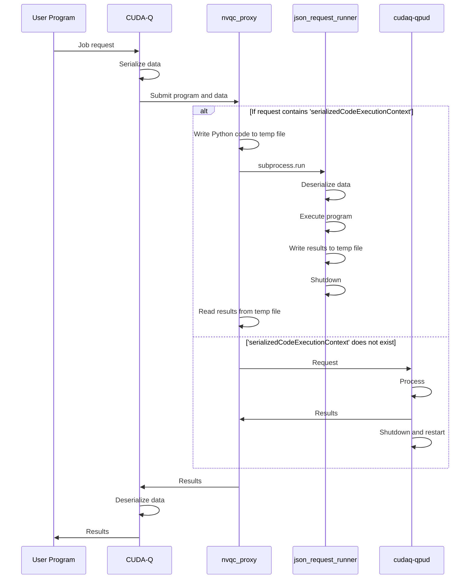

<!-- markdownlint-disable MD013 -->
# `remote-mqpu` / `nvqc` Debugging Tips

This file contains tips and tricks for when you are performing manual testing/
debugging for `remote-mqpu` or `nvqc` targets. This file is primarily intended
for **CUDA-Q developers, not end users**. See the user-facing docs here:

- [`remote-mqpu`](https://nvidia.github.io/cuda-quantum/latest/using/backends/platform.html#remote-mqpu-platform)
- [`nvqc`](https://nvidia.github.io/cuda-quantum/latest/using/backends/nvqc.html)

## Fully local within `cuda-quantum-dev` container

The first step is usually to run the server in a separate window from the
client by disabling any sort of auto-launch capabilities.

1. In one window, launch `cudaq-qpud --port 3030 --type nvcf`. You may also
   prefix this command with `CUDAQ_LOG_LEVEL=info` to turn on additional
   logging in the server.
2.
   - If you are using Python, change your `cudaq.set_target` line to be
   something like this: `cudaq.set_target('remote-mqpu', url='localhost:3030')`.
   - If you are using C++, change your `nvq++` command to something like this:
   `nvq++ --target remote-mqpu --remote-mqpu-url localhost:3030`.

Note: when you run the server with `--type nvcf`, that means that the
`cudaq-qpud` process will shut down after every invocation, so you will have to
manually restart it if you want to invoke it again.

## Fully local testing using a true NVQC image

If you want to run the server in a fully "contained" environment like it is run
for NVQC, then you can perform the following steps.

_Note: the following steps use a Docker image tag that is primarily intended
for CUDA-Q developers, not end users. End users can still use these
instructions to do any testing they would like, but it is recommended that they
choose a different Docker tag name._

1. Build your NVQC server Docker container using this command: `docker build -t nvcr.io/pnyjrcojiblh/cuda-quantum/cuda-quantum:custom -f docker/release/cudaq.nvqc.Dockerfile .`
2. Launch the server on your local machine: `docker run -it --rm --gpus all --network=host -e NVQC_REST_PAYLOAD_VERSION=1.1 -e NUM_GPUS=1 -e WATCHDOG_TIMEOUT_SEC=3600 -e RUN_AS_NOBODY=1 nvcr.io/pnyjrcojiblh/cuda-quantum/cuda-quantum:custom`
   - Note: You need to set the environment variables as intended for your
    environment. If you are running on a multi-GPU machine, you may
    want to set `NUM_GPUS=4` (updating `4` to the correct number for your
    machine) and use something like `--gpus '"device=0,1,2,4"'` (in case your
    machine has more GPUs than you want activated with `NUM_GPUS`.)
3. Get the IP address of your host by running `ifconfig`. For the following
   steps, let's assume your IP address is `172.31.123.45`.
4. Similar to step 2 in the section above, but changing `localhost` to the
   correct IP address obtained in step 3:
   - If you are using Python, change your `cudaq.set_target` line to be
   something like this: `cudaq.set_target('remote-mqpu', url='172.31.123.45:3030')`.
   - If you are using C++, change your `nvq++` command to something like this:
   `nvq++ --target remote-mqpu --remote-mqpu-url 172.31.123.45:3030`.

## Running your own image on the NVQC server

_Note: the following steps use a Docker image tag that is primarily intended
for CUDA-Q developers, not end users. End users can still use these
instructions to do any testing they would like, but it is recommended that they
choose a different Docker tag name._

1. After building your `nvcr.io/pnyjrcojiblh/cuda-quantum/cuda-quantum:custom`
   image, you can `docker push` it (assuming you have authorized credentials).
2. Either use the `ngc.nvidia.com` Web GUI to deploy your function, or use the
   `ngc-cli`. Both are documented [here](https://docs.nvidia.com/cloud-functions/user-guide/latest/cloud-function/function-deployment.html#deploying-a-function).
3. When done, un-deploy your function and remove your custom image using a command like this: `ngc registry image remove nvcr.io/pnyjrcojiblh/cuda-quantum/cuda-quantum:custom`.

## Special notes about running Python code on the server (`CUDAQ_SER_CODE_EXEC` / `serializedCodeExecutionContext`)

Remote Python execution does not actually use `cudaq-qpud` to execute Python
code. That is actually achieved by `tools/cudaq-qpud/nvqc_proxy.py` and
`tools/cudaq-qpud/json_request_runner.py`. `nvqc_proxy.py` is a proxy that sits
at the front end of the NVQC server. It runs on port `3030` and redirects all
`cudaq-qpud`-bound traffic to port `3031`. However, if the JSON request contains
a `serializedCodeExecutionContext` field, then the request is sent to
`json_request_runner.py`, not `cudaq-qpud`.

The following diagram shows the high-level sequence for these operations.

